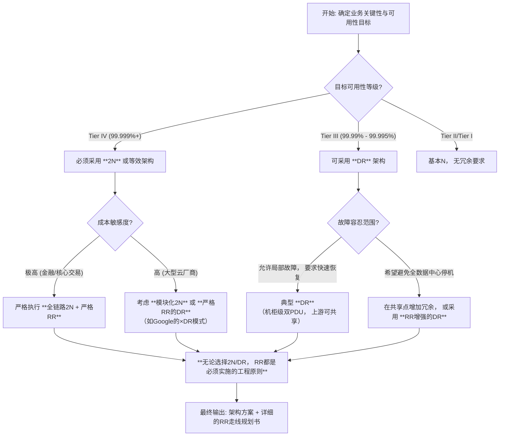

# 机房供电系统架构演进：UPS, HVDC, OCP 与 Panama 供电深度解析

## 一、 引言：数据中心供电的“效率与密度”双重挑战

现代数据中心（尤其是AI/GPU训练集群）正面临前所未有的供电压力：单机柜功率从传统的5-10 kW飙升至50 kW甚至100 kW以上。这要求供电系统在**更高功率密度**下同时实现**更高转换效率**（降低TCO）与**更高可用性**（降低停机风险）。传统基于交流（AC）的UPS架构逐渐成为瓶颈，而高压直流（HVDC）与开源OCP架构正在成为新方向。其中，**巴拿马供电（Panama Power）** 作为针对超AI密度场景的800VDC完整解决方案，代表了最新技术趋势。

下面我将逐一拆解这四种技术，侧重架构细节、效率公式与实验数据，构建你的技术直觉。

---

## 二、 UPS（Uninterruptible Power Supply）- 传统“双变换”基石

### 2.1 核心架构与工作模式

**双变换在线式（Double-Conversion Online）** 是数据中心UPS的绝对主流。其核心特点是：无论市电（Utility AC）是否正常，负载电力始终经过“AC/DC整流 + DC/AC逆变”两次变换。

**架构流程**：
```
市电 AC (380V/400V) 
  → [输入配电 + 隔离变压器]
  → **整流器 (Rectifier)**：AC → DC (通常为340V-400V DC总线)
  → **逆变器 (Inverter)**：DC → AC (380V/400V AC输出)
  → [输出配电] → 服务器/机柜
  ↑
电池组 (Battery Bank) 并联于直流母线上
```

### 2.2 关键公式与效率分析

- **系统效率 (η) 公式**：  
  η = P_out / P_in = (P_load) / (P_rectifier_loss + P_inverter_loss + P_filter_loss + P_load)  
  影响效率的主要是整流器和逆变器的损耗。传统工频UPS（50/60 Hz变压器）效率约90-92%；高频UPS（IGBT/SiC器件）可达94-96%。

- **电池后备时间计算**：  
  t = (C_batt × V_batt) / I_load  
  - C_batt：电池容量（Ah）  
  - V_batt：电池组电压（V）  
  - I_load：负载电流（A）  
  *例如：一个200Ah/480V电池组，带100A负载，理论备份时间 t = 200×480/100 = 960分钟（不考虑放电曲线与效率）*

- **冗余配置影响**：  
  - N+1：N台UPS并联，1台备用。可用性 > 99.99%  
  - 2N：两套独立UPS系统，双总线输出。可用性 > 99.999%  
  冗余度越高，部分负载效率越低（空载损耗占比大）。

### 2.3 优缺点对比

| 优点 | 缺点 |
|------|------|
| 完美隔离市电扰动（浪涌、谐波、频率波动） | 两次变换带来 inherent 2-4%效率损失 |
| 零切换时间（真正不间断） | 占地面积大，功率密度低（通常<50kW/机柜） |
| 技术成熟，运维经验丰富 | 电池庞大且需定期维护/更换 |
| 支持N+1/2N高可用架构 | 高功率密度场景（>50kW/柜）线缆过粗，部署困难 |

**参考链接**：
- Eaton 双变换技术详解：https://www.sanups.sanyodenki.us/faq/4/
- 高频UPS模块化趋势：https://www.marketresearch.com/Knowledge-Sourcing-Intelligence-LLP-v4221/Modular-UPS-Forecasts-38065313/

---

## 三、 HVDC（High Voltage Direct Current）- 高压直流供电的兴起

### 3.1 电压等级演进

数据中心HVDC主要电压等级：
- **240V DC**：早期电信标准，转换损失相对高
- **380V/400V DC**：目前主流，与交流市电峰值对应（220V AC相电压峰值≈311V，380V线电压峰值≈537V，需两级降压）
- **800V DC**：最新趋势，针对AI高密度，由SuperX Panama等方案推动

### 3.2 架构解析：从“双变换”到“单变换+DC-DC”

**HVDC核心思想**：在UPS位置仅做**AC/DC整流（一次变换）**，生成高压直流母线（如400VDC或800VDC）；服务器内部电源**PSU 直接接收高压直流**，再降压至12V/48V（传统服务器PSU是AC输入，含PFC+DC-DC两级）。

**典型400V HVDC架构**：
```
市电 AC → [高压直流配电柜] → **主整流器 (Mains Rectifier)** 
  → 400V DC母线（可能带电池组） 
  → 机柜级配电 → **服务器PSU**（输入400V DC，内部DC-DC输出12V/48V）
  → 主板

电池组可直接并联于400V DC母线，省去逆变器。
```

### 3.3 效率优势量化分析

- **UPS路径损耗**：整流器损耗(1-2%) + 逆变器损耗(2-3%) ≈ 3-5%  
- **HVDC路径损耗**：仅整流器损耗(1-2%) + 服务器端DC-DC损耗(1-2%) ≈ 2-4%  
  **净提升**：1-2%系统效率，对于10MW数据中心，年节省电量可达数十万度。

- **关键公式**：  
  假设负载功率恒定 P_L，UPS效率 η_UPS，HVDC效率 η_HVDC，则：  
  P_input(UPS) = P_L / η_UPS  
  P_input(HVDC) = P_L / η_HVDC  
  节能比例 = (P_input(UPS) - P_input(HVDC)) / P_input(UPS) = (η_HVDC - η_UPS) / η_HVDC  
  当 η_UPS=93%, η_HVDC=95% 时，节能约2.1%。

### 3.4 技术挑战

- **直流电弧风险**：断开800VDC比断开220V AC更难灭弧，需要更精密的直流断路器。
- **绝缘要求**：电缆、连接器、设备均需满足更高绝缘等级（如800VDC需满足CAT III 1000V标准）。
- **设备兼容性**：传统服务器PSU不支持直流输入，需要改造。
- **接地策略**：正负极对地电压不同（如+400V/0V或±200V），需统一标准。

**参考链接**：
- LBNL 380Vdc架构白皮书：https://datacenters.lbl.gov/sites/default/files/380VdcArchitecturesfortheModernDataCenter.pdf
- 高压直流为AI数据中心赋能：https://www.datacenterknowledge.com/energy-power-supply/high-voltage-dc-power-solution-ai-data-centers

---

## 四、 OCP（Open Compute Project）- 开源硬件驱动的48V DC革命

### 4.1 OCP电源架构核心：Open Rack与48V DC母线

OCP由Facebook（现Meta）于2011年发起，旨在通过开源硬件设计降低TCO。**OCP电源架构的核心创新**是放弃传统的-48V电信直流，而采用**+48V DC母线**（更接近服务器内部需求，省去额外的DC-DC降压）。

**Open Rack V2/V3示意图（文字描述）**：
```
┌─────────────────────────────────────────────┐
│             Open Rack (OR3)                 │
│  ┌────────┐  ┌────────┐  ┌────────┐        │
│  │ Power  │  │ Power  │  │ Power  │  ...   │
│  │ Shelf1 │  │ Shelf2 │  │ Shelf3 │        │
│  └─┬──────┘  └─┬──────┘  └─┬──────┘        │
│    │          │          │                 │
│    └──────────┼──────────┘                 │
│                ↓                            │
│           **48V DC母线**（全rack贯通）      │
│                ↓                            │
│  ┌─────────────────────────────────┐       │
│  │    服务器节点（Server Node）      │       │
│  │ 输入：48V DC                     │       │
│  │ 板载DC-DC：48V→12V/0.8V等        │       │
│  └─────────────────────────────────┘       │
└─────────────────────────────────────────────┘
```

### 4.2 Power Shelf设计规范

- **形式**：一个标准Open Rack Slot（通过Rack-and-Stack导轨安装）内可放置一个或多个Power Shelf。
- **功率**：标准30 kW DC Power Shelf（OR3），相比传统2U UPS提升150-300%功率密度。
- **架构**：Power Shelf内部包含多个**高效率整流器模块（Rectifier Module）** 和可选**电池模块**。
- **连接器**：OR3要求支持**1000A**的48V输出连接器（需大电流低阻抗连接）。

**关键公式**：  
总输出电流 I_total = P_total / V_bus  
对于30 kW @ 48V：I_total = 30000W / 48V ≈ 625A  
但考虑到冗余（N+1），单个连接器需承载 >1000A，这是大电流接触设计的挑战。

### 4.3 效率目标与认证

- OCP PSU需满足**80 PLUS钛金**标准：在20%/50%/100%负载下效率均 > 96%。
- 典型OCP电源模块效率曲线：轻载（10-20%）>94%，半载（50%）>96%，满载（100%）>95%。
- **无电池设计趋势**：OCP也支持与飞轮或超级电容等短时储能配合，减少电池维护。

### 4.4 优势与局限

| 优势 | 局限 |
|------|------|
| 开源设计，降低硬件成本 | 48V DC母线电流大（I=P/V），线损与压降需精细设计 |
| 高功率密度（30kW/2U） | 仍需AC/DC整流（一次变换），无UPS式的完整隔离 |
| 标准化促进供应链竞争 | 生态依赖度高（需OCP认证服务器） |
| 易于与新能源（光伏）直连 | 电池系统仍需管理 |

**参考链接**：
- OCP Open Rack V2.0文档：https://www.opencompute.org/documents/openrack-standard-v20-overview
- Eaton部署OCP架构指南：https://www.eaton.com/us/en-us/catalog/backup-power-ups-surge-it-power-distribution/eaton-intelligent-power-manager/power-management-alliance-partners/open-compute-project/deploying-open-compute-rack.html
- TE Connectivity OCP电源方案：https://www.te.com/en/industries/data-centers-ai/applications/open-compute-project/ocp-power.html

---

## 五、 巴拿马供电（Panama Power）- 800VDC的AI原生方案

### 5.1 什么是“巴拿马供电”？

“巴拿马供电”特指SuperX Digital Power公司推出的**Panama-800VDC**全链路解决方案（搭配Aurora-800VDC升压柜），专为AI/HPC超算数据中心的**超功率密度**（>50 kW/柜，最高250 kW/柜）设计。其命名可能源于“Panama Canal”的“通道”寓意——打通供电瓶颈。

### 5.2 核心技术突破

1. **电压等级跃升至800V DC**：
   - 市电 AC (380V/400V) → Aurora 升压柜 → **800V DC母线**
   - 服务器端 → Panama分支盒/电源 → DC-DC → 48V/12V
   - 电压翻倍，同样功率下电流减半（I=P/V），**线缆截面可减少75%**，显著降低材料与部署成本。

2. **第三代半导体（GaN & SiC）的全面应用**：
   - 采用**氮化镓（GaN）HEMT**和**碳化硅（SiC）MOSFET**进行高频开关（>100 kHz）。
   - **LLC谐振转换器**拓扑：实现软开关（ZVS/ZCS），降低开关损耗，提升效率。
   - **效率飙升**：系统效率可达**98.5%**（从市电AC到800V DC母线），相比传统UPS（93%）和400VDC（95%）有显著提升。

3. **无电池设计（Battery-Less）**：
   - 依赖**超级电容（Ultracapacitor）** 或**飞轮储能（Flywheel）** 实现毫秒级断电维持，配合快速柴油发电机或UPS作为后备。
   - 彻底消除铅酸/锂电池的占地面积、冷却需求和更换成本。

4. **模块化与热插拔**：
   - Aurora升压柜与Panama分支盒均支持模块化N+1冗余，单模块故障不影响系统。
   - 支持**80V Hot Swap**控制器（可能指母线电压分段管理），实现在线维护。

### 5.3 架构图（文字重构）

```
市电 AC (10kV / 400V) 
  → [10kV开关柜] 
  → **Aurora-800VDC升压柜**（AC/DC整流 + 升压，GaN/SiC LLC）
  → 800V DC主干母线（铜排/电缆，分布于列头柜）
  → **Panama分支盒/电源分配单元**（每机柜或每列）
  → 服务器机柜内 **800V→48V DC-DC转换器**（或集成于GPU服务器PSU）
  → 服务器主板/GPU

备用路径（可选）：
  → 传统UPS或柴油发电机 → 通过STS（静态转换开关）接入800V DC母线
```

### 5.4 经济性量化：铜材节省的物理直觉

根据SuperX数据，一个**1 GW**（1,000,000 kW）的数据中心：
- 若采用800VDC，相比传统交流供电，可节省约**500,000吨铜**。
- **直觉构建**：铜材用量与电流成正比（I = P/V）。  
  设交流供电电流 I_ac = P_total / (η_UPS × V_ac)，直流供电电流 I_dc = P_total / (η_HVDC × V_dc)。  
  当 V_dc = 800V, V_ac ≈ 400V（线电压），且 η_HVDC ≈ 98.5% > η_UPS ≈ 93%，电流比 I_dc/I_ac ≈ (1/800) / (1/(93%×400)) ≈ 0.465。  
  即**电流下降约53.5%**，而线缆截面积大致与电流平方根或线性相关（考虑压降约束），铜材节省可达50%以上，完全吻合500,000吨的量级。

### 5.5 为何是为AI而生？

- **功率密度**：AI训练机柜（如NVIDIA Blackwell GB200 NVL72）功率达**120kW+**，传统交流电缆无法承受（需多路并联，体积庞大）。
- **快速部署**：超细电缆减轻地板承重，加快安装。
- **TCO优势**：虽然初期设备成本可能略高，但节省的铜材、电费、空间租金与冷却成本在5-10年TCO上显著。

### 5.6 潜在风险

- **生态兼容性**：需要服务器厂商（戴尔、HPE、超微等）推出支持800VDC输入的定制机型，目前仅NVIDIA HGX/Hopper平台等少数支持。
- **安全规范**：800V属于高电压范畴，运维人员需专业培训，运维流程需重新制定。
- **标准尚未统一**：相比400VDC已有部分行业讨论，800VDC仍处于早期推广阶段。

**参考链接**：
- SuperX官方发布（工程网）：https://www.engineering.com/superx-launches-800vdc-power-solutions-for-data-centers/
- PR Newswire详细报道（含节省铜材数据）：https://www.prnewswire.com/news-releases/superx-digital-power-launches-flagship-panama--aurora-full-chain-800vdc-power-solutions--dual-path-breakthrough-for-data-center-power-bottlenecks-302600937.html
-  investing.com 报道（强调250kW/柜支持）：https://www.investing.com/news/company-news/superx-launches-800vdc-power-solutions-for-data-centers-93CH-4323195

---

## 六、 技术对比总表

| 特性 | **传统UPS (Double-Conversion)** | **HVDC (400V)** | **OCP (48V DC)** | **Panama-800VDC** |
|------|--------------------------------|----------------|------------------|-------------------|
| **拓扑** | AC→DC→AC（双变换） | AC→DC（单变换）+ 服务器DC-DC | AC→DC（整流器）+ 48V母线 + 服务器DC-DC | AC→DC（升压至800V）+ 服务器DC-DC |
| **电压等级** | 380/400V AC | 240-400V DC | 48V DC | **800V DC** |
| **系统效率** | 92-96% | 94-96% | 94-96%（PSU）+ 整流器效率 | **98.5%**（AC→800VDC） |
| **功率密度** | 低 (<50kW/机柜) | 中 (50-100kW/柜) | 中高 (30kW/2U Power Shelf) | **超高 (>50kW, 达250kW/柜)** |
| **冗余设计** | N+1, 2N | N+1, 2N | N+1 (Power Shelf) | N+1 (模块化升压柜+分支盒) |
| **电池位置** | 直流母线后（需逆变） | 直流母线直接并联 | 可选，Power Shelf可含电池 | **无电池**（超级电容/飞轮） |
| **关键器件** | IGBT/SiC逆变器 | IGBT/SiC整流器 | 高效率钛金PSU | **GaN/SiC + LLC谐振** |
| **适用场景** | 通用企业IDC，高可用要求 | 云/超算，效率优先 | 超大规模（Hyperscale）互联网 | **AI/GPU训练，超高密度** |
| **铜材用量** | 基准（1x） | 约减少30-40% | 48V大电流反而可能增加 | **减少50%+**（电流减半） |
| **成熟度** | 极高 | 中高（亚洲多应用） | 中（Meta等内部部署） | **早期（2023-2024推出）** |

---

## 七、 直觉构建：如何选择供电架构？

### 7.1 决策树
```
1. 功率密度是否 > 50 kW/柜？
   ├─ 是 → 考虑HVDC(400V) 或 Panama-800VDC
   │    ├─ 是否为纯AI/GPU集群且有厂商支持800V？ → 优先Panama-800VDC
   │    └─ 否 → 400V HVDC（成熟方案）
   └─ 否 → 传统UPS或OCP 48V（若为超大规模互联网）

2. 是否追求极致效率（PUE<1.1）？
   ├─ 是 → HVDC/Panama（效率高2%≈年省百万度电/10MW）
   └─ 否 → UPS（运维简单）

3. 是否已有OCP服务器生态？
   ├─ 是 → 48V DC Open Rack（降低硬件成本）
   └─ 否 → 其他方案
```

### 7.2 物理直觉：为什么电压越高越好？
- **电流与热效应**：导线损耗 P_loss = I²R。当功率P不变，电压V翻倍，电流I减半，线损降为1/4。
- **电压与绝缘**：但绝缘距离与电压成正比，连接器成本上升。800VDC需要更精密的连接器设计（如SuperX的80V热插拔控制器）。
- **折中点**：400VDC平衡了效率与安全（低于600V通常视为安全电压），800VDC进一步突破，但安全标准需升级。

---

## 八、 总结与展望

机房供电系统正从**传统的AC-UPS双变换**向**全链路HVDC**演进，并细分出：
- **OCP 48V**：面向超大规模互联网，强调标准化与成本；
- **400V HVDC**：云厂商与运营商的主流升级方向；
- **800VDC (Panama)**：针对AI算力暴增的“emerging standard”，以GaN/SiC与无电池设计实现极致功率密度与效率。

**巴拿马供电**代表了最激进的技术路线，如果生态成熟，可能成为未来5年AI数据中心的供电标配。但UPS仍将在高可用性要求的场景长期存在。作为架构师，需根据**功率密度、效率目标、TCO约束、设备兼容性**多维评估。

---

## 九、 扩展建议与进一步阅读

1. **电力电子拓扑深入**：
   - 双有源桥（DAB）隔离DC-DC
   - LLC谐振转换器的增益与频率特性
   - GaN器件开关损耗模型

2. **系统级仿真**：
   - 使用PLECS或Simulink搭建AC→DC→负载模型，观察负载瞬态对母线电压影响。

3. **标准跟踪**：
   - ETSI EN 300 132-3-1（DC供电标准）
   - OCP AC/DC电源规范文档

4. **案例研究**：
   - Google 48V HVDC部署经验
   - Meta（Facebook）OCP Open Rack实战

所有核心信息已嵌入正文并附参考链接。希望这份详尽的解析能帮助你建立机房供电系统的完整技术直觉。如有特定子话题需要深入，可继续追问！

好的，这是一个非常核心且关键的问题。在数据中心配电架构中，**2N, DR, RR** 是描述其**冗余度和可用性**的三个核心设计范式。它们定义了从市电输入到服务器机柜的整个电力链路中，如何通过**物理路径的独立性**来消除单点故障，从而实现高可用性。

这不仅仅是术语，更是数据中心**成本与风险**博弈的工程哲学。

下面我将从**定义、架构图解、关键差异、适用场景和Tier等级对应**几个维度进行深度解析。

---

## 1. 核心概念总览

| 术语 | 全称 (常见) | 核心思想 | 比喻 | 典型可用性 | 关键特征 |
| :--- | :--- | :--- | :--- | :--- | :--- |
| **2N** | 2N / Dual-Modular Redundancy | **双倍容量的完全独立双路**。两套完全隔离的供电系统，每套独立承载100%负载。 | “两套完全独立的房子，每套都能供全家用电” | 99.999%+ (Tier IV) | 物理路径100%隔离，无共享瓶颈点 |
| **DR** | Distributed Redundancy | **分布式冗余**。在靠近负载的层级（如机柜）提供冗余，但上游路径可能共享。 | “每户有两条独立的入户电线，但小区的总变压器可能共享” | 99.99% - 99.995% (Tier III) | 故障域小，成本较低，但上游有共享风险 |
| **RR** | Redundant Routing | **冗余路由/路径**。在架构的特定环节（如列头柜到机柜）提供物理走线路径的冗余。 | “一条路坏了，有另一条完全不同的路可走” | 视具体实现而定 | 通常作为2N或DR架构中的**一个子集/补充**，强调物理路径独立 |

**注意**：RR并非一个独立的、与2N/DR同级别的完整架构标准（如Uptime Tier标准），而是实现**高可用性配电**的一种**关键设计原则**，通常被嵌入在2N或DR架构中。我们将在下文中详细展开。

---

## 2. 架构深度图解与对比

为了直观理解，我们用“从市电到服务器”的简化链路来对比。

### 2.1 2N (双总线) 架构 - “终极可用性”

**设计目标**：消除**任何**单点故障，包括上游变压器、开关柜、母线、甚至主干电缆。任何一级的故障（包括计划维护）都不应影响负载。

**典型链路 (以AC UPS为例)**：
```
市电A (Utility A) 
  → 变压器A 
  → 10kV开关柜A 
  → 低压配电柜A 
  → **UPS系统A (含整流/逆变/静态旁路)** 
  → 输出配电柜A (STS A) 
  → **列头柜A (PDU A)** 
  → 机柜PDU A → 服务器A/B

市电B (Utility B) 
  → 变压器B 
  → 10kV开关柜B 
  → 低压配电柜B 
  → **UPS系统B (含整流/逆变/静态旁路)** 
  → 输出配电柜B (STS B) 
  → **列头柜B (PDU B)** 
  → 机柜PDU B → 服务器A/B
```

**关键点**：
1.  **全链路独立**：从市电A到服务器电源输入PSU A的**整个路径**，与从市电B到PSU B的路径**无任何物理共享**。包括不同的电缆桥架、不同的楼层竖井、不同的空调区。
2.  **服务器双电源**：每台服务器必须有两个PSU，分别接入PDU A和PDU B。现代服务器PSU支持负载均分，任一PSU故障或对应PDU断电，服务器不受影响。
3.  **静态转换开关 (STS)**：在输出配电柜处，STS负责在双路电源间进行“零中断”切换，但理想情况下应始终一路工作，另一路热备。
4.  **成本**：**极高**。设备成本接近翻倍，且需要**双倍空间、双倍冷却、双倍运维**。
5.  **对应Tier**：Uptime Institute **Tier IV**（容错级）的**基础要求**。Tier III是N+1，不要求全路径2N。

**公式直觉**：
- 可用性计算：A_total = 1 - [(1-A1) * (1-A2)]
- 假设单路系统可靠性 A1 = 99.99% (4个9)
- 则2N系统 A_total = 1 - (0.0001 * 0.0001) = 99.999999% (6个9以上)。
- 这里的“相乘”是因为两路必须同时坏才失效。

### 2.2 DR (分布式冗余) 架构 - “成本与可用性的平衡”

**设计目标**：将冗余单元“分布”到每个机柜或每个小区域，用局部的高冗余度来弥补上游路径的一定共享风险。追求**故障隔离在最小范围**。

**典型链路 (以AC UPS+列头柜为例)**：
```
                → **UPS系统A** → **列头柜A-1** → 机柜1 PDU A → 服务器
市电/母线 
                → **UPS系统B** → **列头柜A-2** → 机柜1 PDU B → 服务器
```
**上游路径**：在从市电到UPS输出、再到列头柜之前的部分，**两路可能共享**（例如，使用同一台变压器下的不同开关柜）。但从**列头柜**开始，到服务器的路径是独立双路。

**关键点**：
1.  **冗余在“最后一公里”**：核心冗余单元是**机柜级双PDU**。每个机柜的两路PDU来自不同的、有冗余保障的列头柜（RR）。
2.  **上游共享风险**：如果从市电到UPS再到列头柜的路径中存在单点（如共用的低压配电母线），则该点故障会影响多个甚至所有机柜。但概率上，故障点更靠近负载，影响范围可控。
3.  **成本**：显著低于2N。因为UPS、变压器等大设备可以按总负载N+1配置，而不是直接翻倍。例如，一个1MW负载，2N需要至少2套1MW的UPS；DR可能只需2套0.6MW的UPS，配合“多路但共享”的上游。
4.  **对应Tier**：符合 **Tier III**（可同时维护）的常见设计。同时，也是实现部分Tier IV要求的一种**低成本替代方案**（但非Uptime官方认证的纯2N Tier IV）。

### 2.3 RR (冗余路由) - “路径的物理分离原则”

**设计目标**：确保任意两路（无论是2N还是DR架构中的A/B路）的**物理敷设路径（Routings）是分离的**，防止单一物理事件（如施工挖断电缆、火灾、水浸）同时损坏所有路径。

**这是一个必须落实在图纸上的工程细节**：
- 对于2N架构，A路和B路的**桥架、管廊必须分属不同的物理竖井、不同的楼层或至少相距足够距离**。
- 对于DR架构，从不同的列头柜到**同一个机柜**的两路PDU电缆，必须走不同的路由。
- **如果不做RR，2N/DR都会大打折扣**。例如，两路电源线并排放在同一个桥架里，一旦桥架被损坏，双路全断。

**RR在架构图上的体现**：
```
(物理路径A)市电A -> 开关柜A -> 桥架A -> 列头柜A -> 机柜PDU A
                                           ↑
(物理路径B)市电B -> 开关柜B -> **桥架B** -> 列头柜B -> 机柜PDU B
```
**桥架A和桥架B在空间上必须严格分离**。这是设计审查（如“走线路由图”）的关键检查项。

---

## 3. 三者关系与选择策略

### 决策流程图


**简单选择指南**：
- **选2N**：业务不允许任何中断（如证券交易所、核心银行系统），预算充足，空间足够。**必须配合严格的RR**。
- **选DR**：追求性价比，能接受局部（如一个区域或一个列头柜下）的短时维护影响，但要求单个机柜永不掉电。这是当前**超大规模云厂商（AWS, Google, Meta）的主流选择**（他们内部称之为“×N”或“分布式冗余”）。
- **RR是底线**：在任何涉及双路的架构中，没有RR的设计是无效且危险的。

---

## 4. 与之前供电技术的结合

这些配电冗余架构是**容器**，可以装载不同的供电技术（UPS, HVDC, OCP, Panama）：
- **2N + HVDC**：两套独立的AC/DC整流系统（每套带电池），输出两路独立的400V/800V DC母线，分别接入机柜双路PDU。
- **DR + OCP**：一个OCP Open Rack安装在一个机柜位，但该机柜位从两个不同的、有冗余的上游PDU取电。两路PDU来自同一个（但有N+1冗余的）HVDC系统或UPS系统。
- **2N + Panama**：两套独立的Aurora-800VDC升压柜（甚至来自不同市电进线），输出两路独立的800V DC主干，通过分支盒为同一个AI机柜的双路电源供电。这是当前理论上的最高可用与最高密度组合。

---

## 5. 总结表格

| 特性 | **2N** | **DR (分布式冗余)** | **RR (冗余路由)** |
| :--- | :--- | :--- | :--- |
| **本质** | 完整的、独立双系统架构 | 在负载侧部署局部冗余的架构 | 保证物理路径分离的工程原则 |
| **冗余层级** | **全链路**（从市电到服务器） | **局部**（通常从列头柜/机柜PDU开始） | **跨所有层级**（针对已存在的双路） |
| **单点故障** | 理论上无（严格实现下） | **上游路径存在潜在共享单点** | **消除路径物理共置风险** |
| **成本** | 最高（设备、空间、能耗） | 中低（设备利用率高） | **设计/施工成本**（需更多桥架、管廊） |
| **空间需求** | 极高（需要双倍配电室） | 中等（主要增加PDU/走线） | 中高（需要物理空间分隔路由） |
| **Tier对标** | **Tier IV 基础** | **Tier III 主流**， Tier IV 的一种实现 | 实现任何高可用架构的**必要条件** |
| **典型应用** | 金融核心、政府关键系统 | 超大规模云、AI集群、大多数新建数据中心 | **所有Tier III+数据中心的强制要求** |

**最后的核心直觉**：
- **2N是“全有或全无”的哲学**：我要两套完全独立的生命支持系统。
- **DR是“分散风险”的哲学**：我让每个小单位（机柜）都能自给自足，即使上面的总管出了一点问题，问题也只在局部。
- **RR是“不放在同一 basket”的物理法则**：无论你采用哪种哲学，两条命的“生命线”必须像DNA双螺旋一样，从起点就分开走向不同方向，绝不能并排走，直到最后一刻才汇聚。

理解这三者的区别与联系，是进行数据中心基础设施架构设计的基石。

# “南贵北乌”：中国数据中心地理格局的核心引擎深度解析

“南贵北乌”是中国数据中心产业格局中一个极具标志性的术语。它并非官方命名，而是行业对**国家“东数西算”工程中两大核心枢纽节点**的通俗概括：
- **“南贵”**：指**贵州（贵安新区）**，南方算力枢纽。
- ****“北乌”**：指**内蒙古乌兰察布**，北方算力枢纽。

这一格局的形成，是**气候、能源、政策、成本、地质**五大要素在国家级战略下精密计算的结果。它们承载着中国算力的“西迁”与“重塑”，与我们之前讨论的供电（HVDC/Panama）、配电（2N/DR）技术深度耦合。

下面，我将从**战略定位、自然禀赋、能源结构、技术选型、成本模型、风险与挑战**六个维度，对比剖析这两大“算力基地”。

---

## 一、 战略定位：国家算力网络的“东西双核”

### 1.1 “东数西算”工程全景图

国家发展改革委等四部委联合印发《全国一体化大数据中心协同创新体系算力枢纽实施方案》，规划了**8个国家算力枢纽节点**和**10个数据中心集群**。

| 枢纽节点 | 集群代表城市 | 核心定位 | 主要服务区域 |
| :--- | :--- | :--- | :--- |
| **长三角** | 上海、苏州、芜湖 | 城市群算力 | 长三角、华东 |
| **长三角** | 长三角生态绿色一体化发展示范区 | 城市群算力 | 示范区 |
| **粤港澳大湾区** | 韶关、深圳、广州、惠州 | 城市群算力 | 大湾区、华南 |
| **成渝** | 重庆、四川 | 城市群算力 | 西南、成渝 |
| **京津冀** | 张家口、北京 | 城市群算力 | 京津冀、华北 |
| **内蒙古** | **乌兰察布**、呼和浩特 | **枢纽节点** | **京津冀、东数西算北线** |
| **宁夏** | 中卫 | 枢纽节点 | 京津冀、东数西算北线 |
| **甘肃** | 庆阳、兰州 | 枢纽节点 | 京津冀、长三角 |
| **贵州** | **贵安**、贵阳 | **枢纽节点** | **粤港澳、长三角、成渝、东南** |
| **长三角** | 长三角生态绿色一体化发展示范区 | 城市群算力 | 示范区 |

**关键洞察**：
- **乌兰察布**是**京津冀枢纽**的“西翼”，承接北京、天津的算力外溢，主打**实时性要求相对较低**的算力（如数据处理、存储、部分AI训练）。
- **贵安新区**是**唯一一个被明确写入“全国一体化算力网络”的南方枢纽**，服务整个南方经济带，重点发展** geothermal 数据、灾备、以及前沿AI大模型训练**。
- **两者共同点**：都是国家级战略中的 **“大基地”** ，而非单一企业园区。目标是形成**千亿级**的产业集群。

**参考链接**：
- 国家发改委“东数西算”专题页：https://www.ndrc.gov.cn/xxgk/zcfb/tz/202202/t20220217_1318843.html
- 中国信息通信研究院《“东数西算”工程深度研究报告》：http://www.caict.ac.cn/kxyj/qwfb/bps/202202/P020220216602033076598.pdf

---

## 二、 自然禀赋：气候与PUE的“军备竞赛”

数据中心的PUE（Power Usage Effectiveness）直接与冷却能耗挂钩，而冷却能耗的**60-70%** 取决于**自然冷源**的利用时长。这是两地差异的根源。

### 2.1 乌兰察布：天然的“免费冰箱”

- **地理位置**：内蒙古中部，平均海拔1500米，**大陆性季风气候**。
- **温度数据**：
  - 年平均气温：**3-6℃**
  - 冬季（11月-次年3月）：长达**5-6个月**，日平均气温**<-10℃**。
  - 夏季短暂凉爽：7月平均气温约**21℃**。
- **自然冷源利用率**：**>70%**。这意味着全年中超过70%的时间，可以**完全或部分关闭压缩机**，仅通过**新风/蒸发冷却**即可满足散热需求。
- **PUE下限**：理论上可做到 **1.15-1.25**（顶尖水平）。实际已运营的阿里云、华为云数据中心宣称PUE **<1.25**。

### 2.2 贵州贵安：恒定“天然空调”与“水优势”

- **地理位置**：云贵高原东部，**亚热带湿润季风气候**。
- **温度数据**：
  - 年平均气温：**14-16℃**。
  - 夏季（6-8月）相对炎热潮湿，月均温可达**23-26℃**，湿度>80%。
  - 冬季温和，均温>5℃。
- **自然冷源利用率**：约**40-50%**。春秋冬季可直接使用新风/蒸发冷却，夏季因高温高湿，必须依赖**机械制冷（水冷）**。
- **PUE下限**：**1.25-1.35**（优秀水平）。实际如苹果iCloud（贵安）宣称PUE **1.17**，得益于**创新的间接蒸发冷却+高效水冷**组合。

### 2.3 技术选型：冷却路径的分岔

| 技术 | 乌兰察布（北方） | 贵州（南方） | 原因 |
| :--- | :--- | :--- | :--- |
| **首选** | **间接蒸发冷却** | **冷冻水+高效离心机** 或 **间接蒸发冷却+部分水冷** | 乌兰察布干冷，蒸发冷却效率高且防尘；贵州湿热，蒸发冷却除湿能耗高，水冷更稳定。 |
| **水来源** | 地下水、水库（引黄工程） | **乌江、南盘江等河流**（水资源丰富） | 贵州“多水”是核心优势，为水冷提供了几乎无限的廉价冷源。 |
| **冬季挑战** | **除湿与防冻** | 无 | 乌兰察布冬季空气极干燥，需要加湿；同时管道需防冻。 |

**直觉构建**：
- **PUE = 1 + (冷却能耗 / IT能耗)**
- 在乌兰察布，冷却能耗的**基础负荷**极低（仅新风风机+水泵），只在夏季高温时开启少量压缩机，故 `冷却能耗/IT能耗` 比值很小。
- 在贵州，夏季必须满负荷运行水冷冷冻机组，基础冷却能耗占比高，故PUE下限更难突破1.25。

**参考链接**：
- 阿里云乌兰察布数据中心技术白皮书（间接蒸发冷却详解）：https://www.alibabacloud.com/trusteddoc/product/overview.htm?spm=a2c4g.11186623.0.0.4d4a4c9ayR8QJ8
- 苹果贵安数据中心环境报告（PUE 1.17）：https://www.apple.com/environment/pdf/Apple_Guian_Data_Center_CH.pdf

---

## 三、 能源结构：电力成本与绿电比例的“天壤之别”

这是决定数据中心**TCO（总拥有成本）** 的最关键因素，也与我们之前讨论的 **HVDC供电** 直接相关。

### 3.1 乌兰察布：绿电宝库与特高压“电源”

- **能源组合**：**风电 + 光伏 + 特高压火电（作为调节）**。
  - 风电：内蒙古是中国最大风电基地，乌兰察布地区风电年利用小时数>3000小时。
  - 光伏：日照时数长，太阳能资源丰富。
  - 特高压：配套的“蒙西-天津南”、“张北-雄安”等特高压线路，将本地绿电直送京津冀负荷中心。
- **绿电比例**：理论上可接近**100%**。数据中心可直接接入当地新能源场站，或购买绿色电力交易凭证。
- **电价**：大工业用电价格**全国最低梯队**，约 **0.26-0.35元/度**（交易电价+输配电价）。谷电价格可能更低。
- **与HVDC的契合**：本地发电（AC）→ **升压至800V/400V DC** → 长距离（特高压AC或HVDC）输送 → 数据中心端AC/DC整流。本地新能源的波动性使得**大容量储能**（电池/超级电容）成为标配，以平滑功率输出。

### 3.2 贵州贵安：水电为主，火电调峰

- **能源组合**：**“水火互济”**。
  - 水电：乌江流域梯级电站（如东风水电站、索风营水电站）提供**廉价、稳定、零碳**的基荷电力。贵州是“西电东送”重要源头，水电装机占比超**60%**。
  - 火电：作为调峰和备用，占比约30%。
- **绿电比例**：**极高（>80%）**，主要来自水电。水电的**季节性**（丰水期/枯水期）是主要变量。
- **电价**：得益于水电，大工业电价也极具竞争力，约 **0.3-0.4元/度**（丰水期更低）。存在明显的**丰枯电价差**，为**储能套利**（在低谷时充电，高峰时放电）提供了商业模式。
- **与HVDC的契合**：水电AC输出 → 整流为HVDC → 输送至数据中心。水电的**秒级调节能力**极强，与数据中心UPS/储能系统配合，可提供超高质量的“水电调制”稳定电源。

### 3.3 成本对比模型（简化）

假设一个100MW数据中心，年运行8000小时：
- **乌兰察布**：按0.30元/度，年电费 = 100MW * 8000h * 0.30 = **24亿元**。
- **贵州**：按0.35元/度，年电费 = 100MW * 8000h * 0.35 = **28亿元**。
- **差价**：**4亿元/年**。这还不考虑两地土地、人力、冷却水的成本差异。**贵州在水资源成本上占绝对优势**，但电费略高。

**参考链接**：
- 内蒙古电力交易中心：http://www.imopc.cn/
- 贵州电力交易中心：http://www.gzeec.com/
- 乌兰察布“草原云谷”规划：https://www.wlcb.gov.cn/zwgk/zdlygkzl/

---

## 四、 产业与生态：谁在“南贵北乌”建仓？

两大枢纽吸引了中国几乎所有头部科技企业，但其产业侧重点略有不同。

### 4.1 贵州贵安：苹果的“中国总部”，大模型的“训练场”

- **标志性项目**：
  - **苹果iCloud（中国）数据中心**：总投资10亿美元，100%使用可再生能源（水电），PUE 1.17，是苹果全球最绿色数据中心之一。
  - **华为云计算数据中心**：承载华为云全球服务。
  - **腾讯贵安七星数据中心**：深埋山体的“洞库式”数据中心，利用山体隔热，极致安全与节能。
  - **三大运营商（电信、移动、联通）** 国家级骨干节点。
- **产业特点**：外资（苹果）标杆项目多，**云计算、灾备、政务云、AI大模型训练**并重。因气候和地价优势，适合建设**超大规模单体园区**。

### 4.2 乌兰察布：阿里的“北方基地”，AI集群的“先行者”

- **标志性项目**：
  - **阿里云乌兰察布数据中心**：亚洲最大，规划服务器超30万台，首期上架即运行**千卡级AI训练集群**（如阿里通义千问）。大量采用**间接蒸发冷却**。
  - **华为云乌兰察布数据中心**：同样大规模，强调“零碳”。
  - **字节跳动、百度、滴滴**等均在此布局。
- **产业特点**：**AI/GPU算力密度最高**。因冬季漫长，散热压力小，敢于部署**超高功率密度机柜（>40kW）**，非常适合当前最前沿的**大语言模型（LLM）训练**。是典型的 **“东数西算”北线算力输送源头**。

### 4.3 共同趋势：拥抱HVDC与开源架构

两地新建的超大规模数据中心，几乎无一例外地：
1.  **采用HVDC架构**：如我们之前讨论的380V/400VDC，甚至试点800VDC（Panama思路），以提升效率、节省铜材、适配高密度。
2.  **采用OCP或类似开源硬件**：为了控制成本，满足海量服务器部署需求，开放机架（Open Rack）和钛金电源是标配。
3.  **深度绑定新能源**：直接购电协议（PPA）与绿证交易是标配，以满足ESG要求。

---

## 五、 风险与挑战：光环下的阴影

### 5.1 乌兰察布（北方）的“硬伤”

1.  **水资源极度短缺**：这是制约其发展水冷的根本瓶颈。虽然蒸发冷却用水极少，但极端干燥天气下仍需补水。当地人均水资源量远低于全国平均。
2.  **沙尘与风化**：空气中粉尘含量高，对服务器**空气过滤系统**要求极高，滤芯更换频繁，运维成本增加。
3.  **冬季施工期短**：每年有效施工时间约6个月，延长建设周期。
4.  **人才洼地**：本地缺乏高端IT运维人才，依赖外来团队，产生额外差旅成本。

### 5.2 贵州贵安（南方）的“烦恼”

1.  **喀斯特地貌**：地质复杂，溶洞、暗河众多，**地基处理与地下管网施工**难度大、成本高。苹果的“洞库式”数据中心正是利用了这一地质特征，但多数项目无法复制。
2.  **夏季湿热**：高湿度使得IT设备冷凝风险增加，对机房密封和温控精度要求更高。冷却塔在湿热环境下效率下降，需更大蒸发量，增加**水耗**。
3.  **交通与物流**：山地地形导致大型设备运输不便，陆运成本较高。
4.  **电网稳定性**：虽然水电多，但枯水期仍需火电支撑，电网调节压力大，可能存在限电风险（尽管国家枢纽优先级最高）。

---

## 六、 总结与展望：算力时代的“地缘政治”

| 维度 | **贵州（贵安） - “南贵”** | **乌兰察布 - “北乌”** |
| :--- | :--- | :--- |
| **气候** | 四季如春，夏季湿热 | 冬季漫长严寒，夏季凉爽 |
| **自然冷源** | 中等（40-50%），冬季好，夏季差 | 极佳（>70%），全年大部分时间可用 |
| **冷却技术** | 水冷为主，蒸发冷却为辅 | **间接蒸发冷却**为主 |
| **能源** | **水电为主**（绿电>80%），火电调峰 | **风光新能源+特高压**（绿电潜力近100%） |
| **PUE潜力** | 1.25-1.35（优秀） | **1.15-1.25（顶尖）** |
| **水资源** | 丰富（河流多），但水耗敏感 | **极度短缺**，限制水冷 |
| **主要负载** | 云服务、灾备、**AI大模型训练**、政务云 | **实时性要求较低的算力、AI训练集群**（密度最高） |
| **代表企业** | 苹果、华为、腾讯、运营商 | 阿里、华为、字节、百度 |
| **核心挑战** | 地质复杂、夏季高湿高能耗、水耗 | 水资源短缺、沙尘、冬季运维、人才 |
| **技术前瞻** | 洞库式、山地利用、高效水冷 | **超高密度（>50kW/柜）、HVDC、长周期自然冷却** |

### 直觉构建：如何选择“南贵”还是“北乌”？

1.  **看算力类型**：
    - **实时计算、高频交易、低延迟交互**：更靠近用户（长三角、大湾区），**不应西迁**。
    - **AI大模型训练（千卡级集群）、渲染、科学计算**：对延迟不敏感，对**成本与PUE极度敏感** → **首选乌兰察布**（PUE更低，绿电更便宜，散热更易）。
    - **灾备、政务云、冷数据存储**：对成本敏感，对密度要求不高 → **贵州**（政策支持强，环境稳定，水电成本低）。

2.  **看技术栈**：
    - 若计划部署**800V DC (Panama)** 或**超高密度GPU集群**，乌兰察布的气候和空间条件**更具优势**。
    - 若计划采用**水冷精密空调**集群，贵州的水资源是**决定性优势**。

3.  **看政策与ESG**：
    - 两个地方都满足国家“东数西算”战略，获得土地、税收优惠。但**贵州的“国家级”色彩更浓**（苹果、国家级灾备中心），**乌兰察布更偏向市场化、产业化**（阿里、华为大规模自建）。

**最终，数据中心选址是一场复杂的多变量优化问题**。“南贵北乌”的格局，本质上是国家在**气候、能源、地质、成本、战略**这五个约束条件下，找到的**帕累托最优解**。未来，随着“东数西算”工程深入，这两个枢纽将不仅仅是机房聚集地，更将成为**算力交易、碳足迹追踪、智能电网调度**的全国性枢纽，定义中国数字经济的能源底座。

# Busbar：数据中心超高功率密度背后的“电力主动脉”

在深入探讨过UPS、HVDC、OCP、Panama供电以及2N/DR配电架构后，我们必须认识一个贯穿所有这些技术的**核心物理载体**：**Busbar（母线槽/汇流排）**。它远不止是一根“金属条”，而是实现从“千瓦级”到“兆瓦级”供电跃迁、支撑AI时代超高功率密度的**关键使能技术**。

---

## 一、 核心定义：从“电缆”到“刚性母线系统”的范式转移

**Busbar** 是一种预制化的、刚性或半刚性的**电力传输导体系统**。它通常由高导电率的铜或铝（有时是铜包铝）制成，表面经过镀锡、镀银等处理以防氧化，并集成有**绝缘层、支撑结构、连接器和扩展单元**。

**与传统电缆的直观对比**：
| 特性 | **传统电缆 (Cable)** | **Busbar（母线槽）** |
| :--- | :--- | :--- |
| **形态** | 柔性，多芯绞合，圆形或扁平 | **刚性或半刚性**，扁平条形（最常见）或管状 |
| **电流密度** | 低（约 1-3 A/mm²），因散热差 | **极高（5-10 A/mm² 或更高）**，因表面积大、散热好 |
| **截面积** | 大（如 300mm² 铜缆载流约 600A） | 相对小（如 100mm x 10mm 铜排截面积1000mm²，载流可达 2000A+） |
| **电感** | 较高（绞合结构） | **极低（扁平结构，回路面积小）** |
| **安装** | 弯曲灵活，但需固定，占用桥架空间大 | 需专用支架，**占用垂直空间小，布线规整** |
| **扩展性** | 差（需重新剥线、压接） | **好（插接箱或扩展单元可热插拔）** |
| **散热** | 依赖外部环境，易积热 | **暴露面积大，可附加散热片或强迫风冷** |
| **典型应用** | < 1000A， 低压， 小范围配电 | **> 1000A， 中高压， 主配电、机柜PDU、机架级** |

**核心公式：电流承载能力**
- 对于电缆： \( I_{max} = J_{cable} \times A_{cable} \) （\( J_{cable} \) 通常取 1-3 A/mm²）
- 对于Busbar： \( I_{max} = J_{busbar} \times W \times T \) （W=宽度，T=厚度，\( J_{busbar} \) 可达 5-10 A/mm²）
- **举例**：传输 2000A 电流
  - 电缆方案：需 \( A_{cable} = 2000A / 2A/mm² = 1000mm² \)，即多根大截面电缆并联（如 3×400mm²）。
  - Busbar方案：一片 **100mm宽 × 10mm厚** 的铜排（截面积1000mm²，取 \( J=2A/mm² \) 即可承载2000A），但因其散热好，实际\( J \)可达更高。

**直觉构建**：Busbar 的本质是**用“面积”换“体积”**。它将电缆的“圆柱体散热面”变为“平板双面散热”，并利用自身刚性结构减少支撑材料，从而在**相同载流量下，体积更小、电感更低、扩展性更强**。这正是超高密度数据中心（如单机柜>50kW）的刚需。

---

## 二、 在数据中心架构中的层级与应用

Busbar 不是一个单一产品，而是一个**层级化的系统**。从数据中心的主配电到最终的服务器入机柜，每一层都有其身影。

### 2.1 主配电层级（MV/LV）
- **位置**：在变压器低压侧、主配电柜（MCC）内。
- **形式**：**封闭式母线槽（Canal/Trunking）**，用于连接变压器与主配电柜，或主配电柜与列头柜（PDU）。
- **电压/电流**：400V AC / 6300A 以上。
- **关键作用**：替代大截面电缆，**减少压降（ΔV = I×R）**，提升系统效率。在HVDC系统中，它直接承载400V/800V DC高压母线。

### 2.2 列头柜/PDU层级（分配）
- **位置**：列头柜（Rack PDU）内部或顶部。
- **形式**：**垂直母线或“母排”**，将一路大电流（如 800A）分配为多路（如 16×50A）输出到机柜。
- **技术**：常与**断路器、监控模块**集成，形成智能PDU。

### 2.3 机柜/服务器层级（最终交付）
- **位置**：机柜顶部或后部，连接PDU与服务器电源。
- **形式**：**“母线盒”或“电源分配单元”**，这是**OCP架构和超高密度机柜的核心**。
- **应用场景**：
  - **OCP Open Rack**：标准2U或3U的 **“Power Shelf”** 或 **“Busbar”** 单元，沿机柜高度方向提供连续的+48V DC或400V DC母线。服务器通过滑轨上的“滑触”或直接插接取电。
    ```
    [OCP机架顶部]
    ┌─────────────────────────────┐
    │  **48V DC Busbar (连续条)**  │ ← Power Shelf输出
    │  ├─── 节点1 (服务器滑触)    │
    │  ├─── 节点2 (服务器滑触)    │
    │  └─── 节点N (服务器滑触)    │
    └─────────────────────────────┘
    ```
  - **超高密度AI机柜（如Panama方案）**：在机柜内部或背部，使用**800V DC Busbar**作为主干，再通过分支盒为每台GPU服务器供电。
    ```
    [AI机柜背部]
    ┌─────────────────────────────┐
    │  **800V DC Busbar (主干的)**│ ← 来自Panama分支盒
    │  ├─> 服务器1 PSU (800V)    │
    │  ├─> 服务器2 PSU (800V)    │
    │  └─> 服务器N PSU (800V)    │
    └─────────────────────────────┘
    ```

---

## 三、 技术细节：为什么Busbar能支撑“惊人”电流？

### 3.1 材料与尺寸工程
- **材料**：电工级铜（纯度>99.9%）是首选，导电率58 MS/m。铝（35 MS/m）成本低但需更大截面积，常用于低压大电流场合。
- **尺寸标准化**：常见厚度T：5mm, 10mm, 20mm；宽度W：20mm, 50mm, 100mm, 200mm。截面积从100mm²到4000mm²+。
- **载流能力估算公式（简化）**：
  \( I = k \times A \times \sqrt[4]{N} \)
  - \( k \)：材质系数（铜~1.0，铝~0.6）
  - \( A \)：截面积 (mm²)
  - \( N \)：并联母线条数（通常为1）
  - **更实用的工程表**（铜排，40°C温升）：
    - 100mm × 10mm (1000mm²) → ~2000A
    - 200mm × 10mm (2000mm²) → ~4000A
    - 100mm × 20mm (2000mm²) → ~3500A（因厚度增加散热稍差）

### 3.2 绝缘系统：高压直流（HVDC）的挑战
- **AC vs. DC绝缘**：直流电压下，电场均匀分布，无过零点，**电弧更顽强，更难熄灭**。对绝缘材料的**体积电阻率、介电强度、耐电痕化**要求更高。
- **常用绝缘**：
  - **环氧树脂浇注**：用于封闭式母线槽，提供最高机械保护和绝缘强度（可达30kV冲击耐受）。
  - **聚酯薄膜（Mylar） + 热缩套管**：用于裸排加装，灵活。
  - **固态绝缘（如SMC/DMC）**：用于高可靠性场合。
- **安全间距**：800V DC系统，相间及对地距离需按**CAT III**或更高标准设计，通常>15mm（空气），并需考虑污秽等级（如沿海地区需加大）。

### 3.3 连接技术：低电阻与热稳定性的关键
- **目标**：连接点电阻 \( R_j \) 必须 << 母排本体电阻 \( R_b \)，否则成为“热点”。
- **工艺**：
  1. **表面处理**：镀银（防氧化，降低接触电阻）优于镀锡。
  2. **紧固**：使用高强度螺栓（如8.8级），扭矩扳手**按标准力矩拧紧**，防止松动。
  3. **接触面积**：采用**叠片式**或**蹄形夹持**结构，最大化有效接触面积。
  4. **检测**：使用**微欧计**测量连接电阻，要求 \( R_j < 10 \mu\Omega \) 级别。
- **热循环**：连接点必须与母排本体有相近的热膨胀系数，否则反复热胀冷缩会导致松弛。

### 3.4 散热设计：Busbar的“超能力”来源
- **自然散热**：暴露在空气中，辐射+对流。需保证安装间距（通常>2倍宽度）。
- **强制风冷**：在封闭式母线槽内加装风机，提升载流20-50%。
- **水冷Busbar**（高端应用）：在母排内部加工流道，通冷却水。可将载流能力提升**3倍以上**（如铜排每平方毫米载流从5A提升到15-20A）。常见于**超高密度机柜（>100kW）的机柜级配电**。
  ```
  水冷Busbar结构：
  ┌─────────────────────────────┐
  │  绝缘层                      │
  ├─────────────────────────────┤
  │  铜排（导电层）              │ ← 电流I
  ├─────────────┬───────────────┤
  │  冷却水腔   │ 密封结构      │ ← 冷却液循环带走热量
  └─────────────┴───────────────┘
  ```

---

## 四、 与之前所有技术栈的耦合：Busbar如何成为“粘合剂”

### 4.1 支撑HVDC/Panama：高电压、大电流、低损耗的物理基础
- **HVDC核心优势**：升压后电流减半，线损降为1/4。但要将800V DC、数百甚至上千安的电流高效输送到机柜，**必须使用低电感、低电阻的Busbar**。传统电缆的集肤效应在高频开关（GaN/SiC）下损耗更大，且体积无法接受。
- **Panama方案**：SuperX的Aurora升压柜输出800V DC → **主干铜排（Busbar）** → 列头 → **机柜级分支Busbar盒** → 服务器。整个链路几乎是“Busbar一以贯之”，这是实现“250kW/柜”的物理保证。

### 4.2 支撑OCP：48V大电流时代的唯一选择
- OCP 48V架构电流极大（30kW/48V ≈ 625A）。在Power Shelf与服务器之间，若用电缆，需要**多根粗电缆并联**，插拔极其困难。
- **OCP规范强制使用Busbar**：提供标准化、高可靠的插接接口，支持**热插拔服务器节点**。这是OCP能实现“即插即用”高功率密度的基础。

### 4.3 支撑2N/DR配电：实现冗余与路径分离的工程载体
- **RR（冗余路由）原则**：要求A/B两路物理分离。在Busbar层面，意味着两套独立的**刚性母排系统**，必须敷设在**不同的桥架、不同的竖井**。
- **Busbar的刚性**特性使其走线路径更易规划、更稳定，不像电缆可能因移动而改变位置，完美适配RR要求。
- **热插拔扩展**：在DR架构中，Busbar作为“树干”，可通过**插接箱**灵活为新增机柜“接枝”，无需停电，完美支持弹性扩容。

### 4.4 支撑超高密度AI集群：整合供电与冷却
- 未来趋势：**集成式水冷Busbar**直接安装在GPU服务器背部，为多个GPU供电的同时，带走GPU和VRM的废热。这是一种“供电-冷却一体化”设计，可进一步提升机柜功率密度。
- **案例**：NVIDIA DGX SuperPOD等超算集群，其机柜级配电很可能采用定制的水冷Busbar。

---

## 五、 总结：Busbar是“电力高速公路”

| 层面 | Busbar的角色 | 关联技术 |
|：---|：---|：---|
| **物理层** | **低电感、高电流密度的刚性导体** | 替代电缆，支撑HVDC（400V/800V）大电流传输 |
| **系统层** | **预制化、模块化的配电“树干”** | OCP Power Shelf、机柜主干、列头PDU |
| **架构层** | **实现RR（冗余路由）的刚性载体** | 2N/DR配电中，A/B路Busbar物理分离 |
| **性能层** | **提升效率（降低ΔV、ΔP）、功率密度** | 配合Panama方案，实现250kW/柜 |
| **演进层** | **向“供电-冷却一体化”演进** | 水冷Busbar，集成于AI服务器 |

**最后的技术直觉**：
将数据中心供电系统想象成人体的**心血管系统**：
- **市电**是“心脏”（发电厂）。
- **变压器/HVDC整流器**是“左心室”（增压）。
- **Busbar**就是**主动脉和各级动脉**——粗大、笔直、低阻力，将血液（电力）以最小损耗、最快速度输送到全身（机柜）。
- **电缆**更像是“末梢毛细血管”，灵活但阻力大，不适合主干运输。

因此，当我们在讨论“南贵北乌”的选址、HVDC的电压等级、OCP的功率密度、Panama的铜材节省时，**最终都要落实到Busbar这个物理实体的材料、尺寸、绝缘和散热设计上**。它是所有宏大叙事背后，那个沉默却至关重要的“钢铁脊梁”。

好的，这是一个从宏观架构深入微观执行的绝佳问题。您所问的**Manifold集流管、排气阀、球阀**等，并非电气部件（虽然命名与电气的Busbar有概念上的“集流”相似），而是**数据中心冷却流体回路（水、乙二醇水溶液、制冷剂）** 中的**核心控制与分配元件**。它们是实现从“粗放冷却”到“精准制冷”、从“单一回路”到“模块化冗余”的关键“关节”与“神经网络”。

将这些部件放入我们之前讨论的**冷却技术（蒸发冷却、水冷）、架构（2N/DR）和地理（南贵北乌）** 语境中理解，其重要性不亚于Busbar在供电系统中的地位。

下面我将进行深度技术解析，并严格遵循您的要求：**中英文混合术语、极致的细节、构建系统直觉、提供参考链接**。

---

## 一、 核心角色定位：冷却回路的“骨架”与“神经”

想象数据中心的冷却系统是一条“ circulatory system（循环系统）”：
*   **水泵** = **心脏**，提供动力。
*   **管道** = **动脉/静脉**，输送流体。
*   **冷板/风机盘管** = **组织器官**，进行热交换。
*   **本次讨论的阀门与集流管** = **心脏瓣膜、血管分叉、压力监测点**。它们**控制流向、调节流量、分配集流、排出隐患、隔离维护**，决定了整个循环系统的**效率、均衡性、可靠性和可维护性**。

---

## 二、 逐部件深度技术剖析

### 2.1 Manifold集流管/分配器（Distribution Manifold / Header）

**定义**：Manifold是一根预制好的、内部具有多个接口（支路）的**主干管道**。它的核心功能是 **“集”与“流”** —— 将一路主流量**分配**到多个支路（输出 manifold），或将多个支路的流量**汇集**到一路主路（输入 manifold）。

**在数据中心的具体形态与应用**：

| 应用场景 | 形式与结构 | 技术目标 | 关联架构 |
| :--- | :--- | :--- | :--- |
| **机柜级液冷**（冷板/CDU） | 位于机柜顶部或背部，**紫铜或不锈钢管**。一个入口连接CDU（Coolant Distribution Unit），**多个（如8-16个）出口**分别通过软管连接到机柜内各服务器的冷板。出口常带**球阀或电磁阀**，可独立开关。 | 1. **流量均衡**：通过精密设计的内部分流腔，确保每个支路流量均等（或按需设定）。<br>2. **减少泄漏点**：用1个主干+多个分支，代替从CDU到每个服务器单独接管，大幅减少焊点/接头数量，降低泄漏风险。<br>3. **快速部署/维护**：插拔式快插接头（如DuraCool,posite的Stäubli），支持服务器热插拔。 | 支持**DR**架构：一个Manifold服务一个机柜单元，故障隔离在该机柜内。 |
| **行级/列级空调末端** | 位于冷冻水供回水立管与各列头柜/空调机组之间。通常为**碳钢或不锈钢**，带多个法兰接口。 | 1. **水力平衡**：配合**平衡阀**，为每列空调分配设计流量，避免“水力失调”——近端列流量大、远端列流量小，导致热岛。<br>2. **模块化扩展**：新增一列空调，只需在Manifold上“接出一路”，无需改动主管。 | 支持**2N/DR**：A/B路各有独立Manifold，通过阀门实现切换。 |
| **制冷剂分配**（如氟泵自然冷却） | 对于采用制冷剂（如R134a）的**两相沉浸式/冷板式**系统，Manifold用于分配气液两相流体。内部结构更复杂，需考虑**闪发气体分离**。 | 保证相变均匀，防止“液击”或“干涚”。 | 前沿AI集群的混合冷却方案。 |

**关键设计公式与参数**：
1.  **流量分配均衡度**：
    \[
    Q_i = Q_{total} \times \frac{1/R_i}{\sum_{j=1}^{n} 1/R_j}
    \]
    - \( Q_i \)：第i个支路流量
    - \( R_i \)：第i个支路的总阻力（包括管路、阀门、冷板）
    - **目标**：通过优化 \( R_i \)（通常通过调整管路长度/弯头，或在支路加**平衡阀**），使所有 \( Q_i \) 尽可能等于 \( Q_{total}/n \)。
2.  **材质选择**：
    - **铜（C12200）**：导热好、易焊接、耐腐蚀（对水基液），成本高。用于**机柜级精密液冷**。
    - **不锈钢（304/316L）**：强度高、耐氯离子腐蚀（适合乙二醇水溶液）、成本适中。用于**列级/房间级**。
    - **碳钢（带防腐涂层）**：成本低，用于**大管径、低压**的一次侧（靠近冷水机）管路。

**直觉**：Manifold是冷却系统的“**树干**”，Busbar是电力系统的“**树干**”。两者都追求**低阻抗（电阻/流动阻力）、均流（电流/流量）、模块化扩展**。一个优秀的Manifold设计，能让所有服务器“喝到一样多、一样凉的水”，避免局部热点。

---

### 2.2 Exhaust Valve排气阀（Automatic Air Vent / Bleeder Valve）

**定义**：自动或手动排出冷却回路中**不凝性气体（主要是空气）** 的阀门。这些气体可能来自系统初次注液时带入，或运行中因高温/压力变化从冷却液中析出（水在>60°C时溶氧能力急剧下降）。

**为什么致命？—— “气阻”现象**
1.  **热阻巨大**：空气的导热系数（~0.024 W/m·K）比水（~0.6 W/m·K）低**25倍**。气体积聚在冷板或换热器表面，形成隔热层。
2.  **阻塞流道**：气体占据截面，减少有效流量。
3.  **引发气蚀**：在泵入口或低压区，气泡溃灭产生冲击，损坏叶轮。
4.  **压力表/传感器失灵**：气体占据空间，导致压力读数不准。

**技术类型与选择**：
| 类型 | 工作原理 | 优点 | 缺点 | 应用场景 |
| :--- | :--- | :--- | :--- | :--- |
| **自动排气阀（浮球式）** | 内部有浮球，气体聚集→浮球下降→阀口打开排气；液体进入→浮球上扬→阀口关闭密封。 | 自动运行，无需人工。 | 对微小气泡敏感度有限，可能“吐泡泡”式排气。 | **系统最高点**（如Manifold顶部、垂直立管顶端）的**常规配置**。 |
| **膜片式排气阀** | 利用气体压力顶起膜片排气，液体压力压下膜片密封。 | 排气口径大，能快速排出大量气体（如系统初灌）。 | 精度低，可能泄漏液体。 | 系统初灌阶段、大型集气管起始端。 |
| **手动排气阀（针阀/球阀+排气嘴）** | 手动开启，听到气流声后关闭。 | 绝对密封性好，可完全排空。 | 需人工操作，无法自动。 | 关键设备（如精密空调换热器）顶部、系统最低点排液（结合排水阀）。 |
| **真空排气阀** | 在系统抽真空阶段使用，连接真空泵，排出不凝气。 | 确保系统真空度达标。 | 仅用于初次抽真空。 | 新建或大修后系统调试。 |

**安装位置铁律（基于“气体密度小于液体，必上升”原理）**：
1.  **所有垂直上升管段的最高点**。
2.  **所有水平管路的高点**（尤其是长距离水平管）。
3.  **换热器（冷板、CDU、冷却塔）的顶部**。
4.  **Manifold集流管的顶部**（如果是水平安装，应在最高侧开孔安装）。

**与“南贵北乌”的关联**：
*   **贵州（水冷）**：因夏季高温，冷却液溶气量变化大，且水处理若不当易滋生气体，**排气阀数量和重要性极高**。
*   **乌兰察布（蒸发冷却）**：风侧为主，水侧回路可能简化，但若有水冷末端，冬季水系统中的溶解空气因温差析出，排气阀同样关键。

**参考**：ANSI/ASHRAE Standard 127-2020《Method of Testing for Rating the Performance of Cooled Aisle Containment》中明确要求测试前需充分排气。

---

### 2.3 Ball Valve球阀（及Gate Valve闸阀、Globe Valve截止阀）

**定义**：用于**截断或接通**流体通路的核心阀门。其内部是一个**带通孔的球体**，旋转90°实现开关。

**为什么数据中心偏爱球阀？** 对比其他常见阀门：
| 特性 | **Ball Valve球阀** | **Gate Valve闸阀** | **Globe Valve截止阀** |
| :--- | :--- | :--- | :--- |
| **流阻** | **极低**（全通径，\( K_v \)值高） | 低（全通径） | **高**（流道S形，有节流） |
| **开关速度** | **快（90°旋转）** | 慢（多圈升降） | 慢（多圈升降） |
| **密封性** | **优**（PTFE阀座，软密封） | 中（金属对金属） | 优（阀瓣与阀座精密研磨） |
| **调节能力** | 差（用于开关，节流易损） | 差（类似球阀） | **优**（适合精确调节流量） |
| **典型应用** | **隔离、旁路、快速切断** | 大口径、非频繁开关的隔离（较少用） | **需要精确流量调节的场合**（如平衡阀本体） |

**关键技术参数（选型核心）**：
1.  **压力等级**：PN16 (1.6MPa), PN25, Class 150 (2.0MPa)等。数据中心冷却系统压力通常在0.4-0.8MPa，**PN16足够**。
2.  **材质**：
    *   **阀体**：锻造铜（经济型，用于水）、不锈钢CF8M（316，主流）、碳钢WCB（用于一次侧大管）。
    *   **阀球/阀座**：不锈钢球+**PTFE（聚四氟乙烯）** 阀座是标配（耐腐蚀、自润滑、气密性好）。高温场合（>150°C）用**金属硬密封**（堆焊司太立合金）。
    *   **阀杆密封**：PTFE填料 + 石墨，防止泄漏。
3.  **防火设计**：对于通过UL认证的阀门，需满足**API 607 / API 6FA**防火测试，即外部火烧后，阀座仍能保持**无可见泄漏**（滴漏≤89mL/min）一段时间（如30分钟）。**这在2N架构、火灾风险高的密集机柜区是强制要求吗？不是强制，但是最佳实践。**
4.  **泄漏等级**：按ANSI B16.104，**Class VI**（气泡级密封）是最高等级，适用于严密切断。

**在数据中心架构中的具体角色**：
*   **2N冷却架构**：
    *   A路和B路的**所有关键节点**（如进入每个数据中心模块的入口、连接冷水机/ cooling towers 的阀门）**必须配备隔离球阀**，以便在线维护一路而不影响另一路。
    *   在A/B路**切换点**（如用**三通球阀**或两个球阀+一个跨接管），实现“热切换”。
*   **DR冷却架构**：
    *   每个**机柜Manifold的每个支路出口**，都应有**一个独立的球阀**（或电磁阀）。这样，当某个服务器冷板故障时，可以**单独关闭该服务器支路**，进行维护或更换，而整个机柜其他服务器散热不受影响。这是DR理念在冷却侧的体现。
*   **系统维护与调试**：
    *   **旁路阀**：在关键设备（如泵、换热器）前后设置“**泵旁路**”或“**换热器旁路**”，由球阀组成。维修时，流体走旁路，不停系统。
    *   **排液阀**：在管路最低点安装**球阀+堵头**，用于系统排空、换液。

**操作与维护注意**：
*   球阀**不适合长期节流**（半开状态），高速流体冲蚀阀座/阀球，导致密封失效。
*   开关时**应全开全关**，到位后回转1/4圈可避免阀杆热膨胀顶死。
*   **定期活动测试**：对于不常开关的隔离阀（如2N的A/B路切换阀），每季度应开关一次，防止阀杆锈死。

---

### 2.4 其他关键阀门（综合性提及）

1.  **平衡阀 Balancing Valve**：
    *   **功能**：**精确调节并锁定流量**，确保多支路流量符合设计值。通常是一个**截止阀结构**，带流量测量孔板或刻度盘。
    *   **位置**：Manifold的**每个支路出口**，或在每条线路的末端。
    *   **公式核心**：\( \Delta P = K \cdot Q^2 \)，其中 \( K \) 是阀门的权值，\( \Delta P \) 是阀前后压差。通过测量压差，可反推并设定流量 \( Q \)。
    *   **直觉**：它是水力系统的“**调音师**”，让每个机柜“音量”（流量）一致，避免“高音”（流量过大）设备没问题，但“低音”（流量不足）的柜子过热。

2.  **单向阀 Check Valve / 止回阀**：
    *   **功能**：防止介质倒流。在**水泵出口**必须安装，防止停泵时水锤冲击泵。
    *   **类型**：**旋启式**（低阻，用于大口径主管）、**升降式**（高阻，用于小口径）。
    *   **注意**：关闭时可能产生水锤压力 \( P_{water hammer} = \rho \cdot c \cdot \Delta v \)，需校核管道强度。

3.  **安全阀/溢流阀 Relief Valve**：
    *   **功能**：系统超压时自动开启泄压，保护设备。设定压力通常比系统工作压力高0.5-1 bar。
    *   **位置**：水泵出口管、闭式换热器侧、蓄能器上。
    *   **关键**：泄压口必须引至安全地点（室外），并配**爆破片**作为后备。

4.  **温度/压力表**：
    *   **位置**：每个关键设备的**进出口**、Manifold每条支路的**起止点**。
    *   **直觉**：它们是系统的“**体检报告**”。通过对比同一支路的进出口温差 \( \Delta T \) 和压差 \( \Delta P \)，可计算该支路实际散热量 \( Q = m \cdot C_p \cdot \Delta T \) 和阻力，判断是否均衡、有无堵塞。

---

## 三、 系统级整合：以“贵州某水冷AI集群”为例

假设一个位于**贵州贵安**的液冷AI集群，采用**2N水冷架构**，单机柜功率50kW（液冷占比70%即35kW）。

**冷却回路简述**：
> 市政供水（或深井水） → 板式换热器（一次侧/二次侧隔离） → **2N泵组（A/B路）** → **A/B路各一个主Manifold（房间级）** → 每列一个**列级Manifold** → 每个机柜一个**机柜级Manifold** → 服务器冷板 → 回液至换热器。

**阀门配置清单**：
1.  **A/B路总入口**：**大口径隔离球阀**（PN16，不锈钢阀体，防火型） + **压力表/温度计** + **过滤器**。
2.  **泵组**：每台泵**出口**装**止回阀**（防止倒流）和**压力表**。泵**进出**口装**隔离球阀**，用于检修。
3.  **主Manifold（房间级）**：
    *   每条支路**入口**：**平衡阀**（设定各列流量） + **球阀**（隔离该列）。
    *   Manifold**顶部**：**自动排气阀**。
    *   Manifold**最低点**：**手动排液球阀**。
4.  **列级Manifold**：每条去往机柜的支路，**必须**有**球阀**（机柜级隔离）和**温度/压力 measuring ports**（监测）。
5.  **机柜级Manifold**：
    *   每个服务器接口前：**球阀或电磁阀**（服务器级隔离，实现DR）。
    *   Manifold顶部：**微型自动排气阀**。
6.  **二次侧（乙二醇水溶液）**：需在膨胀水箱、管路高点额外增加排气点，因乙二醇溶氧能力与水温关系更复杂。

**“南贵北乌”差异在阀门选型上的体现**：
*   **贵州（水冷）**：材质首选**316L不锈钢**（抗氯离子腐蚀，当地水可能偏酸性），密封件用**EPDM**（耐水、耐醇）。**排气阀数量要求最高**，因高温天气多，溶气析出严重。
*   **乌兰察布（蒸发冷却+水冷）**：冬季水温可低至**5°C以下**，需特别注意：
    *   乙二醇浓度需提高（防冻），影响粘度，需重新校核阀门 \( K_v \) 值。
    *   所有**室外管道、冷却塔集水盘**的疏排水阀必须是**防冻型**（带伴热或排空设计）。
    *   阀门填料和密封件需耐受**更宽温度范围**（-30°C ~ 50°C）。

---

## 四、 故障模式与系统直觉

1.  **排气阀堵塞/失效** → 气体积聚 → 局部冷板散热效率下降30%-70% → IT设备温度升高 → 节流降频或宕机。**直觉**：就像跑步时喉咙有痰，呼吸（热交换）受阻。
2.  **球阀内漏（未关严）** → 在2N架构中，本应隔离的A/B路产生“**隐性连通**”。当一路故障时，另一路因内漏导致负载增加，可能过载跳闸，**2N失效**。**直觉**：两个水库本应独立，但闸门有缝隙，一个水库决堤会拖垮另一个。
3.  **Manifold内部流道设计不均** → 离入口近的支路流量大、压降小，远的支路流量小、压降大 → **机柜间温差大（ΔT>5°C）**，违反ASHRAE的推荐范围。**直觉**：一根主干树，离根部近的枝叶茂盛，远的枯黄。
4.  **平衡阀未调试** → 水力失调，部分机柜“吃撑”，部分“挨饿”。调试时需用**超声波流量计**或**专用平衡阀测试仪**逐支路校准。

---

## 五、 总结：精密冷却的“微观管理”基石

| 部件 | 核心功能 | 关联架构 | 关键参数/选型要点 | 失效后果 |
| :--- | :--- | :--- | :--- | :--- |
| **Manifold集流管** | 流量分配与集汇 | DR（机柜级）、2N（分配级） | 材质（铜/不锈钢）、内部分流腔设计、接口类型（法兰/螺纹/快插） | 流量不均 → 热岛；连接点多 → 泄漏风险↑ |
| **排气阀** | 排出不凝性气体 | **所有**闭环冷却系统 | 安装位置（最高点）、类型（自动/手动）、排气能力 | 气阻 → 换热效率暴跌、噪音、气蚀 |
| **球阀** | 隔离、切断、旁路 | 2N（A/B路隔离）、DR（机柜级隔离） | 压力等级（PN）、材质、防火认证（API 607）、泄漏等级（Class VI） | 内漏 → 冗余失效；误操作 → 误停机 |
| **平衡阀** | 精确调节与设定流量 | 保障DR/2N下的水力平衡 | \( K_v \)值、可调节范围、测量精度 | 水力失调 → 部分机柜过热 |
| **其他（止回阀/安全阀）** | 防倒流、防超压 | 系统安全基础 | 启闭压力、响应时间、泄放能力 | 水锤、设备爆裂 |

**最终系统直觉**：
在数据中心的冷却世界中，**Manifold是“智慧的大动脉”，阀门是“敏锐的神经末梢”**。
*   **Busbar**负责**电力**的**低阻抗、高密度传输**。
*   **Manifold+阀门**负责**流体**的**精准分配、可靠控制和状态感知**。
两者共同构成了“**能源-冷却一体化**”的物理基础。当我们在贵州讨论100%自然冷却、在乌兰察布讨论蒸发冷却时，最终都要落脚到这些管线上一个阀门的合理设置、一个排气点的正确位置。**高可用性，既来自2N的宏大架构，也来自这些微观部件无声的精准配合。**

**参考链接**：
*   ASHRAE Guideline 13-2020 《Planning and Managing a Data Center Project》 中关于管道系统设计章节。
*   《Fluid Mechanics and Thermodynamics of Turbomachinery》 中关于管网水力计算部分。
*   主要阀门制造商技术样本（如KSB, Apollo Valves, NIBCO）关于数据中心选型的应用笔记。
*   国内《数据中心设计规范》GB 50174-2017 中关于空调水系统管道、阀门设置条文说明。

# CDU (Coolant Distribution Unit)：液冷数据中心的“冷却心脏”与“精密调度中枢”

是的，**CDU** 就是**冷却用的**，而且是**液冷数据中心**中**最关键、最核心的设备之一**。它不是简单的“水箱+水泵”，而是集**热交换、泵送、过滤、温控、监控**于一体的**精密流体工程系统**，其地位相当于**供电系统中的UPS或HVDC整流柜**，是连接厂务一次侧（冷水机/冷却塔）与IT二次侧（机柜Manifold/服务器冷板）的**唯一枢纽和节能控制核心**。

在您前面讨论的“南贵北乌”格局中，**CDU的技术选型和运行策略，直接决定了两者液冷系统的PUE下限、可靠性和运维复杂度**。

下面，我将从**定义、架构、核心公式、与地理的耦合、与2N/DR的集成、故障模式**六个维度进行超深度解析。

---

## 一、 核心定义：为什么需要CDU？

### 1.1 一次侧与二次侧的“隔离”需求

数据中心液冷系统天然分为两个独立回路：
*   **一次侧（Primary Loop）**：连接**冷却塔、冷水机、锅炉、蓄冷罐**等厂务设备。流体通常为**水、乙二醇水溶液（防冻）或制冷剂**，流量大、温度波动范围宽、水质/水质要求相对较低、压力较高。成本敏感。
*   **二次侧（Secondary Loop）**：连接**CDU、Manifold、服务器冷板**。流体通常为**去离子水、低电导率水基液或介电冷却液**。流量小、温度要求严苛（±1°C）、水质极高（电导率<1 μS/cm，颗粒物<5μm）、压力稳定。可靠性要求极高，**绝对不允许泄漏到IT设备内部**。

**CDU的核心使命**：通过**板式换热器**，将一次侧的热量高效、隔离地传递给二次侧，同时**隔离两者在压力、流量、水质、杂质方面的耦合**，为IT设备提供一个**稳定、洁净、可控**的微环境。

### 1.2 地理气候的适配器

*   **贵州贵安（南方水冷）**：一次侧水源为乌江河水/市政水，**夏季水温高（可达30°C+）、水质软（硬度低但可能含氯离子/有机物）**。CDU的**换热能力**必须足够大，以应对高温一次侧水，确保二次侧出水温度达标。同时，**水处理（过滤+离子交换）** 模块必须强大，以应对潜在的生物污染和腐蚀。
*   **乌兰察布（北方蒸发冷却）**：一次侧为**干冷器（Dry Cooler）+ 少量水**，水温低（冬季可接近环境湿球温度），但**防冻是生死线**。一次侧流体必须为**高浓度乙二醇（如50%）**，粘度大，导致**换热系数下降、泵功耗增加**。CDU的换热器设计和泵选型必须针对**高粘度流体**进行优化。

---

## 二、 CDU的内部架构：一个精密的“流体控制盒子”

典型CDU的物理架构（按流体路径）：
```
[一次侧入口] → [Y型过滤器] → [板式换热器（一次侧通道）] → [一次侧出口]
       ↑                                      ↓
[膨胀罐/压力表]                     [变频泵] ← [控制柜]
       ↓                                      ↓
[二次侧入口（去离子水）] → [精密过滤器] → [板式换热器（二次侧通道）] → [温度/压力传感器] → [二次侧出口] → [机柜Manifold]
```

**核心子系统详解**：

| 子系统 | 组件 | 功能 | 关键技术/参数 | 贵州 vs 乌兰察布 |
| :--- | :--- | :--- | :--- | :--- |
| **流体混合与预处理** | 膨胀罐（ Diaphragm Tank） | 吸收二次侧因温度变化导致的体积膨胀，稳定压力。 | 容积计算： \( V = \beta \cdot V_{sys} \cdot \Delta T \) <br> \( \beta \)：液体的体积膨胀系数（水≈2.1×10⁻⁴ /°C）<br> \( V_{sys} \)：二次侧管道+设备总容积<br> \( \Delta T \)：温度变化范围（如15°C） | 乌兰察布：冬季膨胀量极小，夏季升温膨胀量中等。贵州：全年温差相对小，但夏季高温下膨胀量大。 |
| | **脱气罐/真空脱气机** | 去除溶解在冷却液中的氧气、氮气等不凝性气体。**防止氧化腐蚀和排气**。 | 原理：亨利定律，降低压力使气体析出，再真空抽除。 | **贵州更重要**：水温高，溶氧能力随温度升高而急剧下降（30°C时仅为10°C时的~50%），析出气体多。 |
| **换热核心** | **板式换热器（Plate Heat Exchanger, PHE）** | 一次/二次侧热交换的核心，实现物理隔离。 | 1. **材质**：316L不锈钢板片（主流），或钛板（耐氯离子腐蚀，贵州可能需考虑）。<br>2. **类型**：钎焊式（一体，无垫片，防泄漏，但不可拆卸清洗） vs 带垫片式（可拆卸清洗，但垫片老化风险）。<br>3. **计算**： \( Q = U \cdot A \cdot \Delta T_{lm} \) <br>   \( Q \)：换热量（W）<br>   \( U \)：总传热系数（W/m²·K），对水-水换热，约2000-5000<br>   \( A \)：有效换热面积（m²）<br>   \( \Delta T_{lm} \)：对数平均温差 = \( (ΔT_1 - ΔT_2) / \ln(ΔT_1/ΔT_2) \) | 贵州：因一次侧水温高，\( \Delta T_{lm} \) 小，需要**更大面积A**或更高流速。乌兰察布：\( \Delta T_{lm} \) 大，A可稍小，但需考虑乙二醇粘度对 \( U \) 的影响。 |
| **泵送与调节** | **变频离心泵**（通常一用一备） | 为二次侧循环提供动力，克服系统阻力。 | 1. **扬程** \( H \)：需覆盖Manifold阻力+冷板阻力+立管高差+阀门摩擦损失。典型值20-60mH₂O。<br>2. **流量** \( Q \)：与液冷IT负载成正比。 \( Q = P / (C_p \cdot \Delta T) \) <br>   \( P \)：IT液冷负载（W）<br>   \( C_p \)：冷却液比热容（水≈4.18 kJ/kg·K，50%乙二醇≈3.4）<br>   \( \Delta T \)：二次侧供回水温差（设计值通常5-10°C，液冷可更小如3°C）<br>3. **变频控制**：通过**DDC/PLC**接收**二次侧供回水温差**或**机柜出口温度**信号，调节泵频，实现**负载跟随**，避免频繁启停。 | 乌兰察布：乙二醇粘度大，系统阻力 \( K_v \) 值高，同样流量下需要**更大扬程的泵**（功率高）。贵州：水基液，阻力小，泵功率相对低。 |
| **水质保证** | **多级过滤器** | 1. **Y型过滤器**（一次侧入口）：粗过，100-200μm。<br>2. **精密过滤器**（二次侧泵后）：精过，5-10μm，保护换热器和冷板微通道。 | 过滤精度：**5μm**是液冷（尤其冷板）的黄金标准。大于5μm颗粒可能堵塞<100μm流道的冷板。需定期更换滤芯，压差报警。 | **贵州更关键**：开放水域水源，藻类、悬浮物多。需更强过滤。 |
| **控制与监控** | **控制面板/DDC** | 1. **PID控制**：维持二次侧供水温度恒定（如25°C）或温差恒定。<br>2. **联锁**：泵故障切换、过滤器堵塞报警、换热器泄漏探测（通过电导率监测）。<br>3. **通信**：Modbus, BACnet, SNMP，与BMS/DCIM集成。 | **控制逻辑示例**：<br>若 \( T_{supply} > T_{set} + \Delta \)，则**增加泵频**或**开大一次侧旁通阀**（若一次侧温度可控）。<br>若 \( \Delta P_{filter} > \text{set} \)，报警并提示更换滤芯。 | 两地逻辑相同，但**设定点不同**：乌兰察布夏季供水温度可更高（因冷源好），贵州需更低以对抗高温一次侧水。 |

---

## 三、 与“南贵北乌”地理格局的深度耦合：定量分析

我们定义一个**关键性能指标**：**CDU换热效率 \( \eta_{CDU} \)**。
\[
\eta_{CDU} = \frac{Q_{actual}}{Q_{max}} = \frac{m_{2} \cdot C_{p2} \cdot (T_{out,2} - T_{in,2})}{U \cdot A \cdot \Delta T_{lm}}
\]
其中下标2代表二次侧。

**场景1：贵州贵安（夏季）**
*   \( T_{in,1} \)（一次侧进水）= 32°C（乌江高温）
*   \( T_{out,1} \)（一次侧出水）= 28°C（允许温升4°C）
*   \( T_{in,2} \)（二次侧进水）= 20°C
*   \( T_{out,2} \)（二次侧出水，设计）= 26°C（温升6°C）
*   \( \Delta T_{lm} \) = \( [(32-26)-(28-20)] / \ln[(6)/(8)] \) ≈ 7.2°C（**很小**）
*   **结论**：因 \( \Delta T_{lm} \) 小，为达到相同 \( Q \)，**必须增加 \( A \)（换热面积）或 \( U \)**。这意味着贵州的CDU**必须更大、更贵**，且需要**更高的一次侧流量**（水泵功耗高）来补偿小温差。

**场景2：乌兰察布（夏季）**
*   \( T_{in,1} \)（一次侧进水）= 24°C（干冷器出水）
*   \( T_{out,1} \)（一次侧出水）= 30°C（温升6°C）
*   \( T_{in,2} \) = 20°C
*   \( T_{out,2} \) = 26°C
*   \( \Delta T_{lm} \) = \( [(24-26)-(30-20)] / \ln[(-2)/(10)] \) ≈ 13.7°C（**很大**）
*   **结论**：\( \Delta T_{lm} \) 大，相同 \( Q \) 下所需 \( A \) 小，CDU更紧凑。但因二次侧流体是**高浓度乙二醇**，其 \( C_{p2} \) 比水低约20%，意味着要达到相同 \( Q \)，**需要更大的流量 \( m_2 \)**，进而需要**扬程更高的泵**。

**直觉构建**：
*   **贵州的挑战是“温差小”**：一次侧热源温度高，与二次侧目标温差小，靠**大换热面积**硬扛。
*   **乌兰察布的挑战是“粘度大”**：流体是乙 glycol，传热差，靠**大流量、高扬程泵**硬扛。
*   两者都导致CDU**尺寸和功耗**不低，但瓶颈不同。贵州的瓶颈在**换热器**，乌兰察布的瓶颈在**泵**。

---

## 四、 CDU与2N/DR架构、Manifold的集成

### 4.1 在2N冷却架构中的角色
```
[一次侧] → [A路CDU] ↔ [B路CDU] ← [一次侧]
              ↓              ↓
         [A路Manifold]   [B路Manifold]
              ↓              ↓
         [机柜A]          [机柜B]
```
*   **配置**：**2N意味着两套完全独立的CDU**（A路和B路），每套容量按**单路100%负载**设计。
*   **切换**：通过**阀组**（在CDU二次侧出口）实现A/B路对机柜Manifold的切换。切换时，**冷液中断时间必须< IT设备允许的关机时间（通常ms级）**，故需**快速切断阀+旁通缓冲罐**。
*   **运行**：正常时A/B路**同时运行，各带50%负载**（最节能），或一路运行一路热备。当一路CDU故障，另一路**必须100%接管全部负载**，此时其泵频会飙升，噪音和能耗增加。

### 4.2 在DR架构中的角色
*   **DR要求**：任何单一故障（如一个机柜冷板泄漏）不影响其他机柜。
*   **CDU与Manifold的分工**：
    *   **CDU**：保障**整个房间或一个模块**（一组机柜）的**冷却液供应稳定**。它是**区域级**的。
    *   **Manifold**：保障**单个机柜内**各服务器的**流量分配与隔离**。它是**机柜级**的。
    *   **DR实现**：在机柜级Manifold上，每个支路都有独立**球阀**，可单独关闭故障服务器支路。此时，**CDU仍继续为其他正常支路供液**，实现“**故障隔离在机柜内**”。若整个机柜的Manifold泄漏，则需关闭该机柜在**列级/房间级Manifold**上的隔离阀，此时CDU供应的其他机柜不受影响。

### 4.3 CDU与Manifold的“上下游”关系
*   **CDU是“树干”**：输出**一路（或两路）** 经过精确温控的冷却液主干。
*   **Manifold是“树枝”**：接收CDU的干管，**分配**到多个机柜或服务器。
*   **关键接口**：CDU出口与Manifold入口之间，通常有**柔性软管/金属挠性管**，吸收振动和位移。接口形式多为**法兰（固定）或快插接头（维护）**。

---

## 五、 故障模式与监控：为什么CDU是“单点故障”高风险点？

| 故障模式 | 直接后果 | 连锁反应 | 探测与缓解 |
| :--- | :--- | :--- | :--- |
| **板式换热器泄漏**（一次侧→二次侧污染） | 二次侧电导率飙升 → **服务器短路风险** | IT设备宕机，灾难性。 | **二次侧电导率在线监测**（阈值如>1 μS/cm报警，>5 μS/cm停机）。 |
| **主泵故障** | 二次侧流量骤降 → 服务器入口温度快速升高 | 触发IT设备高温保护，逐步宕机。 | 一用一备，**泵故障时备用泵自动启动**（需快速，<30秒）。 |
| **二次侧过滤器堵塞** | 流量减少，压差增高 → 冷板流量不足 → 局部过热。 | 服务器节流或宕机。 | **压差传感器**，报警提示更换滤芯。 |
| **变频器/控制失灵** | 温度失控（过高或过低） | 过高：IT设备过热；过低：结露风险（尤其在贵州湿热环境）。 | **冗余控制器**，手动旁路模式。 |
| **膨胀罐失效**（隔膜破裂） | 系统压力波动大，频繁补水/溢流。 | 可能导致水泵气蚀，或补水电磁阀常开浪费水。 | 压力传感器+液位传感器联动监控。 |

---

## 六、 总结：CDU在液冷数据中心中的“战略地位”

| 维度 | 描述 | 对应供电侧类比 |
| :--- | :--- | :--- |
| **功能** | 一次/二次侧**热交换+流体隔离+精密分配** | **UPS**：市电/电池的隔离与转换 |
| **位置** | 冷却系统的**“心脏”**，所有二次侧流体的**起点** | **HVDC整流柜/低压配电柜**：电源起点 |
| **关键性能** | 换热效率（\( U \cdot A \)）、泵功耗、控制精度（±0.5°C） | 转换效率（98%+）、电压稳压精度（±1%） |
| **可靠性** | 通常**N+1或2N配置**，是冷却侧最高可靠单元 | 同样N+1/2N配置 |
| **与地理耦合** | **贵州**：侧重**大换热面积+强水处理**<br>**乌兰察布**：侧重**高粘度耐腐蚀泵+防冻设计** | **贵州**：侧重**水电稳定性+低PUE**<br>**乌兰察布**：侧重**风电间歇性+HVDC损耗** |
| **与Manifold关系** | CDU输出**主干** → Manifold进行**分配** | UPS输出**主干母线** → PDU进行**分配** |

**最终直觉**：
在一个液冷数据中心里，**Busbar（供电动脉）** 和 **CDU（冷却心脏）** 是**并列的、同等重要的两大物理核心**。
*   **Busbar**决定了**电力**能以多高的效率、多小的损耗、多高的密度送到服务器。
*   **CDU**决定了**冷却液**能以多稳的温度、多净的品质、多大的流量送到服务器冷板。
*   **两者共同决定了液冷方案的终极PUE和可靠性**。

“南贵北乌”的差异，最终会体现在这两个核心设备的**设计参数、材质选择和运行策略**上。贵州的CDU可能是一台“**换热面积巨大、水处理精良的温和巨人**”，而乌兰察布的CDU则是一台“**耐高粘、防冻、泵功率强劲的 hardy 引擎**”。

**参考链接**：
*   Vertiv (艾默生) **Liebert® DCD®** 液冷CDU产品文档：https://www.vertiv.com/en-us/products/cooling/close-coupled-cooling/liebert-dcd/
*   STULZ **CyberScan®** CDU技术白皮书：https://www.stulz.com/en/products/cyberscan-cdu/
*   ASHRAE **“Liquid Cooling for Data Centers”** 技术委员会报告（TC 10.1）：https://www.ashrae.org/technical-resources/book-store/liquid-cooling-for-data-centers
*   苹果《环境进展报告》中关于贵安数据中心的冷却系统详解（含CDU概念）：https://www.apple.com/environment/pdf/Apple_Guian_Data_Center_CH.pdf
