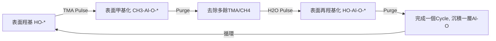

## 原子層沉積（Atomic Layer Deposition, ALD）核心原理與技術詳解

### 一、 第一性原理定義與核心概念

**Atomic Layer Deposition (ALD)** 是一種基於**sequential, self-limiting surface chemical reactions**的氣相薄膜沉積技術。其本質是將連續的化學反應分解為兩個或多個離散的、自我終止的半反應，通過精確控制前驅體的暴露順序和時間，實現**sub-monolayer**級別的厚度控制。

#### 核心特徵：

1.  **Self-limiting Surface Chemistry**：當所有表面活性位點反應完畢後，反應自動停止，這是ALD區別於CVD和PVD的最根本特徵。
2.  **Sequential Pulsing**：前驅體以脈衝形式交替引入，中間用inert gas purge隔開。
3.  **Surface-controlled Growth**：生長速率由表面化學反應決定，而非氣相中的擴散或傳輸過程。
4.  **Conformality & Uniformity**：能夠在複雜的三維結構上實現均勻的保形覆蓋。

> **第一性原理推導**：
> ALD的精確性源於化學反應的**表面飽和吸附**。假設表面活性位點密度為N_s (sites/cm²)，單個前驅體分子佔據的表面位點數為n，則理論上單個週期的最大沉積量為N_s/n。這種計量化學關係使得ALD能夠實現Ångström級別的精度。

### 二、 ALD 工作循環詳解

以最經典的 **Al₂O₃ ALD** 使用 **trimethylaluminum (TMA, Al(CH₃)₃)** 和 **H₂O** 為前驅體為例，一個完整的ALD cycle包括四個步驟：

#### 步驟1：金屬前驅體脈衝

- **過程**：TMA蒸氣脈衝進入反應腔，與表面羥基發生化學吸附。
- **反應式**：
  $$ \text{Al(CH}_3\text{)}_3 \text{(g)} + \text{HO-}^* \text{(s)} \rightarrow \text{(CH}_3\text{)}_2\text{AlO-}^* \text{(s)} + \text{CH}_4 \text{(g)} $$
  - 變量說明：
    - `Al(CH₃)₃ (g)`: 氣相TMA分子。
    - `HO-* (s)`: 表面羥基，`*` 代表表面活性位點。
    - `(CH₃)₂AlO-* (s)`: 表面吸附的中間產物，兩個甲基配體仍與Al原子鍵合。
    - `CH₄ (g)`: 氣相副產物甲烷。
- **機理**：TMA通過配體交換反應，將甲基基團轉移到表面，釋放CH₄。當所有表面羥基被消耗殆盡，反應自動停止，實現self-limiting。

#### 步驟2：惰性氣體吹掃

- **目的**：移除反應腔內多餘的TMA蒸氣和副產物CH₄，防止氣相預反應。
- **過程**：通入高純度N₂或Ar，將殘餘氣體排出。
- **重要性**：若吹掃不徹底，會導致CVD-like生長，破壞ALD特性。

#### 步驟3：氧源前驅體脈衝

- **過程**：H₂O蒸氣脈衝進入，與表面甲基配體反應。
- **反應式**：
  $$ \text{H}_2\text{O (g)} + \text{(CH}_3\text{)}_2\text{AlO-}^* \text{(s)} \rightarrow \text{(HO)}_2\text{AlO-}^* \text{(s)} + 2\text{CH}_4 \text{(g)} $$
  - 變量說明：
    - `(HO)₂AlO-* (s)`: 表面重新羥基化的Al-O結構，為下一個cycle準備了新的活性位點。
- **機理**：H₂O通過質子轉移反應，將表面甲基替換為羥基，同時生成CH₄。此過程同樣是self-limiting的。

#### 步驟4：惰性氣體吹掃

- **目的**：移除多餘的H₂O和生成的CH₄。
- **結果**：完成一個cycle，沉積了約一個原子層厚度的Al-O單元（實際厚度取決於前驅體位阻效應）。

### 三、 ALD 生長動力學與關鍵參數

#### 1. Growth Per Cycle (GPC)

ALD的生長速率定義為每個週期沉積的薄膜厚度，單位為 Å/cycle。

- **理論GPC**：理想單層生長，GPC由前驅體分子的表面覆蓋密度決定。
- **實際GPC**：受多種因素影響，包括：
  - **前驅體位阻效應**：大體積配體會降低表面覆蓋率。
  - **表面羥基密度**：不同襯底表面的初始活性位點數量不同。
  - **反應溫度**：影響化學吸附效率和副產物脫附。

**Al₂O₃ ALD的典型GPC**：約 1.1 Å/cycle。

#### 2. ALD 溫度窗口

ALD過程存在一個特定的溫度範圍，在此範圍內GPC基本恆定，稱為**ALD Temperature Window**。

| 溫度區域 | 特性 | 原因 |
| :--- | :--- | :--- |
| **低溫區** | GPC隨溫度升高而增加 | 表面反應動力學限制，反應不完全；前驅體凝結。 |
| **ALD Window** | GPC恆定，呈現平臺 | 表面反應完全，且前驅體無分解或脫附。 |
| **高溫區** | GPC隨溫度升高而降低或增加 | 前驅體熱分解（CVD-like）；表面羥基脫附（dehydroxylation）；或前驅體在表面發生分解。 |

> **第一性原理**：ALD Window的存在是表面反應活化能與前驅體熱穩定性共同作用的結果。在窗口內，反應速率足夠快以達到飽和，且前驅體不發生熱分解。

#### 3. 飽和曲線

飽和曲線描述了GPC與前驅體暴露時間的關係。典型的ALD飽和曲線呈現出"S"形：

1.  **線性增長區**：暴露時間短，表面未達飽和，GPC與暴露時間成正比。
2.  **過渡區**：隨暴露時間增加，GPC增長趨緩。
3.  **飽和平臺區**：暴露時間足夠長，表面完全覆蓋，GPC達到最大值並保持恆定。

**技術細節**：在實際工藝中，必須選擇足夠長的脈衝時間，確保工作在飽和平臺區，這樣才能保證薄膜的均勻性和重複性。

### 四、 ALD 與其他薄膜技術的比較

| 特性 | ALD | CVD (Chemical Vapor Deposition) | PVD (Physical Vapor Deposition) |
| :--- | :--- | :--- | :--- |
| **生長機制** | Sequential, self-limiting surface reactions | Continuous gas-phase reactions and surface deposition | Physical sputtering or evaporation |
| **厚度控制** | Ångström級精度，通過cycle數精確控制 | 較難精確控制，受流量、壓力、溫度多因素影響 | 較難精確控制，依賴時間和功率 |
| **均勻性** | 極佳，大面積均勻性<1% | 依賴氣體流場設計，均勻性較難保證 | 依賴靶材均勻性和襯底旋轉，均勻性較差 |
| **保形性** | 極佳，能覆蓋高深寬比結構 | 較差，受氣相擴散限制 | 極差，為線-of-sight過程 |
| **沉積速率** | 慢，通常< 1 nm/min | 快，可達數μm/hour | 中等至快 |
| **薄膜質量** | 高密度、低缺陷、無針孔 | 依賴工藝，可能產生柱狀晶 | 可能有柱狀晶結構，應力較大 |
| **適用材料** | 極廣泛，金屬、氧化物、氮化物、硫化物等 | 廣泛 | 主要為金屬、部分化合物 |
| **溫度範圍** | 低溫至中溫 (< 500°C) | 中溫至高溫 (300-1000°C) | 可室溫沉積 |

**關鍵區別**：ALD的核心優勢在於其**自限制**特性和**表面控制**生長模式，這賦予了它無與倫比的厚度精度和三維覆蓋能力。

### 五、 ALD 的分類與變體

#### 1. Thermal ALD

- **定義**：僅依靠熱能驅動表面化學反應，是最傳統的ALD形式。
- **特點**：工藝簡單，薄膜質量高，但需要一定的襯底溫度，且部分材料（如金屬、氮化物）生長困難。

#### 2. Plasma-Enhanced ALD (PEALD)

- **原理**：使用plasma（如O₂ plasma, N₂ plasma, H₂ plasma）作為反應物之一，替代熱ALD中的氣態前驅體（如H₂O, NH₃）。
- **優勢**：
  - **高反應活性**：plasma中的自由基和高能離子能促進反應，降低沉積溫度。
  - **更廣的材料範圍**：可生長純金屬、氮化物等熱ALD難以生長的材料。
  - **更高的薄膜密度**：離子轟擊可提高薄膜緻密度。
- **挑戰**：
  - **降低保形性**：自由基壽命短，在高深寬比結構中難以擴散到深處。
  - **襯底損傷**：高能離子可能損壞敏感襯底（如聚合物、有機層）。
- **應用**：高k柵介質、阻擋層、金屬電極沉積。

#### 3. Spatial ALD (SALD)

- **概念**：將時間順序的脈衝過程轉化為空間上的分離。襯底在不同前驅體區域之間移動，實現連續沉積。
- **優勢**：
  - **高吞吐量**：消除了purge時間，沉積速率可提高數十倍。
  - **適合大面積生產**：特別適用於太陽能電池、平板顯示器等大面積應用。
- **技術難點**：需要精密的氣體屏障設計，防止前驅體交叉污染。

#### 4. Molecular Layer Deposition (MLD)

- **定義**：ALD技術的延伸，用於沉積有機或混合有機-無機薄膜。
- **前驅體**：使用有機分子（如二醇、二胺）作為前驅體。
- **特點**：能精確控制聚合物鏈的長度和結構，實現單分子層級別的有機薄膜沉積。
- **應用**：柔性電子、滲透屏障層、生物界面工程。

### 六、 ALD 前驅體化學詳解

前驅體是ALD技術的核心，其性質直接決定了薄膜質量和工藝可行性。

#### 理想ALD前驅體的特徵：

1.  **足夠的揮發性**：在源溫度下具有適合的蒸氣壓（通常> 0.1 Torr），以實現足夠的傳輸通量。
2.  **足夠的反應活性**：能與襯底表面快速反應，在合理時間內達到飽和。
3.  **高熱穩定性**：在沉積溫度下不發生熱分解，避免CVD-like生長。
4.  **無自分解**：在表面吸附後，不發生進一步的分解反應。
5.  **副產物無腐蝕性、易揮發**：避免副產物在表面殘留或腐蝕薄膜。
6.  **安全性與成本**：低毒性、不易燃、價格合理。

#### 常見前驅體類型：

| 材料類別 | 常見前驅體 | 化學式 | 特點與挑戰 |
| :--- | :--- | :--- | :--- |
| **金屬氧化物** | Trimethylaluminum (TMA) | Al(CH₃)₃ | Al₂O₃ ALD的標準前驅體，活性高，但易燃。 |
| | Titanium tetrachloride (TiCl₄) | TiCl₄ | TiO₂ ALD常用，活性高，但副產物HCl有腐蝕性。 |
| | Tetrakis(dimethylamido)titanium (TDMAT) | Ti[N(CH₃)₂]₄ | 有機金屬前驅體，無鹵素，但熱穩定性較差。 |
| **金屬氮化物** | Tris(dimethylamido)gallium (TDMA Ga) | Ga[N(CH₃)₂]₃ | GaN ALD前驅體。 |
| | Hexakis(dimethylamido)ditungsten | W₂[N(CH₃)₂]₆ | WNₓ ALD前驅體。 |
| **金屬單質** | Bis(tert-butylimido)bis(dimethylamido)molybdenum | Mo[(NtBu)₂(NMe₂)₂] | Mo ALD前驅體。 |
| | (Methylcyclopentadienyl)manganese tricarbonyl | (MeCp)Mn(CO)₃ | Mn ALD前驅體，用於磁性材料。 |

> **技術細節**：前驅體的**ligand design**是ALD研究的關鍵領域。配體的大小、電子效應直接影響GPC、薄膜純度和沉積溫度。例如，使用更大位阻的配體（如(EtCp)₂Zr vs. Cp₂Zr）可以降低前驅體的反應活性，避免氣相預反應，但也可能降低GPC。

### 七、 ALD 的典型應用領域

#### 1. 半導體器件

- **高k柵介質**：HfO₂、ZrO₂、Al₂O₃替代SiO₂，用於FinFET、GAA-FET等先進器件。
- **阻擋層/粘附層**：TaN、TiN、WN，用於Cu互連結構，防止Cu擴散。
- **spacer定義工藝**：利用ALD的精確厚度控制，形成sub-lithographic特徵尺寸。
- **界面工程**：在high-k/Si界面插入Al₂O₃或SiNₓ界面層，改善電學特性。

**實驗數據示例**：Intel 45nm工藝中首次引入HfO₂ high-k柵介質，採用ALD技術沉積，等效氧化層厚度（EOT）降低至1nm以下，有效降低了柵漏電流。 [Reference: M. Bohr, et al., "The High-k Solution," IEEE Spectrum, 2007](https://spectrum.ieee.org/semiconductors/devices/the-highk-solution)

#### 2. 能源存儲與轉換

- **鋰離子電池**：
  - **電極表面包覆**：Al₂O₃、TiO₂、ZrO₂ ALD包覆LiCoO₂、LiNiMnCoO₂（NMC）等正極材料，抑制過渡金屬溶解和電解液分解，顯著提升循環壽命。
  - **固態電解質界面（SEI）人工構建**：在負極表面沉積超薄Al₂O₃層，穩定SEI。
  - **固態電池**：沉積LiPON、Li₃PO₄等固態電解質薄膜。
- **太陽能電池**：
  - **鈍化層**：Al₂O₃ ALD用於PERC電池背面鈍化，實現優異的場效應鈍化。
  - **緩衝層**：Zn(O,S) ALD替代CdS，用於CIGS和CdTe太陽能電池。
  - **鈣鈦礦太陽能電池**：SnO₂ ALD作為電子傳輸層，兼具高透光性和高遷移率。
- **燃料電池**：Pt ALD在碳載體上沉積超細Pt納米顆粒，最大化催化劑利用率。

#### 3. 催化劑與納米材料合成

- **催化劑製備**：在多孔載體上沉積高度分散的金屬納米顆粒（如Pt、Pd、Ru）。ALD能精確控制顆粒尺寸和載量。
- **核殼結構合成**：在納米顆粒表面沉積氧化物殼層，構建yolk-shell或核殼催化劑，提升穩定性和選擇性。
- **單原子催化劑**：利用ALD的原子級精度，實現單原子催化劑的可控制備。

**關鍵實驗數據**：通過ALD製備的Pt/TiO₂催化劑，Pt顆粒尺寸可控制在1-2 nm，質量比活性是傳統浸漬法催化劑的3-5倍。 [Reference: J. Lu, et al., "Synthesis of high-quality Pt nanoparticles by atomic layer deposition," Journal of Catalysis, 2013](https://www.sciencedirect.com/science/article/abs/pii/S0021951713001838)

#### 4. 光學塗層

- **抗反射塗層**：多層Al₂O₃/TiO₂/ZnO ALD薄膜，實現寬波段、廣角度的抗反射效果。
- **光學濾波器**：精確控制各層厚度，設計特定的光譜響應。
- **耐磨/防腐蝕塗層**：Al₂O₃、TiO₂ ALD塗層用於保護光學元件和器件。

#### 5. 生物醫學與防護塗層

- **生物相容性塗層**：TiO₂、Al₂O₃ ALD塗層用於植入物表面，改善生物相容性。
- **抗菌塗層**：沉積Ag、Cu等具有抗菌性能的金屬薄膜。
- **防滲透屏障層**：用於OLED封裝、食品包裝，阻隔水汽和氧氣。ALD Al₂O₃/ZnO多層膜可實現WVTR（Water Vapor Transmission Rate）< 10⁻⁶ g/m²/day的超低滲透率。

### 八、 ALD 的技術挑戰與未來發展方向

#### 1. 主要技術挑戰

- **沉積速率低**：傳統ALD的GPC通常為Å/cycle級別，cycle time在秒級，限制了其在某些高吞吐量應用中的推廣。**Spatial ALD**是主要解決方案之一。
- **前驅體成本與安全性**：許多高效前驅體（如金屬有機化合物）價格昂貴、有毒或易燃。開發新型、廉價、安全的綠色前驅體是重要方向。
- **顆粒污染**：前驅體在氣相中的預反應或冷凝可能產生顆粒，影響薄膜質量。優化反應器設計和氣路系統是關鍵。
- **高深寬比結構中的滲透極限**：對於極高深寬比（> 100:1）的結構，前驅體擴散時間極長，需要極長的脈衝時間，影響生產效率。
- **低溫ALD的薄膜質量**：低溫下反應不完全，薄膜可能含有較多雜質（如C、H），密度較低。PEALD可部分解決此問題。

#### 2. 未來發展趨勢

- **高通量ALD**：SALD、batch ALD、spatial-ALD技術的進一步成熟與產業化。
- **低溫ALD與柔性電子**：開發室溫或近室溫ALD工藝，用於聚合物、紙張、紡織品等溫度敏感襯底。
- **選擇性ALD (Area-Selective ALD, AS-ALD)**：
  - **原理**：利用表面化學性質的差異（如親水/疏水、活化/鈍化），實現只在特定區域沉積薄膜，類似於一個“自對準”的薄膜生長工藝。
  - **方法**：使用inhibitors、表面改質劑或種子層來定義生長/非生長區域。
  - **意義**：可簡化器件製造流程，減少光刻步驟，實現真正的bottom-up製造。
- **ALD in Porous and Nanostructured Materials**：用於MOFs、COFs、沸石等多孔材料的功能化，開闢催化、分離、傳感等新應用。
- **機器學習與AI輔助工藝開發**：利用AI模型預測前驅體性質、優化工藝參數，加速新材料和工藝的開發。

> **直覺構建**：將ALD想像成一個“**原子級的噴墨打印機**”。每一個cycle就像打印機的一個“噴頭”動作，精確地“噴”上一層原子。由於是基於化學反應的“自動停筆”機制，無需擔心“噴多”了。這種**化學上的自我限制**是其所有神奇特性的根源，使得它能夠在複雜的三維迷宮中均勻地“刷漆”。

### 參考文獻與推薦閱讀

1.  **經典綜述**：M. Leskelä and M. Ritala, "Atomic layer deposition (ALD): from precursors to thin nanostructures," *Thin Solid Films*, 2002. [Link](https://www.sciencedirect.com/science/article/abs/pii/S0040609002000801)
2.  **ALD基礎教程**：A. C. Jones and M. L. Hitchman, *Chemical Vapour Deposition: Precursors, Processes and Applications*, RSC Publishing, 2009.
3.  **ALD應用綜述**：V. Miikkulainen, et al., "Crystallinity of inorganic films grown by atomic layer deposition: Overview and general trends," *Journal of Applied Physics*, 2013. [Link](https://aip.scitation.org/doi/10.1063/1.4757907)
4.  **PEALD專題**：H. B. Profijt, et al., "Plasma-Assisted Atomic Layer Deposition: Basics, Opportunities, and Challenges," *Journal of Vacuum Science & Technology A*, 2011. [Link](https://avs.scitation.org/doi/10.1116/1.3609974)
5.  **ALD前驅體設計**：S. M. George, "Atomic Layer Deposition: An Overview," *Chemical Reviews*, 2010. [Link](https://pubs.acs.org/doi/10.1021/cr900056b)
6.  **選擇性ALD綜述**：A. J. M. Mackus, et al., "From atomic layer deposition to area-selective atomic layer deposition," *Journal of Vacuum Science & Technology A*, 2014. [Link](https://avs.scitation.org/doi/10.1116/1.4900839)
7.  **Spatial ALD技術**：P. Poodt, et al., "Spatial atomic layer deposition: A route towards further industrialization of high volume ALD," *Journal of Vacuum Science & Technology A*, 2012. [Link](https://avs.scitation.org/doi/10.1116/1.3683429)