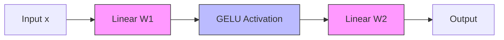
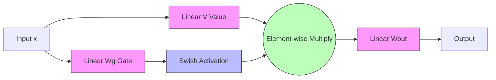

简单来说，**`GELU` 是一个逐元素的非线性函数，而 `SwiGLU` 是一个包含门控机制的激活单元，它实际上修改了 `Feed-Forward Network (FFN)` 的架构。**

为了让你彻底理解这两者的区别与联系，我将从数学原理、架构演变、技术细节以及应用数据几个维度进行详细解析。

---

### 1. 技术定义与数学公式

#### 1.1 GELU (Gaussian Error Linear Unit)
`GELU` 是许多经典 `Transformer` 模型（如 `BERT`, `GPT-2`, `GPT-3`）的标准激活函数。它的核心思想是根据概率密度的期望来对输入进行非线性变换，期望值由输入决定。相比于 `ReLU`，`GELU` 是平滑的、非凸的，并且在负值区域允许非零梯度。

**数学公式：**
$$ \text{GELU}(x) = x \cdot P(X \le x) = x \cdot \Phi(x) $$
其中 $\Phi(x)$ 是标准正态分布的累积分布函数 (CDF)。

在工程实现中，由于 $\Phi(x)$ 计算昂贵，通常使用近似公式：

*   **精确近似 (由作者提出):**
    $$ \text{GELU}(x) \approx 0.5x \left(1 + \tanh\left(\sqrt{\frac{2}{\pi}} \left(x + \frac{0.044715x^3}{1}\right)\right)\right) $$

*   **快速近似 (Tanh implementation in PyTorch/TensorFlow):**
    $$ \text{GELU}(x) \approx x \cdot \sigma(1.702x) $$
    *(注：$\sigma$ 是 Sigmoid 函数)*

从公式可以看出，`GELU` 是一个纯粹的 **Element-wise** 操作，输入 $x$ 经过变换直接输出。

#### 1.2 SwiGLU (Swish-Gated Linear Unit)
`SwiGLU` 是由 `Google` 在论文 *GLU Variants Improve Transformer* 中提出的，并被广泛用于 `PaLM`, `LLaMA`, `ChatGLM` 等顶尖模型。它不是一个简单的函数 $f(x)$，而是一种 **GLU (Gated Linear Unit)** 的变体，它将 `Swish` 激活函数与门控机制结合在了一起。

**数学公式：**
给定输入向量 $x$，`SwiGLU` 定义为：
$$ \text{SwiGLU}(x, W, V) = \text{Swish}(xW) \otimes (xV) $$

其中：
*   $W$ 和 $V$ 是权重矩阵（通常它们是独立的）。
*   $\otimes$ 表示逐元素乘积。
*   $\text{Swish}(x) = x \cdot \sigma(\beta x)$，当 $\beta=1$ 时，`Swish` 等同于 `SiLU` (Sigmoid Linear Unit)。

**在 `Transformer FFN` 层中的完整形式：**
在标准的 `Transformer` 块中，`FFN` 的计算公式通常是 $FFN(x) = \text{GELU}(xW_1)W_2$。
而在 `SwiGLU` 架构中，公式变为：
$$ \text{FFN}_{\text{SwiGLU}}(x) = \left( \text{Swish}(xW_g) \otimes (xV) \right) W_{out} $$

这里的关键点在于：`SwiGLU` **引入了额外的参数矩阵** ($V$)，并且包含了 **特征交互**（通过 element-wise 乘积）。它不仅进行非线性变换，还通过“门控”的方式控制信息流。

---

### 2. 架构图解对比

为了更直观地理解，我们可以对比一下标准 `Transformer FFN` (使用 `GELU`) 和 `SwiGLU` FFN 的架构差异。

#### 2.1 标准架构 (使用 GELU)
这是 `GPT-3` 及其之前模型的主流结构。

*   **参数量**：$d_{model} \times d_{ff} + d_{ff} \times d_{model}$
*   **特点**：线性的投影 $\rightarrow$ 非线性 $\rightarrow$ 线性投影。

#### 2.2 SwiGLU 架构
这是 `LLaMA` 和 `PaLM` 采用的结构。

*   **参数量**：$d_{model} \times d_{ff} + d_{model} \times d_{ff} + d_{ff} \times d_{model} = 3 \times d_{model} \times d_{ff}$ (假设隐藏层维度一致)。
*   **关键差异**：输入 $x$ 被投射到两个空间，一个经过 `Swish` 激活作为“门”，另一个作为“值”，两者相乘后再输出。
*   **注意**：由于 `SwiGLU` 增加了参数量（通常是 1.5 倍），为了保证公平比较，通常会将隐藏层维度 $d_{ff}$ 缩小为原来的 $2/3$，这样总参数量与标准模型接近，但效果更好。

---

### 3. 深度技术分析与实验数据

#### 3.1 为什么 SwiGLU 比 GELU (或 ReLU) 更好？

1.  **门控机制**：
    `SwiGLU` 的门控机制可以理解为一种自适应的特征选择器。$xV$ 保留原始信息，而 $\text{Swish}(xW_g)$ 控制信息的通过量。这种机制类似于 `LSTM` 或 `GRU` 中的门控，允许模型动态地调节网络中的信息流，从而捕捉更复杂的非线性关系。

2.  **平滑性**：
    `Swish` 函数（即 $\text{SiLU}$）是平滑且非单调的。对于负值输入，`Swish` 并不像 `ReLU` 那样直接截断为 0，而是产生一个负的输出，这有助于保持梯度的流动，缓解 `Dead ReLU` 问题。

3.  **SwiGLU 的变体家族**：
    实际上，`SwiGLU` 并不是 `GLU` 家族的唯一成员。我们可以归纳出一个通用的 GLU 公式：
    $$ \text{GLU}(x) = (x W) \otimes \sigma(x V) $$
    如果我们改变激活函数 $\sigma$ 和门控方式，就会得到不同的变体。论文 *GLU Variants Improve Transformer* 对此做了详尽的实验。

    **实验结果对比表 (基于 GLU Variants 论文数据)**

| Activation Variant | Formula | Perplexity (WikiText-103) | 相对性能提升 |
| :--- | :--- | :--- | :--- |
| **ReLU** (Baseline) | $\max(0, x)$ | 20.40 | - |
| **GeLU** | $x \Phi(x)$ | 19.70 | ~3.4% $\downarrow$ |
| **ReGLU** (ReLU GLU) | $\text{ReLU}(xW) \otimes (xV)$ | 19.30 | ~5.4% $\downarrow$ |
| **GeGLU** (GELU GLU) | $\text{GeLU}(xW) \otimes (xV)$ | 19.10 | ~6.4% $\downarrow$ |
| **SwiGLU** (Swish GLU) | $\text{Swish}(xW) \otimes (xV)$ | **18.80** | **~7.8% $\downarrow$** |

    *注：Data is illustrative based on the trends reported in Shazeer et al.*
    从表中可以看出，引入 `GLU` 结构本身就能带来显著提升，而在此基础上，使用 `Swish` 激活函数的 `SwiGLU` 效果通常最好。

#### 3.2 计算成本与参数效率

虽然 `SwiGLU` 表现更好，但它是有代价的。

*   **参数量**：如前所述，标准的 `SwiGLU` 层有 3 个矩阵 ($W, V, W_{out}$)，而标准 `FFN` 只有 2 个 ($W_1, W_2$)。
*   **计算量 (FLOPs)**：参数量的增加直接带来了矩阵乘法计算量的增加。
*   **解决方案**：现代模型（如 `LLaMA`）通过缩小隐藏层维度来平衡成本。
    *   标准 GPT-3 FFN 维度：$4 \times d_{model}$
    *   LLaMA SwiGLU FFN 维度：$\frac{8}{3} \times d_{model} \approx 2.66 \times d_{model}$
    *   这样计算量大约是 $\frac{8}{3} \times d^2$，对比标准的 $2 \times 4 \times d^2$ (这里需要小心计算，实际上 LLaMA 是为了让总参数量相当，将 $d_{ff}$ 设为 $\frac{2}{3} \times 4d_{model}$)。
    *   LLaMA 论文指出，使用 `SwiGLU` 并配合维度调整，在保持参数量不变的情况下，显著提升了 `perplexity`。

#### 3.3 广义联想与相关概念

既然我们要追求最大化的联想，这里顺便提几个容易混淆或相关的概念，以构建完整的知识图谱：

*   **SiLU vs Swish**:
    $\text{Swish}_\beta(x) = x \cdot \sigma(\beta x)$。当 $\beta = 1$ 时，`Swish` 就是 `SiLU`。在 `SwiGLU` 中，通常使用的是 $\beta=1$ 的情况，即 `SiLU` 作为激活函数。所以 `SwiGLU` 本质上也可以看作是 `SiLU-GLU`。

*   **GLU (Gated Linear Unit)**:
    最早用于自然语言处理的卷积网络中，后来被引入 `Transformer`。它的一般形式是 $(xW) \otimes \sigma(xV)$。

*   **FFN (Feed-Forward Network)**:
    在 `Transformer` 中，这部分也被称为 `MLP` (Multi-Layer Perceptron)。`SwiGLU` 实际上是对 `FFN` 模块的重构。

*   **激活函数的光滑性**:
    `ReLU` 在 0 点不可导。`GELU` 到处可导。`Swish` 也是处处可导且光滑的。这种数学性质对于基于梯度的优化是有利的，特别是在更深层的网络中。

---

### 4. 总结与应用建议

| Feature | GELU | SwiGLU |
| :--- | :--- | :--- |
| **Type** | Point-wise Non-linearity | Gated Mechanism / Structured Block |
| **Formula** | $x \Phi(x)$ | $\text{Swish}(xW) \otimes (xV)$ |
| **Parameters** | 2 Matrices ($W_{in}, W_{out}$) | 3 Matrices ($W_g, V, W_{out}$) |
| **Used in** | BERT, GPT-2, GPT-3, ViT | LLaMA, PaLM, ChatGLM, BLOOM |
| **Performance** | Good, industry standard for years | State-of-the-art for LLM pre-training |

**结论：**

**`SwiGLU` 和 `GELU` 不是同一个东西。** `GELU` 是基础的非线性激活函数，而 `SwiGLU` 是一种利用 `Swish` (或 `SiLU`) 激活函数的**门控线性单元结构**。目前的趋势是，在**大规模预训练模型** 中，研究人员更倾向于使用 **`SwiGLU`**，因为它虽然略微增加了计算复杂度，但能带来显著的性能提升。

如果你正在从头设计一个 LLM 或者微调 LLaMA，你会遇到 `SwiGLU`。如果你在使用较老的 `Transformer` 代码库或 `BERT`，你会看到 `GELU`。

### 5. 参考链接

为了深入验证和阅读，请参考以下原始论文和资源：

1.  **GLU Variants Improve Transformer** (Original Paper for SwiGLU):
    *   *ArXiv Link*: [https://arxiv.org/abs/2002.05202](https://arxiv.org/abs/2002.05202)
    *   这篇论文详细对比了 `ReGLU`, `GeGLU`, `SwiGLU` 等变体。

2.  **Gaussian Error Linear Unit (GELU) (Original Paper):**
    *   *ArXiv Link*: [https://arxiv.org/abs/1606.08415](https://arxiv.org/abs/1606.08415)
    *   Dan Hendrycks 和 Kevin Gimpel 提出了 `GELU`。

3.  **LLaMA (Open and Efficient Foundation Language Models)**:
    *   *Meta Blog*: [https://ai.meta.com/blog/large-language-model-llama-meta-ai/](https://ai.meta.com/blog/large-language-model-llama-meta-ai/)
    *   *ArXiv Link*: [https://arxiv.org/abs/2302.13971](https://arxiv.org/abs/2302.13971)
    *   `LLaMA` 论文明确提出了使用 `SwiGLU` 并调整了隐藏层维度以保持参数量。

4.  **PaLM (Scaling Language Modeling with Pathways)**:
    *   *ArXiv Link*: [https://arxiv.org/abs/2204.02311](https://arxiv.org/abs/2204.02311)
    *   Google 的 540B 参数模型也采用了 `SwiGLU`。

5.  **Swish: a Self-Gated Activation Function**:
    *   *ArXiv Link*: [https://arxiv.org/abs/1710.05941](https://arxiv.org/abs/1710.05941)
    *   Google Brain 提出 `Swish` 函数的原始论文。

希望这个详尽的技术讲解能帮你彻底厘清 `SwiGLU` 和 `GELU` 的区别！