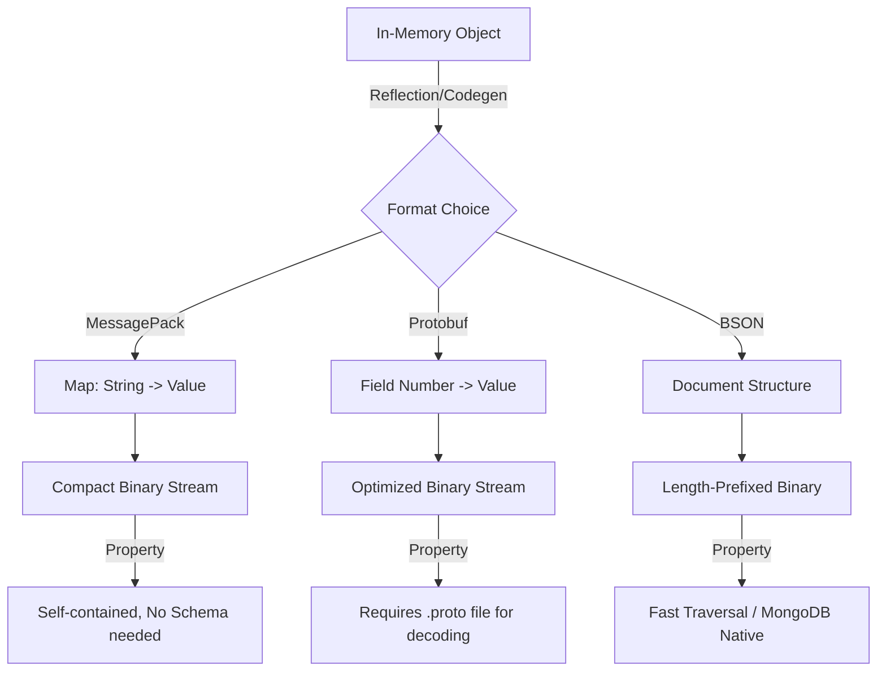

根据 **第一性原理**，数据序列化的本质是 **数据结构** 与 **字节流** 之间的映射。这种映射追求三个核心指标：**空间效率**、**时间效率** 和 **易用性**。

以下是对 **MessagePack** 的深度解析及其与 **Protobuf**、**BSON** 的全方位对比。

---

### 1. MessagePack: 核心直觉

**MessagePack** 的核心理念是：**It's like JSON, but fast and small.**

从第一性原理看，JSON 的主要问题在于文本冗余。例如，数字 `123` 在 JSON 中占用 3 个字节，而在二进制中仅需 1 个字节。**MessagePack** 通过牺牲部分可读性，将 JSON 的文本标记转换为极其紧凑的二进制标记。

#### 技术细节：Type-Length-Value (TLV) 变体

**MessagePack** 没有采用标准的 TLV 结构，而是采用了 **Type-Value (TV)** 和 **Type-Length-Value (TLV)** 混合的模式。它利用了 CPU 指令集中的“前缀码”概念。

**格式规范解析:**

一个 **MessagePack** 字节流的首字节决定了数据类型和部分元数据。

1.  **Positive FixNum (正数小整数)**:
    *   **Pattern**: `0XXXXXXX`
    *   **公式**: $V = B \ \& \ 0x7F$
    *   **解释**: 如果首字节最高位是 `0`，那么剩下的 7 bits 直接表示数值 $V$。范围 $[0, 127]$。
    *   **Intuition**: 这是一个极致的优化。对于常见的小整数，不需要额外的 Length 字段，1 个字节全部用来承载信息，Overhead 为 0。

2.  **FixMap (小 Map)**:
    *   **Pattern**: `1000XXXX`
    *   **公式**: $N = B \ \& \ 0x0F$
    *   **解释**: 首字节高 4 位为 `1000`，低 4 位表示 Map 中元素的数量 $N$。最大支持 15 个键值对。
    *   **Intuition**: 类似于计算机总线中的控制信号，高位用于路由，低位携带参数。

3.  **Variable Length (变长类型)**:
    *   对于超过 Fix 范围的数据，使用 `Type byte` + `Length` + `Payload`。
    *   例如 `str 16`：`0xDA` (Type) + `2 bytes length` + `payload`。

**对比 JSON**:
假设序列化 `{"compact": true}`:
*   **JSON**: `{"compact":true}` -> 14 bytes.
*   **MessagePack**:
    *   `FixMap(1 element)`: `81` (1 byte)
    *   `FixStr(7 chars "compact")`: `a7 "compact"` (1 + 7 bytes)
    *   `True`: `c3` (1 byte)
    *   Total: 1 + 1 + 7 + 1 = 10 bytes.

---

### 2. Protobuf (Protocol Buffers): Schema-Driven 的极致

**Protobuf** 的直觉与 **MessagePack** 截然不同。它基于一个假设：**Schema 是预先知晓的**。

#### 核心技术：Field Number + Wire Type

**Protobuf** 不传输 Key (如字符串 "compact")，而是传输 Field Number (数字 ID)。这是其比 **MessagePack** 更紧凑的根本原因。

**编码公式**:
每一个字段被编码为 Key-Value 对。
$$Key = (field\_number << 3) | wire\_type$$

*   $field\_number$: `.proto` 文件中定义的字段序号 (e.g., `optional string name = 1;` 中的 1)。
*   $wire\_type$: 数据类型标识 (0 for Varint, 2 for Length-delimited, etc.)。
*   $<< 3$: 左移三位，相当于乘以 8。

**Varint 编码原理**:
**Protobuf** 使用 Varint 压缩整数。
*   **公式**: 每个字节的最高位 (MSB) 是延续位。
    *   如果 $MSB = 1$，表示后面还有字节。
    *   如果 $MSB = 0$，表示这是最后一个字节。
    *   剩余 7 bits 是有效载荷 (Payload)。
*   **Intuition**: 这是一种动态自适应编码。小数字用很少的字节，大数字才用多字节。虽然 **MessagePack** 也有类似机制，但 **Protobuf** 结合 Field Number 节省了 Key 的开销。

**ZigZag Encoding (针对负数)**:
为了解决负数 Varint 效率低的问题，**Protobuf** 引入 ZigZag。
*   **公式**: $n_{zigzag} = (n << 1) \oplus (n >> 31)$ (for 32-bit)。
*   **解释**: 将负数映射为正奇数，正数映射为正偶数。例如 -1 -> 1, 1 -> 2。这使得接近 0 的负数也能用 1-2 字节表示。

---

### 3. BSON (Binary JSON): MongoDB 的选择

**BSON** 的直觉是：**Traversal Efficiency > Space Efficiency**。

#### 核心技术：Length-Prefixed Documents

**BSON** 设计之初是为了服务于 **MongoDB** 数据库。数据库在查询时，经常需要“跳过”某个字段。JSON 是流式文本，跳过字段必须一直扫描直到找到分隔符。**BSON** 在每个 Document 的头部存储了总长度。

**结构解析**:
`int32 length | e_list | 0x00`

*   **Intuition**: 空间换时间。虽然存储了额外的 4 bytes 长度信息，但解析器可以瞬间 `seek` 到下一个 Document 或 Field，不需要像 **JSON** 那样逐字符解析。

**额外类型支持**:
**BSON** 扩展了 **JSON** 的类型系统：
*   **Binary data**: 直接存储字节流。
*   **Date**: 64-bit integer timestamp。
*   **ObjectId**: MongoDB 特有的 12-byte ID。

---

### 4. 深度对比实验数据表

基于 **First Principles**，我们从数据熵和计算复杂度维度构建对比直觉。

| Feature | **MessagePack** | **Protobuf** | **BSON** |
| :--- | :--- | :--- | :--- |
| **Schema Requirement** | **Schema-less** (Self-describing) | **Schema-required** (Requires `.proto`) | **Schema-less** |
| **Encoding Type** | Hybrid (TV + TLV) | Tag-Value (Varint-based) | TLV (Length-prefixed) |
| **Key Transmission** | Transmits **Full String Key** | Transmits **Integer Field ID** | Transmits **Full String Key** |
| **Payload Size (Typical)** | Medium (Small than JSON, > Protobuf) | **Smallest** (High entropy density) | Large (Larger than JSON sometimes) |
| **Parsing Speed** | Fast (O(N), lookup based) | Fastest (No string key parsing) | Fast (Traversal optimized) |
| **Human Readability** | Low (Binary, but close to JSON structure) | Lowest (Opaque binary) | Low |
| **Data Evolvability** | Good (Loose coupling) | **Best** (Forward/Backward compatibility design) | Good |

#### 实验数据模拟

假设 payload 为一个包含 10 个键值对的 struct，Key 平均长度 5 字节，Value 为小整数。

1.  **JSON**: `{"key_1": 1, ...}`
    *   Size $\approx 10 \times (5 \text{ (key)} + 2 \text{ (quotes)} + 1 \text{ (colon)} + 1 \text{ (val)} + 1 \text{ (comma)}) \approx 100$ bytes.
    *   Overhead: Quotes, Colons, Braces.

2.  **MessagePack**:
    *   Size $\approx \sum (1 \text{ (FixStr header)} + 5 \text{ (key)} + 1 \text{ (FixInt)}) \times 10$.
    *   Total: $70$ bytes.
    *   节省了 Syntax overhead (quotes, colons).

3.  **Protobuf**:
    *   Size $\approx \sum (1 \text{ (Key=FieldID+Type)} + 1 \text{ (Varint Value)}) \times 10$.
    *   Total: $20$ bytes.
    *   **为什么这么小？** 它将 5 字节的 String Key 压缩成了 1 字节的 Field ID Tag。

4.  **BSON**:
    *   Size $\approx 4 \text{ (doc len)} + \sum (1 \text{ (type)} + 5 \text{ (key)} + 1 \text{ (null term)} + 1 \text{ (val)}) \times 10 + 1 \text{ (end null)}$.
    *   Total: $\approx 80-90$ bytes.
    *   BSON 通常比 JSON 略大或相近，因为它存储了 Type byte 和 Length overhead，但解析速度更快。

---

### 5. 架构图解与联想

#### Serialization Pipeline

#### 联想与技术外延

1.  **Google FlatBuffers vs Cap'n Proto**:
    *   **Protobuf/MessagePack** 都需要 "Unmarshaling" (解码到内存对象)。
    *   **FlatBuffers** 采用 "Zero-copy" 原理。二进制数据直接映射为内存对象，无需解析步骤。这利用了操作系统的 **Memory Mapping (mmap)** 机制。
    *   **Intuition**: 如果 **Protobuf** 是压缩包，**FlatBuffers** 就是直接可执行的内存镜像。

2.  **RPC 框架中的应用**:
    *   **gRPC** 默认使用 **Protobuf**。为什么？因为 RPC 通常在服务端之间进行，Schema 定义一致可以最大化带宽效率。Field ID 机制使得增删字段非常安全。
    *   如果是 **WebSocket** 推送给前端，**MessagePack** 更优。因为前端通常没有预定义的 Schema (JavaScript dynamic nature)，且 **MessagePack** 有完善 JS 库支持。

3.  **JSON 的统治地位**:
    *   尽管 **MessagePack** 更高效，**JSON** 依然统治 Web。这是 **Metcalf's Law** (网络效应) 的体现。HTTP/1.1 的 `Content-Type: application/json` 已经成为基础设施的一部分。

---

### 6. 总结与建议

*   **选择 Protobuf**: 如果你在设计 **Internal APIs** (微服务间通信)、**RPC** 或者对 **Bandwidth** 极其敏感的场景。你需要严格的 Schema 来保证数据契约。
*   **选择 MessagePack**: 如果你在做 **Browser-Server** 通信，需要替换 **JSON** 以获得性能提升，但不想引入复杂的 Schema 定义。它保持了 **JSON** 的灵活性。
*   **选择 BSON**: 如果你在使用 **MongoDB**。它是数据库的原生格式，优化了修改和遍历操作，但作为通用网络传输格式，它比 **MessagePack** 臃肿。

### References

1.  **MessagePack Official Specification**:
    *   Detailed format spec: [https://github.com/msgpack/msgpack/blob/master/spec.md](https://github.com/msgpack/msgpack/blob/master/spec.md)
2.  **Protocol Buffers Encoding**:
    *   Google's official guide on Varint, ZigZag, and Wire Types: [https://developers.google.com/protocol-buffers/docs/encoding](https://developers.google.com/protocol-buffers/docs/encoding)
3.  **BSON Specification**:
    *   Structure and types: [http://bsonspec.org/spec.html](http://bsonspec.org/spec.html)
4.  **Comparison of Data Serialization Formats**:
    *   Wikipedia overview: [https://en.wikipedia.org/wiki/Comparison_of_data-serialization_formats](https://en.wikipedia.org/wiki/Comparison_of_data-serialization_formats)