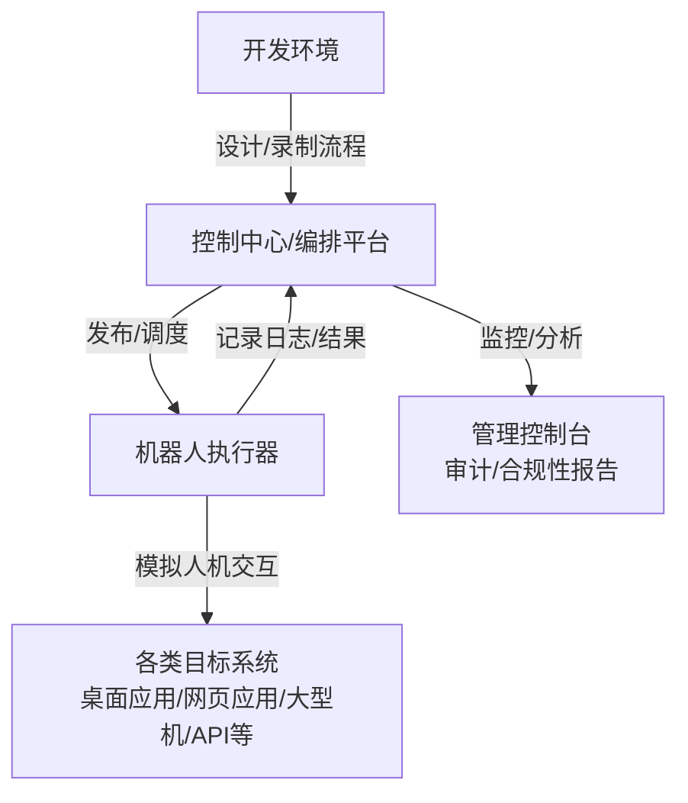

好的，我们来深度、系统地解析 **Robotic Process Automation (RPA)**。我将结合最新技术趋势，从直觉、原理、架构到应用进行全方位构建。

### 1. 核心直觉：RPA 是什么？
你可以把 RPA 想象成一个 **“数字劳动力”** 或 **“软件机器人”**。它不是一个物理的机器人，而是一段运行在电脑或服务器上的软件程序。

*   **核心类比**：它像一个**极其快速、从不疲倦、严格按规则操作**的虚拟实习生。你教他如何点击哪个按钮、从哪个Excel单元格复制数据、粘贴到哪个系统表单、最后发送一封邮件。他就能7x24小时、零错误地重复这个操作。
*   **关键特征**：**非侵入式**。它通过模拟人类在图形用户界面（GUI）上的操作（如鼠标点击、键盘输入）来工作，**不需要**修改底层的企业应用程序（如SAP, Oracle, CRM）的代码或数据库。它工作在应用“之外”。
*   **与宏/脚本的区别**：传统宏/脚本通常绑定在特定应用程序（如Excel VBA）内。RPA 是**跨应用**的，可以在多个不相关的系统（如网页、桌面软件、大型机终端）之间自动传递和操作数据，实现端到端流程自动化。

### 2. 技术架构深度解析
一个典型的现代 RPA 平台（如 UiPath, Automation Anywhere, Blue Prism）包含以下核心组件：



**组件详解：**

1.  **开发环境 / 设计器**：
    *   **低代码/无代码界面**：提供拖拽式活动库（如 `Click`, `Type Into`, `Read Cell`, `If/Else`），业务人员也能参与设计。
    *   **录制功能**：类似宏录制，但更智能。可以录制用户在界面上的操作，并优先生成**选择器（Selectors）**，用于精确定位UI元素（如网页的按钮、桌面的输入框）。**核心技术**：通常使用 **UI Automation（微软UI Automation框架）**、**Accessibility API** 或**图像/计算机视觉识别**来“看到”并理解界面元素。
    *   **调试器**：单步执行、设置断点、查看变量值。

2.  **控制中心 / 编排平台**：
    *   **中央管理枢纽**：这是RPA的“大脑”。
    *   **机器人管理**：注册、授权、调度大量机器人的启动、停止。
    *   **流程部署**：将开发好的流程包（`.xaml`， `.atmx` 等格式）发布到机器人。
    *   **队列管理（关键概念）**：对于批量处理（如处理1000张发票），流程不是一次性加载所有数据。控制中心创建**队列（Queue）**，机器人从队列中按顺序**获取工作项（Work Item）** 进行处理。这实现了**负载均衡**和**高可用性**——一个机器人挂了，另一个可以接手。
    *   **日志与审计**：记录每个步骤的成功/失败、耗时、操作人，满足合规（如SOX, GDPR）要求。

3.  **机器人执行器**：
    *   **运行环境**：可以是**用户交互式机器人**（在登录的桌面会话中运行，适合需要人工干预的流程）或**非交互式/无人值守机器人**（在Windows服务或虚拟化环境中运行，实现后台全自动）。
    *   **运行时核心**：读取流程定义，与目标系统交互。其“智能”程度取决于使用的技术：
        *   **基于选择器**：最稳定，但要求目标界面结构不变。
        *   **基于计算机视觉**：当界面选择器失效（如老旧系统、虚拟化环境），使用OCR（光学字符识别）和图像匹配来“看”屏幕。
        *   **基于API**：这是**RPA的进化方向**。如果目标系统提供API（如REST, SOAP），机器人应优先调用API，这比模拟UI操作更**稳定、高效、安全**。

4.  **目标系统**：任何有图形界面或API的软件。RPA的价值在于**连通异构系统**。

### 3. 关键技术细节与公式

*   **选择器（Selector）稳定性**：
    *   一个典型的UI Automation选择器类似于XML片段：`<wnd app='chrome.exe' title='Login Page' /> <btn name='submit' />`。
    *   **变量**：使用`*`（通配符）或`?`（单字符）来应对动态变化的部分（如会话ID）。
    *   **锚点（Anchor）**：当目标元素本身不稳定时，相对于一个稳定的“锚点”元素（如固定标签）来定位目标。

*   **异常处理（Exception Handling）机制**：
    RPA流程必须健壮。标准模式是 **`Try-Catch-Finally`**。
    ``` pseudocode
    Try {
        执行主要步骤（如登录系统、读取数据）
    } Catch (业务异常， 如“记录未找到”) {
        执行特定处理（如记录失败ID到日志队列，发送通知）
    } Catch (系统异常， 如“应用无响应”) {
        执行重试逻辑（最多N次）或终止流程并告警
    } Finally {
        清理工作（如关闭应用、释放资源），无论成功失败都执行
    }
    ```

*   **投资回报率（ROI）估算模型**：
    一个简单的ROI计算可表示为：
    $$
    ROI = \frac{\text{总成本节约} + \text{效率提升价值} - \text{总实施成本}}{\text{总实施成本}} \times 100\%
    $$
    *   **总成本节约**：`= 自动化前人力工时（小时） × 人力时薪 × 自动化流程年运行次数 - 机器人运行时成本`
    *   **效率提升价值**：24/7运行、零错误减少返工、加速业务流程带来的业务收益（如更快收款）。
    *   **总实施成本**：软件许可费、开发咨询费、基础设施（虚拟机/服务器）费、维护费。

### 4. RPA 与人工智能（AI）的融合：迈向“智能自动化”/“超自动化”
传统RPA是**规则驱动**的，只能处理结构明确、变体少的任务。现代RPA平台集成了多种AI能力，演变为 **Hyperautomation**：

| AI 能力 | 在 RPA 中的应用 | 举例 |
| :--- | :--- | :--- |
| **计算机视觉 (CV)** | 识别非标准界面、验证码、扫描文档图像 | 自动化需要识别图像按钮或验证码的流程 |
| **OCR (光学字符识别)** | 从图像、PDF、扫描件中提取文本 | 从发票图片中提取供应商、金额、日期 |
| **NLP (自然语言处理)** | 理解非结构化文本，分类，情感分析 | 从邮件正文中提取投诉内容并分类；自动回复简单客服邮件 |
| **ML (机器学习)** | 进行分类、预测、异常检测 | 对发票进行三单匹配（PO、发票、收货单）时，使用ML模型判断供应商名称是否一致；预测流程瓶颈 |
| **智能文档处理 (IDP)** | 结合OCR、NLP、CV处理复杂文档 | 从合同PDF中提取关键条款、签名、日期 |

**集成方式**：通常通过**RPA平台的AI技能库**或调用**外部AI服务**（如Azure Form Recognizer， Google Document AI， 自定义ML模型）来实现。RPA负责**流程编排**和**系统交互**，AI负责**认知决策**和**非结构化数据处理**。

### 5. 实施流程与挑战

*   **典型实施路径**：
    1.  **识别与评估**：流程发现（Process Discovery）、流程挖掘（Process Mining）工具分析现有系统日志，识别高自动化潜力的重复性、高体积、规则明确的流程。
    2.  **设计与开发**：在沙箱环境中设计流程，编写脚本。
    3.  **测试**：在隔离环境中进行单元测试、集成测试、用户接受测试（UAT）。
    4.  **部署与上线**：发布到生产控制中心，逐步切换。
    5.  **运维与优化**：监控机器人性能，处理异常，持续优化流程。

*   **主要挑战与局限性**：
    *   **流程变异性**：如果业务规则经常变化，或同一流程有多个变体，维护成本极高。**解决方案**：设计更灵活的流程，或使用AI进行自适应。
    *   **环境变化**：目标软件UI升级（如网站改版）会导致选择器失效，流程中断。**解决方案**：使用更健壮的选择器策略，定期维护。
    *   **治理与安全**：机器人拥有类似人的系统访问权限，需严格管理凭据（使用**凭证保险库**）、职责分离（SoD）。
    *   **技能差距**：需要兼具业务理解、流程分析和基础技术知识的**RPA开发者**或**业务分析师**。
    *   **不是万能药**：不适合需要人类判断、创造性、复杂沟通的流程。它自动化的是“任务”，而非“工作”。

### 6. 主流RPA平台与生态
*   **三大巨头（传统）**：UiPath (.NET-based)， Automation Anywhere (基于Web的架构)， Blue Prism（强调IT治理，最初基于Java）。
*   **云原生/新兴力量**：Microsoft Power Automate（深度集成Microsoft 365生态，低代码优势）， SAP Signavio， IBM Robotic Process Automation。
*   **开源选项**：Robot Framework（关键字驱动，更贴近测试自动化）， Taskt（C#开源）。

### 7. 典型应用场景（行业无关）
*   **财务与会计**：AP/AR处理、工资单处理、费用报告审计、总账对账。
*   **人力资源**：员工入职/离职（创建账号、分配权限）、简历筛选、考勤数据同步。
*   **客户服务**：从邮件提取信息创建工单、自动回复常见问题、订单状态查询。
*   **IT运维**：密码重置、用户账户 provisioning/deprovisioning、监控告警自动处理、软件部署。
*   **供应链**：订单录入、物流跟踪、库存水平更新、供应商数据维护。

### 总结与趋势
RPA 已从最初的“屏幕抓取”工具，演变为 **“数字劳动力 orchestration 平台”**，并与**AI、低代码、流程挖掘、iPaaS（集成平台即服务）** 深度融合，形成 **超自动化** 的核心引擎。

**未来方向**：
1.  **完全自主的自动化**：通过AI持续发现、建议、构建和优化自动化流程。
2.  ** everywhere 机器人**：更轻量、事件驱动的机器人，可嵌入到任何业务流程或应用中。
3.  **更好的公民开发者体验**：让业务人员通过自然语言描述需求，AI自动生成流程。
4.  **集中式治理与分布式执行**：在云上统一管理，但机器人在边缘（本地、虚拟机、容器）安全执行。

**核心价值**：RPA 不是要取代员工，而是将员工从**重复、枯燥、易错**的“数字苦役”中解放出来，让他们专注于更高价值的**分析、决策、创新和人际互动**工作，从而提升整体组织效能和员工满意度。

---

**参考链接（用于深入技术细节）**：
*   [UiPath 官方文档 - RPA 架构](https://docs.uipath.com/robot/docs/about-the-robot)
*   [Automation Anywhere - 什么是 RPA？](https://www.automationanywhere.com/rpa)
*   [IEEE 关于 RPA 的技术导览](https://ieeexplore.ieee.org/document/9046640) - *需机构访问*
*   [Gartner: 超自动化指南](https://www.gartner.com/en/information-technology/insights/top-technology-trends-2023/hyperautomation)
*   [RPA 与 API 自动化的比较 (Forrester)](https://www.forrester.com/report/The-Top-RPA-Vendors-Offer-Much-More-Than-Robotic-Process-Automation/-/E-RES142052)
*   [Process Mining 工具 Celonis 与 RPA 集成案例](https://www.celonis.com/solutions/rpa-integration/)