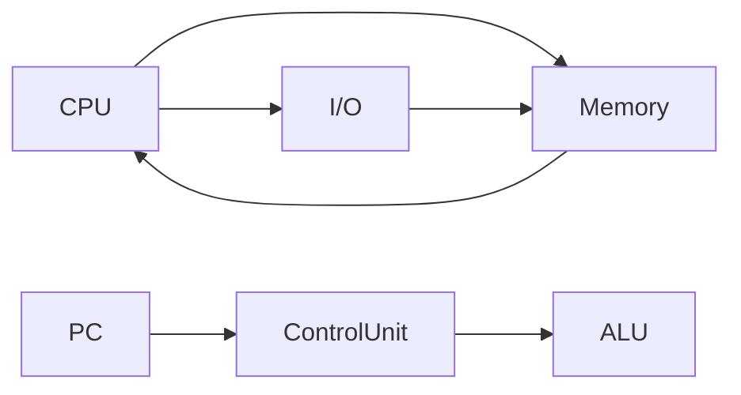

这篇文章是 Ankush Menat 于 2024 年 11 月 撰写的一篇博客，旨在重新审视 **von Neumann architecture** 的经典论文。基于博主原计划在 FOSS United meetup 的演讲，文章从哲学和工程两个维度探讨了计算的本质，并引用了经典美剧 *Halt and Catch Fire* 以及 Leslie Lamport 的论述，强调**解决实际问题**与**解决元问题**（如构建计算机本身）之间的辩证关系。随后，文章聚焦于 Arthur W. Burks、Herman H. Goldstine 与 John von Neumann 合著的《Preliminary Discussion of the Logical Design of an Electronic Computing Instrument》（通常认为是 1946 年的 **EDVAC** 报告初稿），分析其作为“**bit flip**”的变革性意义——即论文翻转了当时关于计算机设计的多个核心假设，从而奠定了现代计算机的基础。

---

## 技术细节与架构解析

### 1. von Neumann Architecture 的核心假设翻转

在 **von Neumann architecture** 出现之前，计算机（如 ENIAC）采用**硬连线编程**（hard‑wired programming），即通过物理接插件和开关来定义计算任务。这种设计的“**status quo assumption**”是：**程序必须外在于计算引擎，且行为由静态硬件决定**。

该论文通过 **bit flip** 将其颠覆为：

- **Stored‑Program Concept**：程序指令与数据共享同一存储空间。计算机可以从内存中读取指令，就像读取数据一样，从而实现**自编程**（self‑programming）和**条件跳转**。
- **Binary Arithmetic**：使用二进制数而非十进制，简化了电路设计（只需处理两种状态）。
- **Centralized Memory**：使用统一、可寻址的内存（如 ** mercury delay lines** 或后续的 **RAM**），支持随机访问。
- **Sequential Control**：通过**程序计数器（PC）** 自动递增，实现指令的自动顺序执行；结合**条件分支**（branch）实现控制流。

### 2. 经典架构图与数据通路

经典的 **von Neumann Architecture** 可简化为下图所示的五个主要组件：



- **CPU（Central Processing Unit）**：包含**控制单元（Control Unit）**和**算术逻辑单元（ALU）**。
- **Memory（主存）**：存储**指令**与**数据**，通过**地址总线（Address Bus）** 与**数据总线（Data Bus）** 与 CPU 通信。
- **I/O（输入/输出）**：通过**I/O 控制器**与外部设备交互。
- **System Bus**：连接所有部件，实现数据和指令的传输。

#### Fetch‑Decode‑Execute 周期（指令周期）

每个时钟周期（或更复杂的分周期）完成：

1. **Fetch**：从 **PC** 指向的内存地址读取指令。
   - 公式：`IR ← Memory[PC]` （IR = Instruction Register）
   - 随后 `PC ← PC + 1`（假设固定长度指令）。
2. **Decode**：控制单元解析 **opcode** 与 **operand address**。
3. **Execute**：ALU 执行操作，或内存访问，或 I/O 操作。
4. **Repeat**：循环回到步骤 1，除非遇到 **HALT** 或异常。

该周期是 **von Neumann bottleneck** 的根源——指令与数据共享同一总线，导致**吞吐量受限**。

### 3. 原始论文中的关键公式与设计

在《Preliminary Discussion...》中，作者为 **EDVAC** 提出了详细的设计，包括：

- **Memory Organization**：使用 **2^10 = 1024** 个 **word** 的延迟线存储器，每个 **word** 包含 **32 bits**（10 位地址 + 1 位符号 + 21 位数值）。
  - **地址格式**：`A = a_9 a_8 ... a_0`（共 10 位，可寻址 2^10 位置）。
  - **指令格式**：`OPCODE (6 bits) + ADDRESS (10 bits) + NEXT ADDRESS (10 bits)` 或类似变体（实际设计有多种版本）。
- **Instruction Set**：包含算术操作（加、减、乘、除）、逻辑操作、跳转、存储、读取等。

**示例：加法指令**：
```
ADD address  // ACC ← ACC + Memory[address]
```
执行时涉及：
- 读取 `address` 中的数据到 **ACC（累加器）**
- ALU 执行加法
- 结果写回 ACC

**控制流**：通过 **conditional transfer**（如 `JUMP IF ACC < 0`）实现分支。

### 4. von Neumann Bottleneck 与后续演进

由于指令与数据共享同一内存总线，**CPU** 在任意时刻只能访问**指令**或**数据**之一，这被称为 **von Neumann bottleneck**。现代计算机通过以下技术缓解：

- **Cache hierarchy**（L1/L2/L3）：将频繁访问的数据和指令缓存在靠近 CPU 的**SRAM**中，减少总线争用。
- **Separate Instruction/Data Caches（Harvard Architecture）**：在微处理器内部使用独立的总线分别取指和取数（如 ARM Cortex‑M 的 **Harvard 总线**），但仍保留 von Neumann 的“统一地址空间”语义供程序员使用。
- **Branch Prediction** 与 **Speculative Execution**：提前 fetch 并执行指令，掩盖延迟。
- **Superscalar & Pipelining**：在同一时钟周期内并行处理多条指令的不同阶段。

### 5. 历史背景与漏稿事件

正如博客所言，论文之所以冠名 **von Neumann**，是因为一份**内部初稿**被 Herman Goldstine “泄露” 给外界。那份 **First Draft of a Report on the EDVAC**（1945）由 von Neumann 执笔，虽然后续正式报告署名为 Burks、Goldstine、von Neumann 三人，但学界与业界均以 **von Neumann** 命名此架构。

此外，漏稿的直接后果是**无法申请专利**，这使得整个设计进入**公共领域**，极大加速了全球计算机研发——很可能将计算机普及提前了 10 至 20 年。这一 **open‑source 式的思想** 奠定了现代计算生态的基石。

---

## 延伸联想：Why the Soul of an Old Machine?

博客标题“**The Soul of an Old Machine**”暗示：尽管 **von Neumann architecture** 已有 80 年历史，但其核心思想——**将程序视为数据**、**统一的内存模型**——依然是现代计算设备的“灵魂”。从智能手机到超级计算机，从嵌入式系统到云端服务器，无一不遵循此范式。

然而，今日的挑战正如 Leslie Lamport 所言：若我们止步于使用“不可理解”的系统（如 **cryptic legacy code** 或 **black‑box neural networks**），而不深究其逻辑本质，计算将退化为“**homeopathy and faith healing**”。因此，重新审视原始论文不仅是怀旧，更是为了**回归第一性原理**：理解每个 **bit flip** 背后的逻辑necessity，从而构建更清晰、更可靠的系统。

---

## 参考链接

- 原始论文（PDF）：[First Draft of a Report on the EDVAC](https://archive.computerhistory.org/resources/access.text/2018/06/102738840-05-01-acc.pdf)（Computer History Museum）
- 后续正式报告：<https://archive.org/details/burksgoldstinevonneumann1946>
- von Neumann Architecture 维基百科：<https://en.wikipedia.org/wiki/Von_Neumann_architecture>
- Halt and Catch Fire 剧集引用：<https://www.imdb.com/title/tt3449728/>
- Leslie Lamport 原文：<https://www.microsoft.com/en-us/research/publication/future-computing-logic-or-biology/>

---

**总结**：这篇文章通过 **bit flip** 的分析框架，揭示了 **von Neumann architecture** 如何重塑计算的逻辑基础。它的核心贡献不仅是技术设计，更是一种“**程序即数据**”的**元认知转变**——正是这种翻转，使得通用计算机成为可能，并持续塑造着信息时代的灵魂。