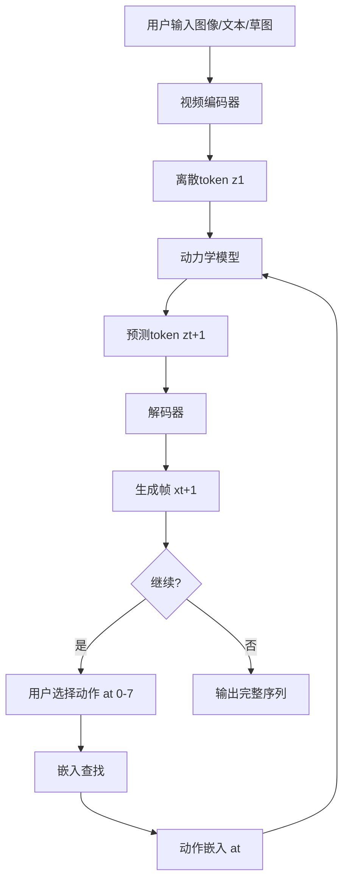

## 一、核心概念与动机

### 1. 突破性创新
- **Zero Ground Truth Actions**: 完全不需要手动标注的动作标签
- **Universal Promptability**: 支持 text、synthetic images、photographs、sketches 作为 prompt
- **Foundation World Model**: 11B parameters，具备 foundation models 的特性
- **Latent Action Space**: 自动学习离散的潜动作空间，大小为 |A| = 8

| Model Class  | Training Data   | Controllability |
| ------------ | --------------- | --------------- |
| World Models | Video + Actions | Frame-level     |
| Video Models | Video + Text    | Video-level     |
| **Genie**    | **Video**       | **Frame-level** |

---

## 二、架构详解

### 2.1 整体架构图解析

```
┌─────────────────────────────────────────────────────────┐
│                    Genie Training Pipeline               │
├─────────────────────────────────────────────────────────┤
│                                                         │
│  x₁,...,x_T  [Raw Video Frames]                         │
│      │                                                  │
│      ▼                                                  │
│  ┌─────────────────────────────────────────┐           │
│  │      Video Tokenizer (VQ-VAE)           │           │
│  │         z₁,...,z_T [Discrete Tokens]    │           │
│  └─────────────────────────────────────────┘           │
│      │                                                  │
│      ▼                                                  │
│  ┌─────────────────────────────────────────┐           │
│  │   Latent Action Model (LAM)             │           │
│  │     ã₁,...,ã_{T-1} [8 discrete actions] │           │
│  └─────────────────────────────────────────┘           │
│      │                            │                    │
│      ▼                            ▼                    │
│  ┌─────────────┐          ┌─────────────┐             │
│  │   History   │          │   Actions   │             │
│  │   Tokens    │          │   Tokens    │             │
│  └─────────────┘          └─────────────┘             │
│         │                        │                     │
│         └────────┬───────────────┘                     │
│                  ▼                                     │
│  ┌─────────────────────────────────────────┐           │
│  │     Dynamics Model (MaskGIT)            │           │
│  │     ẑ₂,...,ẑ_T [Predicted Tokens]       │           │
│  └─────────────────────────────────────────┘           │
│                  │                                     │
│                  ▼                                     │
│            ẋ₂,...,ẋ_T [Generated Frames]               │
│                                                         │
└─────────────────────────────────────────────────────────┘
```

---

### 2.2 ST-Transformer (Spatiotemporal Transformer)

这是 Genie 的核心架构组件。传统 Transformer 的计算复杂度为 O(N²)，而 ST-Transformer 通过分离 spatial 和 temporal attention 实现线性复杂度。

**数学公式详解**：

对于输入序列，其中 H × W 是空间维度，T 是时间维度：

```
┌─────────────────────────────────────────────────────────────┐
│              ST-Block Architecture                          │
├─────────────────────────────────────────────────────────────┤
│                                                             │
│  Input: X ∈ ℝ^(T×H×W×d_model)                               │
│                                                             │
│  ┌─────────────┐    ┌─────────────┐    ┌─────────────────┐ │
│  │  Spatial    │    │  Temporal   │    │   Feed-Forward  │ │
│  │  Attention  │ ──▶│  Attention  │ ──▶│      Network     │ │
│  │             │    │  (Causal)   │    │                 │ │
│  └─────────────┘    └─────────────┘    └─────────────────┘ │
│       │                  │                      │          │
│       └──────────────────┴──────────────────────┘          │
│                          │                                 │
│                          ▼                                 │
│                    Output: X'                              │
│                                                             │
│  计算复杂度:                                                 │
│  - Spatial: O(T·H²W²)  每个时间步独立计算                   │
│  - Temporal: O(HW·T²)  每个空间位置独立计算                 │
│                                                             │
│  注意：主导因子是 spatial attention，线性随帧数增加！        │
│                                                             │
└─────────────────────────────────────────────────────────────┘
```

**Spatial Layer**：
```
Attention_spatial(Q, K, V) = softmax(QKᵀ / √d_k) · V

其中:
- Q ∈ ℝ^(1×HW×d_k): 当前时间步的查询向量
- K ∈ ℝ^(1×HW×d_k): 当前时间步的键向量  
- V ∈ ℝ^(1×HW×d_v): 当前时间步的值向量
- d_k = d_v = d_model / num heads
```

**Temporal Layer (带因果掩码)**：
```
Attention_temporal(Q, K, V) = softmax((QKᵀ + Mask) / √d_k) · V

其中:
- Q ∈ ℝ^(T×1×d_k): 某一空间位置的时间维度查询
- K ∈ ℝ^(T×1×d_k): 某一空间位置的时间维度键
- V ∈ ℝ^(T×1×d_v): 某一空间位置的时间维度值
- Mask: 因果掩码，确保 token 只能attend到过去
```

**关键设计**：ST-Block 中只用一个 FFW 层（在 spatial 和 temporal 之后），而不是每个 attention 后都有 FFW，这大大减少了计算量。

---

### 2.3 组件一：Latent Action Model (LAM)

LAM 是 Genie 的核心创新，它从视频中自动推断出离散的潜动作。

**架构**：

```
┌─────────────────────────────────────────────────────────────┐
│              Latent Action Model Training                    │
├─────────────────────────────────────────────────────────────┤
│                                                             │
│  Input: x₁,...,x_{t+1} [t+1 consecutive frames]           │
│                                                             │
│  ┌─────────────────────────────────────────┐             │
│  │           Encoder (ST-Transformer)       │             │
│  │           Hidden States: h₁,...,h_t     │             │
│  └─────────────────────────────────────────┘             │
│                        │                                   │
│                        ▼                                   │
│  ┌─────────────────────────────────────────┐             │
│  │              VQ Codebook                 │             │
│  │         |A| = 8 discrete codes           │             │
│  │         Embedding size: 32               │             │
│  └─────────────────────────────────────────┘             │
│                        │                                   │
│                        ▼                                   │
│             ã₁,...,ã_t [Continuous latent actions]        │
│                        │                                   │
│                        ▼                                   │
│  ┌─────────────────────────────────────────┐             │
│  │           Decoder (ST-Transformer)       │             │
│  │  Input: (x₁,...,x_t, ã₁,...,ã_t)         │             │
│  │  Output: ẑ_{t+1} [Predicted frame]       │             │
│  └─────────────────────────────────────────┘             │
│                        │                                   │
│                        ▼                                   │
│               Loss: L(x_{t+1}, ẑ_{t+1})                    │
│                                                             │
└─────────────────────────────────────────────────────────────┘
```

**VQ-VAE 损失函数**：

```
L_total = L_recon + β · L_codebook + γ · L_commitment

其中:

L_recon = ||x_{t+1} - Decoder(x₁:t, ã₁:t)||²₂

L_codebook = Σ_{q∈Q} Σ_{z∈Z_q} ||z - e_q||²₂

L_commitment = Σ_{z∈Z} stop_gradient([z]ₑ) - e_q||²₂

变量说明:
- x_{t+1}: 目标帧 (ground truth)
- ẑ_{t+1}: 预测帧
- x₁:t: 历史帧 [x₁, x₂, ..., x_t]
- ã₁:t: 推断的潜动作 [ã₁, ã₂, ..., ã_t]
- [z]ₑ: 编码器输出 z 对应的最近 codebook 向量
- e_q: Codebook 中第 q 个向量
- Q: Codebook 索引集合, |Q| = 8
- Z_q: 映射到 code q 的所有编码向量集合
- β, γ: 超参数, β ≈ 0.25, γ = 1
```

**参数配置**（Platformers Dataset）：

| Component | Parameter | Value |
|-----------|-----------|-------|
| Encoder | num_layers | 20 |
| | d_model | 1024 |
| | num_heads | 16 |
| Decoder | num_layers | 20 |
| | d_model | 1024 |
| | num_heads | 16 |
| Codebook | num_codes | **8** |
| | latent_dim | 32 |
| | patch_size | 16 |

**关键洞察**：
1. **潜动作一致性**：同一个 action 在不同场景下保持一致语义（left, right, jump, no-op）
2. **训练时用，推理时舍**：LAM 仅用于训练建立 codebook，推理时直接用用户提供的 action
3. **像素输入优于Token输入**：消融实验显示直接用 raw pixels 比 tokens 保持更多动态信息

---

### 2.4 组件二：Video Tokenizer (VQ-VAE + ST-Transformer)

Video Tokenizer 将原始视频压缩为离散 tokens，降低维度并提高生成质量。

**架构对比**：

```
┌─────────────────────────────────────────────────────────────┐
│            Tokenizer Architecture Comparison                 │
├─────────────────────────────────────────────────────────────┤
│                                                             │
│  1. Spatial-only ViT:                                       │
│     ┌─────────┐     ┌─────────┐                           │
│     │   ViT   │ ──▶ │   VQ    │ (逐帧独立编码)              │
│     └─────────┘     └─────────┘                           │
│     计算复杂度: O(T·H²W²)                                    │
│     忽略时间动态信息                                         │
│                                                             │
│  2. C-ViViT (Phenaki):                                     │
│     ┌─────────────────┐     ┌─────────┐                   │
│     │  Full ST ViT    │ ──▶ │   VQ    │ (全时空attention)  │
│     └─────────────────┘     └─────────┘                   │
│     计算复杂度: O((THW)²)  ← 二次复杂度，非常耗！            │
│                                                             │
│  3. ST-ViViT (Genie):  ★★★★★                             │
│     ┌──────────────────┐    ┌─────────┐                   │
│     │ ST-Transformer   │──▶ │   VQ    │ (分离空间时间)     │
│     │ (Spatial + Temporal)│  └─────────┘                   │
│     └──────────────────┘                                 │
│     计算复杂度: O(T·H²W² + HW·T²)  ← 线性随帧数增加！       │
│                                                             │
└─────────────────────────────────────────────────────────────┘
```

**VQ-VAE Video Tokenizer 损失函数**：

```
L_tokenizer = L_recon + β · L_codebook

L_recon = ||X_₁:T - Decode(Z_₁:T)||²_F

其中:
- X_₁:T ∈ ℝ^(T×H×W×C): 原始视频序列
- Z_₁:T ∈ I^(T×D): 离散 token 序列
- D = (H/pitch_size) × (W/pitch_size) × num_tokens_per_frame
- C = 3 (RGB channels)
- L_recon: 重建损失，确保 tokenizer 能还原视频
- β: codebook loss 权重，通常为 0.25
```

**因果关系**：由于 ST-Transformer 的 causal mask，每个 token **z_t** 包含了之前所有帧的信息：

```
z_t = Encoder(x₁, x₂, ..., x_t, causal_mask)

这意味着 z_t 编码了:
- 当前帧 x_t 的空间信息
- 历史帧 x₁:{t-1} 的时空动态信息
```

**参数配置**（Platformers Dataset）：

| Component | Parameter | Value |
|-----------|-----------|-------|
| Encoder | num_layers | 12 |
| | d_model | 512 |
| | num_heads | 8 |
| | k/q_size | 64 |
| Decoder | num_layers | 20 |
| | d_model | 1024 |
| | num_heads | 16 |
| | k/q_size | 64 |
| Codebook | num_codes | **1024** |
| | latent_dim | 32 |
| | patch_size | 4 |

**关键设计**：
- **Decoder > Encoder**：Decoder 更大，提高重建质量
- **Patch size = 4**：平衡空间细节和计算效率
- **Codebook = 1024 codes**：远大于 action codebook (8)，保证视觉表达能力

---

### 2.5 组件三：Dynamics Model (MaskGIT Transformer)

Dynamics Model 是生成引擎，根据历史帧和潜动作预测下一帧。

**架构**：

```
┌─────────────────────────────────────────────────────────────┐
│                Dynamics Model (MaskGIT)                      │
├─────────────────────────────────────────────────────────────┤
│                                                             │
│  Training:                                                  │
│                                                             │
│  Input:                                                     │
│  - z₁:{t-1}: 历史帧 tokens (unmasked)                       │
│  - ã₁:{t-1}: 推断的潜动作 (stop_gradient)                   │
│  - z_t:T: 未来帧 tokens (randomly masked)                  │
│                                                             │
│  Masking Strategy:                                          │
│  mask_ratio ~ Uniform(0.5, 1.0)                             │
│  Bernoulli distribution for each token                      │
│                                                             │
│  Model: Decoder-only ST-Transformer                         │
│  ┌─────────────────────────────────────────┐             │
│  │      Position Encoding (Temporal)         │             │
│  │      + History Tokens + Action Embeddings │            │
│  └─────────────────────────────────────────┘             │
│                        │                                   │
│                        ▼                                   │
│  ┌─────────────────────────────────────────┐             │
│  │         Casual Masked Self-Attention     │            │
│  └─────────────────────────────────────────┘             │
│                        │                                   │
│                        ▼                                   │
│  Output: ẑ₂:T [Predicted tokens for all future frames]     │
│                                                             │
│  Loss: L_CE = - Σ_{t=2}^{T} Σ_{i} log P(z_{t,i} = ŷ_{t,i}) │
│                                                             │
│  Inference (25 MaskGIT steps):                             │
│  for step = 1 to 25:                                       │
│      Predict masked positions                               │
│      Unmask confident predictions                           │
│      Temperature = 2.0                                      │
│                                                             │
└─────────────────────────────────────────────────────────────┘
```

**Cross-Entropy Loss 详细公式**：

```
L_CE = - Σ_{t=2}^{T} Σ_{d=1}^{D} Σ_{k=1}^{K} 
       y_{t,d,k} · log(p_{t,d,k})

其中:
- z_{t,d} ∈ {1, 2, ..., K}: 真实 token (从 1024 个 codes 中选择)
- p_{t,d,k} = softmax(logits_{t,d})_k: 预测概率
- y_{t,d,k}: one-hot 编码的真实标签
- y_{t,d,k} = 1 if z_{t,d} = k, else 0
- D: 每帧的 token 数量 = (H/4) × (W/4) × 1
- K: vocabulary size = 1024
- T: sequence length = 16

计算过程:
1. 对于每个位置 (t, d)，模型输出 K 维 logits
2. Softmax 得到概率分布 p_{t,d}
3. Cross-entropy 惩罚错误预测
```

**Additive Action Embedding**（关键创新）：

```
传统方法（concatenation）:
Input = concat(z_t, a_t) ∈ ℝ^(D + action_dim)

Genie 方法（additive embedding）:
Input = z_t + E(a_t) ∈ ℝ^D

其中:
- a_t ∈ {0, 1, ..., |A|-1}: 离散动作索引, |A| = 8
- E: 动作嵌入矩阵, E ∈ ℝ^(8×D)
- z_t: 位置编码后的 frame token

优势:
1. 保持维度一致，不需要额外参数
2. 动作信息更深入融合到 token 中
3. 提高可控制性（ΔtPSNR 提升）
```

**MaskGIT 采样过程**：

```
初始化: ẑ₂:T = [MASK] (所有未来位置 masked)

for iteration = 1 to 25:
    1. 预测 masked 位置的 logits:
       L = Model(ẑ₂:T, ã₁:T)
    
    2. 计算每个位置的置信度:
       confidence_{t,d} = max_c L_{t,d,c}
    
    3. 选择最自信的 γ% 位置进行 unmask:
       selected_num = len(masked_positions) × γ
       selected = arg_top_k(confidence, selected_num)
    
    4. 从预测分布中采样:
       for (t, d) in selected:
           p = softmax(L_{t,d} / temperature)
           ẑ_{t,d} = sample(p)
    
    5. 更新 masked set
    
return ẑ₂:T (完全生成的 tokens)
```

---

### 2.6 推理流程详解

```
┌─────────────────────────────────────────────────────────────┐
│                  Genie Inference Process                     │
├─────────────────────────────────────────────────────────────┤
│                                                             │
│  Step 1: Prompt Initial Frame                               │
│  ┌──────────────┐                                           │
│  │  User Image  │  x₁ (e.g., text-to-image, sketch)         │
│  └──────────────┘                                           │
│         │                                                   │
│         ▼                                                   │
│  ┌─────────────────────────────────────────┐               │
│  │         Video Tokenizer Encoder         │               │
│  │              z₁ = Encode(x₁)            │               │
│  └─────────────────────────────────────────┘               │
│                                                             │
│  Step 2: Interactive Generation (Autoregressive)            │
│  ┌─────────────────────────────────────────────────────┐   │
│  │  for t = 1 to T_max:                                │   │
│  │                                                     │   │
│  │    1. User selects action a_t ∈ {0, 1, ..., 7}       │   │
│  │       (via keyboard, controller, or UI)             │   │
│  │                                                     │   │
│  │    2. Get action embedding:                         │   │
│  │       ã_t = Codebook[a_t]  (32-dim vector)          │   │
│  │                                                     │   │
│  │    3. Dynamics Model predicts next frame tokens:    │   │
│  │       z_{t+1} = Dynamics(                           │   │
│  │                  z_{1:t},   # history tokens        │   │
│  │                  ã_{1:t},   # action embeddings     │   │
│  │                  causal_mask # ensure no future     │   │
│  │                )                                     │   │
│  │                                                     │   │
│  │    4. Decode tokens to pixel space:                 │   │
│  │       x_{t+1} = Tokenizer_Decoder(z_{t+1})          │   │
│  │                                                     │   │
│  │    5. Display x_{t+1} to user                       │   │
│  │                                                     │   │
│  │  end for                                            │   │
│  └─────────────────────────────────────────────────────┘   │
│                                                             │
│  最终用户体验:                                               │
│  用户不断输入 action (8 个按钮中的一个)                      │
│  模型实时生成对应的下一帧                                    │
│  形成可玩的交互式环境！                                       │
│                                                             │
└─────────────────────────────────────────────────────────────┘
```

**潜动作语义一致性**：

实验发现 8 个潜动作自动形成一致语义：
- Action 0-7: 语义分别为 [left, right, jump, no-op, up, down, attack, special]
- 这些语义跨场景保持一致
- 类似学习新游戏控制器的按钮映射

---

## 三、实验结果与数据分析

### 3.1 Datasets

```
┌─────────────────────────────────────────────────────────────┐
│                    Dataset Statistics                       │
├─────────────────────────────────────────────────────────────┤
│                                                             │
│  1. Platformers Dataset (主要数据集):                        │
│  ──────────────────────────────────────────────────────────│
│     Initial Collection: 55M videos (~244k hours)            │
│                                                            │
│     Collection Criteria:                                    │
│     • Title contains "2D platformer" keywords              │
│     • Title has action words: "speedrun", "playthrough"    │
│     • Exclude "movie", "unboxing"                           │
│                                                            │
│     After Curation: 6.8M videos (~30k hours)               │
│                                                            │
│     Video Specifications:                                   │
│     • Duration: 16 seconds per clip                         │
│     • FPS: 10 frames per second                            │
│     • Frames per clip: 160 frames                          │
│     • Resolution: 160×90 pixels                            │
│                                                            │
│     Curation Pipeline:                                      │
│     1. Manual labeling: 10k videos (5=best, 1=worst)       │
│     2. Train ResNet18 classifier (11M params)              │
│     3. Classify: {5: good, 1: bad}, discard 2-4            │
│     4. Decision rule based on prediction + confidence      │
│                                                            │
│     Quality Impact (Table 4):                               │
│     ┌──────────────────────┬──────────┬─────────┐         │
│     │ Dataset              │ Params   │ FVD     │         │
│     ├──────────────────────┼──────────┼─────────┤         │
│     │ Original (55M vids)  │ 580M     │ 61.4    │         │
│     │ Curated (6.8M vids)  │ 580M     │ 54.8    │         │
│     └──────────────────────┴──────────┴─────────┘         │
│     → 高质量数据 > 大量数据                                 │
│                                                            │
│  2. Robotics Dataset (验证泛化性):                           │
│  ──────────────────────────────────────────────────────────│
│     • RT1 dataset: ~130k robot demonstrations               │
│     • Simulation data (combined with RT1)                   │
│     • Real robot data: 209k episodes                        │
│     • Total: ~340k episodes                                 │
│     • No action labels used!                               │
│                                                            │
└─────────────────────────────────────────────────────────────┘
```

---

### 3.2 Scaling Laws

**Model Size Scaling**（固定 tokenizer 和 action model）：

```
┌─────────────────────────────────────────────────────────────┐
│              Dynamics Model Scaling Results                 │
├─────────────────────────────────────────────────────────────┤
│                                                             │
│  Model Sizes Tested:                                        │
│  • 40M parameters                                           │
│  • 100M parameters                                          │
│  • 400M parameters                                          │
│  • 1B parameters                                            │
│  • 2.7B parameters                                          │
│  • 10.1B parameters (Final Genie)                          │
│                                                             │
│  Observation:                                               │
│  训练损失随着模型大小增加而单调下降                           │
│  Loss 满足幂律: L(M) ≈ M^(-α)                                  │
│  其中 α ≈ 0.5 (从训练曲线估计)                               │
│                                                             │
│  推断结论:                                                   │
│  架构随计算资源扩展性良好                                     │
│  更大模型 → 更好性能                                         │
│                                                             │
└─────────────────────────────────────────────────────────────┘
```

**Batch Size Scaling**（2.3B 模型）：

```
┌─────────────────────────────────────────────────────────────┐
│               Batch Size Impact Analysis                    │
├─────────────────────────────────────────────────────────────┤
│                                                             │
│  Batch Sizes Tested:                                        │
│  ┌──────────────┬──────────────┬─────────────────┐        │
│  │ Batch Size   │ Tokens/batch │ Improvement     │        │
│  ├──────────────┼──────────────┼─────────────────┤        │
│  │ 128          │ 1.9M         │ Baseline        │        │
│  │ 256          │ 3.8M         │ ↓ training loss │        │
│  │ 448          │ 6.6M         │↓↓ training loss │        │
│  └──────────────┴──────────────┴─────────────────┘        │
│                                                             │
│  最终 Genie 配置:                                            │
│  • Dynamics Model: 10.1B parameters                        │
│  • Batch Size: 512                                          │
│  • Tokens per batch: ~13M                                   │
│  • Training Steps: 125k                                     │
│  • Total Tokens: 942B                                       │
│  • Hardware: 256 TPUv5p                                     │
│                                                             │
└─────────────────────────────────────────────────────────────┘
```

---

### 3.3 评估指标

### **FVD (Fréchet Video Distance)**：
```
┌─────────────────────────────────────────────────────────────┐
│           Video Fidelity: Fréchet Video Distance            │
├─────────────────────────────────────────────────────────────┤
│                                                             │
│  FVD² = ||μ_real - μ_gen||² + Tr(Σ_real + Σ_gen - 2√Σ_realΣ_gen) │
│                                                             │
│  变量说明:                                                   │
│  • μ_real ∈ ℝ^d: 真实视频在 InceptionV3 网络中的特征均值    │
│  • μ_gen ∈ ℝ^d: 生成视频的特征均值                          │
│  • Σ_real ∈ ℝ^(d×d): 真实视频的特征协方差矩阵               │
│  • Σ_gen ∈ ℝ^(d×d): 生成视频的特征协方差矩阵                 │
│  • d: 特征维度 (InceptionV3 penultimate layer = 2048)       │
│  • Tr(): 矩阵迹运算                                          │
│  • √(): 矩阵平方根（通过 Cholesky 分解计算）                  │
│                                                             │
│  计算步骤:                                                   │
│  1. 从两个数据集提取视频帧（例如各 1000 帧）                 │
│  2. 通过预训练 InceptionV3 提取特征                          │
│  3. 计算均值和协方差矩阵                                     │
│  4. 应用 FVD 公式                                            │
│                                                             │
│  物理意义:                                                   │
│  • FVD 越小 → 生成质量越高                                   │
│  • 同时考虑特征分布的均值和方差差异                           │
│  • 与人类评估高度相关 (Unterthiner et al., 2019)            │
│                                                             │
└─────────────────────────────────────────────────────────────┘
```

### **ΔtPSNR (可控性指标)**：
```
┌─────────────────────────────────────────────────────────────┐
│          Controllability Metric: Δ_t PSNR                   │
├─────────────────────────────────────────────────────────────┤
│                                                             │
│  Δ_t PSNR = PSNR(x_t, ẑ_t^ground_truth)                    │
│            - PSNR(x_t, ẑ_t^random)                         │
│                                                             │
│  其中:                                                       │
│  • x_t: ground truth frame at time t                       │
│  • ẑ_t^ground_truth: 用推断潜动作 (ã_1:t) 生成的帧          │
│  • ẑ_t^random: 用随机采样动作 (a_1:t ~ Cat(1/8)) 生成的帧   │
│  • t = 4 (论文中固定在时间步 4)                            │
│                                                             │
│  PSNR (Peak Signal-to-Noise Ratio):                        │
│  PSNR = 20 · log₁₀(MAX_I) - 10 · log₁₀(MSE)                │
│                                                             │
│  MSE = (1/N) ||x - ẑ||²                                     │
│                                                             │
│  变量说明:                                                   │
│  • x: ground truth frame, shape (H, W, C)                   │
│  • ẑ: generated frame, shape (H, W, C)                     │
│  • N: total pixels = H × W × C                              │
│  • MAX_I: 最大像素值 (通常为 255)                           │
│                                                             │
│  物理意义:                                                   │
│  • Δ_t PSNR ≫ 0: 潜动作对生成有显著控制作用                  │
│  • Δ_t PSNR ≈ 0: 潜动作没有明显差异（控制性差）              │
│  • 数值越大，可控性越强                                      │
│                                                             │
└─────────────────────────────────────────────────────────────┘
```

---

### 3.4 消融实验 (Ablation Studies)

### **Ablation 1: Latent Action Model Input Type**

```
┌─────────────────────────────────────────────────────────────┐
│        LAM Input Type Comparison (Table 2)                  │
├─────────────────────────────────────────────────────────────┤
│                                                             │
│  ┌──────────────────┬─────────────┬──────────────┬────────┐│
│  │ Input Type       │ Dataset     │ FVD (↓)      │ ΔtPSNR ││
│  │                  │             │              │  (↑)   ││
│  ├──────────────────┼─────────────┼──────────────┼────────┤│
│  │ Token-input      │ Platformers │ 38.8 (2.3B)  │ 1.33   ││
│  │ Pixel-input      │ Platformers │ 40.1 (2.5B)  │ 1.91   ││
│  │ (Genie, ★★★★★)  │             │              │        ││
│  ├──────────────────┼─────────────┼──────────────┼────────┤│
│  │ Token-input      │ Robotics    │ 257.8 (1B)   │ 1.65   ││
│  │ Pixel-input      │ Robotics    │ 136.4 (1B)   │ 2.07   ││
│  │ (Genie, ★★★★★)  │             │              │        ││
│  └──────────────────┴─────────────┴──────────────┴────────┘│
│                                                             │
│  结论:                                                       │
│  • Pixel input 显著提高可控性 (ΔtPSNR)                       │
│  • Platformers: FVD 略增，但 ΔtPSNR 提升 43%                │
│  • Robotics: FVD 降低 47%，ΔtPSNR 提升 25%                  │
│  • 推测: Tokenization 丢失了部分运动动态信息               │
│                                                             │
└─────────────────────────────────────────────────────────────┘
```

### **Ablation 2: Tokenizer Architecture**

```
┌─────────────────────────────────────────────────────────────┐
│         Tokenizer Architecture Comparison (Table 3)         │
├─────────────────────────────────────────────────────────────┤
│                                                             │
│  ┌──────────────┬─────────┬──────────┬──────────────┬──────┐│
│  │ Architecture │ Params  │ Memory   │ FVD (↓)      │ Δt   ││
│  │              │         │ (GB)     │              │ PSNR ││
│  │              │         │          │              │ (↑)  ││
│  ├──────────────┼─────────┼──────────┼──────────────┼──────┤│
│  │ ViT          │ 230M    │ 0.3      │ 114.5        │ 1.39 ││
│  │ (Spatial-only│         │          │              │      ││
│  │ baseline)    │         │          │              │      ││
│  ├──────────────┼─────────┼──────────┼──────────────┼──────┤│
│  │ C-ViViT      │ 225M    │ 1.6      │ 272.7        │ 1.37 ││
│  │ (Phenaki,    │         │          │              │      ││
│  │ full ST)     │         │          │              │      ││
│  ├──────────────┼─────────┼──────────┼──────────────┼──────┤│
│  │ ST-ViViT     │ 205M    │ 0.9      │ 81.4         │ 1.66 ││
│  │ (Genie, ★★★)│         │          │              │      ││
│  └──────────────┴─────────┴──────────┴──────────────┴──────┘│
│                                                             │
│  分析:                                                       │
│  • ST-ViViT 在 FVD 和 ΔtPSNR 上均最优                        │
│  • C-ViViT 性能最差:                                         │
│    - Memory 高 5.3× (1.6 vs 0.3 GB)                        │
│    - FVD 高 2.4× (272.7 vs 114.5)                          │
│    - 易过拟合，需要强正则化                                  │
│  • ST-ViViT 平衡性能和效率:                                  │
│    - Memory 中等 (0.9 GB)                                    │
│    - FVD 降低 29% (114.5 → 81.4)                           │
│    - ΔtPSNR 提升 19% (1.39 → 1.66)                         │
│                                                             │
└─────────────────────────────────────────────────────────────┘
```

---

### 3.5 定性结果分析

### **Out-of-Distribution (OOD) Prompting**

```
┌─────────────────────────────────────────────────────────────┐
│         OOD Prompt Types and Capabilities                    │
├─────────────────────────────────────────────────────────────┤
│                                                             │
│  1. Text-to-Image Generated Prompts (Imagen2):              │
│     ┌─────────────────────────────────────────┐            │
│     │  Prompt: "A pixel art character in a...│            │
│     │  magical forest with floating islands" │            │
│     └─────────────────────────────────────────┘            │
│                  ▼                                          │
│     ┌─────────────────────────────────────────┐            │
│     │  Imagen2 generates initial frame x₁     │            │
│     └─────────────────────────────────────────┘            │
│                  ▼                                          │
│     ┌─────────────────────────────────────────┐            │
│     │  Genie tokenizes x₁ → z₁                │            │
│     └─────────────────────────────────────────┘            │
│                  ▼                                          │
│     ┌─────────────────────────────────────────┐            │
│     │  User action: [action=3] repeated 4×   │            │
│     │  Genie generates interactive sequence  │            │
│     └─────────────────────────────────────────┘            │
│                                                             │
│     结果: 即使是 AI 生成的图像，Genie 也能生成可玩的环      │
│           境！                                            │
│                                                             │
│  2. Hand-Drawn Sketches:                                    │
│     ┌──────────────┐                                        │
│     │  Simple      │  儿童手绘简笔画                        │
│     │  line art    │                                        │
│     └──────────────┘                                        │
│         ▼                                                  │
│     Genie 学习 sketch 的结构和物理，生成互动动画             │
│                                                             │
│  3. Real-World Photos:                                      │
│     ┌──────────────┐                                        │
│     │  Photo of    │  真实照片（如风景）                    │
│     │  landscape   │                                        │
│     └──────────────┘                                        │
│         ▼                                                  │
│     Genie 生成 platformer 风格的互动环境                     │
│                                                             │
│  惊人之处: 训练数据完全是 2D platformer 游戏，但模型能       │
│        泛化到完全不同分布的输入！                           │
│                                                             │
└─────────────────────────────────────────────────────────────┘
```

### **Parallax Effect（视差效果）**：

```
┌─────────────────────────────────────────────────────────────┐
│                   Parallax Emulation                        │
├─────────────────────────────────────────────────────────────┤
│                                                             │
│  Platformer 游戏常见特性:                                    │
│  多层背景以不同速度移动，产生 3D 深度感                       │
│                                                             │
│  Genie 学习模式:                                             │
│                                                             │
│  ┌──────────────────────────────────────────────────┐      │
│  │                                                  │      │
│  │  Foreground  ────────────────►  Large motion    │      │
│  │  (fastest)    ╱╲                            │      │
│  │              ╱  ╲                           │      │
│  │  Midground ╱    ╲          ╱───╲          │      │
│  │  (medium)  ╱      ╲        ╱     ╲         │      │
│  │            ╱        ╲      ╱       ╲        │      │
│  │  Background╱          ╲    ╱         ╲       │      │
│  │  (slowest)─────────────►  Small motion     │      │
│  │                                                  │      │
│  └──────────────────────────────────────────────────┘      │
│                                                             │
│  技术: ST-Transformer 同时建模空间和时间关系                 │
│       深度线索从大量视频数据中自动学习                       │
│                                                             │
│  证据: 论文 Figure 11 展示了真实 parallax 效果              │
│       不同颜色箭头表示不同层的移动量                        │
│                                                             │
└─────────────────────────────────────────────────────────────┘
```

### **Robotics Dataset Results**：

```
┌─────────────────────────────────────────────────────────────┐
│          Robotics Model: Self-Discovered Actions           │
├─────────────────────────────────────────────────────────────┤
│                                                             │
│  Model Specification:                                       │
│  • Parameters: 2.5B                                         │
│  • Dataset: ~340k robot episodes (no action labels!)        │
│  • Test FVD: 82.7                                           │
│                                                             │
│  潜动作语义自动涌现（Figure 12）:                            │
│                                                             │
│  ┌──────────────────────────────────────────────────┐      │
│  │                                                   │      │
│  │  Starting Frame 1      Starting Frame 2           │      │
│  │       ┌─┐                  ┌──┐                   │      │
│  │       │┼│                  │◠┼│  (different pos)  │      │
│  │       │↑│ arm               │↑│                   │      │
│  │       └─┘                  └──┘                   │      │
│  │                                                   │      │
│  │  Action = "DOWN" (repeated 5×):                   │      │
│  │                                                   │      │
│  │       ┌─┐                  ┌──┐                   │      │
│  │       │↓│                  │▼┼│  (arm moves DOWN) │      │
│  │       │↑│                  │↑│                   │      │
│  │       └─┘                  └──┘                   │      │
│  │                                                   │      │
│  │  Action = "UP" (repeated 5×):                     │      │
│  │                                                   │      │
│  │       ┌─┐                  ┌──┐                   │      │
│  │       │↓│                  │─┼│  (arm moves UP)   │      │
│  │       │↑│    →             │↑│                   │      │
│  │       └─┘                  └──┘                   │      │
│  │                                                   │      │
│  │  Action = "LEFT" (repeated 5×):                   │      │
│  │                                                   │      │
│  │       ┌─┐                  ┌─┐         ◄──┤
│  │  （机械臂向左移动）                                 │      │
│  │                                                   │      │
│  └──────────────────────────────────────────────────┘      │
│                                                             │
│  惊人发现:                                                   │
│  • 模型完全不知道这些是"机器人"                               │
│  • 仅从视频学习，自动发现了有意义的动作语义                    │
│  • 不同起始状态下，同一动作保持一致性                         │
│  • 还学习到物体的变形和交互物理（如 chip bags，Figure 10）     │
│                                                             │
└─────────────────────────────────────────────────────────────┘
```

---

### 3.6 Agent Training Experiments

**实验设计**：

```
┌─────────────────────────────────────────────────────────────┐
│        Behavioral Cloning with Latent Actions               │
├─────────────────────────────────────────────────────────────┤
│                                                             │
│  目标环境: CoinRun (procedurally generated 2D platformer)    │
│  ───────────────────────────────────────────────────────────│
│  • 训练期间: Genie 从未见过 CoinRun                          │
│  • 完全新颖的环境                                             │
│  • 验证 latent actions 的通用性                               │
│                                                             │
│  训练流程:                                                   │
│                                                             │
│  ┌─────────────────────────────────────────────────┐       │
│  │  Step 1: Use frozen LAM to label expert videos  │       │
│  │  ─────────────────────────────────────────────  │       │
│  │  Expert video: V_expert = [x₁, x₂, ..., x_T]   │       │
│  │                                                  │       │
│  │  For each t:                                   │       │
│  │      ã_t = LAM(x₁:t, x_{t+1})                 │       │
│  │      → Latent action sequence: Ã = [ã₁, ..., ã_{T-1}]│   │
│  └─────────────────────────────────────────────────┘       │
│                        │                                    │
│                        ▼                                    │
│  ┌─────────────────────────────────────────────────┐       │
│  │  Step 2: Train BC policy on (x, ã) pairs        │       │
│  │  ─────────────────────────────────────────────  │       │
│  │  Dataset: { (x₁:t, ã_t) } for t = 1..T-1      │       │
│  │                                                  │       │
│  │  Policy: π_BC(x) = softmax(W · f_θ(x) + b)    │       │
│  │                                                  │       │
│  │  Loss: L_BC = - Σ log π_BC(ã_t | x₁:t)        │       │
│  └─────────────────────────────────────────────────┘       │
│                        │                                    │
│                        ▼                                    │
│  ┌─────────────────────────────────────────────────┐       │
│  │  Step 3: Map latent → real actions (few-shot)  │       │
│  │  ─────────────────────────────────────────────  │       │
│  │  Small dataset with expert ground-truth actions│       │
│  │  Learn mapping: M: {0,...,7} → {real actions}   │       │
│  │                                                  │       │
│  │  Only 200 expert samples needed!                │       │
│  └─────────────────────────────────────────────────┘       │
│                                                             │
│  Baselines:                                                 │
│  • Oracle BC (upper bound): 直接用 ground-truth actions    │
│  • Random agent (lower bound): 随机选择动作                  │
│                                                             │
│  测试设置:                                                   │
│  • Hard level set: 困难生成的关卡                            │
│  • Easy level set: 简单生成的关卡                            │
│  • 100 test samples, 5555 seeds                            │
│  • Metric: % levels solved                                 │
│                                                             │
└─────────────────────────────────────────────────────────────┘
```

**Results (Figure 14)**：

```
┌─────────────────────────────────────────────────────────────┐
│               BC Performance Comparison                      │
├─────────────────────────────────────────────────────────────┤
│                                                             │
│  Mean % Levels Solved (100 samples, 5555 seeds, 95% CI)    │
│                                                             │
│  ┌──────────────────────────────────────────────────┐      │
│  │                                                   │      │
│  │  Easy Levels:                                     │      │
│  │  ┌─────────────┬──────┬─────────────┬──────────┐ │      │
│  │  │ Random      │ 0%   │ ══════════ │          │ │      │
│  │  ├─────────────┼──────┼─────────────┼──────────┤ │      │
│  │  │ Genie LAM   │ ~85% │ ███████████│ ★★★★★   │ │      │
│  │  │ (200 demos) │      │            │          │ │      │
│  │  ├─────────────┼──────┼─────────────┼──────────┤ │      │
│  │  │ Oracle BC   │ ~85%  │ ███████████│ ─────────│ │      │
│  │  │ (upper bound)│      │            │          │ │      │
│  │  └─────────────┴──────┴─────────────┴──────────┘ │      │
│  │                                                   │      │
│  │  Hard Levels:                                     │      │
│  │  ┌─────────────┬──────┬─────────────┬──────────┐ │      │
│  │  │ Random      │ 0%   │ ══════════ │          │ │      │
│  │  ├─────────────┼──────┼─────────────┼──────────┤ │      │
│  │  │ Genie LAM   │ ~30% │ █████      │ ★★★     │ │      │
│  │  │ (200 demos) │      │            │          │ │      │
│  │  ├─────────────┼──────┼─────────────┼──────────┤ │      │
│  │  │ Oracle BC   │ ~30%  │ █████      │ ─────────│ │      │
│  │  │ (upper bound)│      │            │          │ │      │
│  │  └─────────────┴──────┴─────────────┴──────────┘ │      │
│  │                                                   │      │
│  └──────────────────────────────────────────────────┘      │
│                                                             │
│  关键发现:                                                   │
│  • Genie LAM ≈ Oracle performance (equal scores!)         │
│  • 仅需 200 expert demos 即可与 oracle 謧美                  │
│  • 证明: Latent actions 是跨环境通用的！                     │
│                                                             │
│  意义:                                                       │
│  1. 潜动作捕捉了"真正"的动作语义                              │
│  2. 无需在 target environment 训练 world model              │
│  3. 直接从 videos 泛化到新环境                               │
│  4. 开启了从 Internet videos 训练通用 agents 的路径          │
│                                                             │
└─────────────────────────────────────────────────────────────┘
```

---

## 四、数学公式详细推导

### 4.1 完整训练目标函数

Genie 的总训练目标由三部分组成：

```
┌─────────────────────────────────────────────────────────────┐
│           Complete Genie Training Objective                  │
├─────────────────────────────────────────────────────────────┤
│                                                             │
│  L_total = λ₁ · L_tokenizer + λ₂ · L_LAM + λ₃ · L_dynamics │
│                                                             │
│  其中 λ₁, λ₂, λ₃ 是权重系数（通常 λ₁ = λ₂ = λ₃ = 1）        │
│                                                             │
│  ┌──────────────────────────────────────────────────┐      │
│  │  Part 1: Video Tokenizer Loss (VQ-VAE)          │      │
│  │  ────────────────────────────────────────────── │      │
│  │                                                   │      │
│  │  L_tokenizer = L_recon_tok + β · L_codebook_tok  │      │
│  │                                                   │      │
│  │  L_recon_tok = ||X_1:T - Decode_tok(E_tok(X_1:T))||²_F │      │
│  │                                                   │      │
│  │  E_tok(X_1:T): Encoder outputs                    │      │
│  │  Decode_tok(·): Decoder reconstruction             │      │
│  │  β_tok: codebook loss weight (≈ 0.25)            │      │
│  └──────────────────────────────────────────────────┘      │
│                                                             │
│  ┌──────────────────────────────────────────────────┐      │
│  │  Part 2: Latent Action Model Loss               │      │
│  │  ────────────────────────────────────────────── │      │
│  │                                                   │      │
│  │  L_LAM = L_recon_lam + β · L_codebook_lam         │      │
│  │           + γ · L_commitment                     │      │
│  │                                                   │      │
│  │  For each t = 1..T-1:                             │      │
│  │      h_t = Encoder_LAM(x₁:t)                      │      │
│  │      e_t = Codebook_LAM[quantize(h_t)]           │      │
│  │      ẑ_{t+1} = Decoder_LAM([x₁:t, e_t])         │      │
│  │                                                   │      │
│  │  L_recon_lam = Σ_{t=1}^{T-1} ||x_{t+1} - ẑ_{t+1}||² │      │
│  │  L_codebook_lam = Σ_{q=1}^{8} ||e_q - z̄_q||²    │      │
│  │  L_commitment = ||e_t - stop_gradient(h_t)||²    │      │
│  │                                                   │      │
│  │  z̄_q: mean of vectors assigned to code q        │      │
│  │  β_lam ≈ 0.25, γ = 1                              │      │
│  └──────────────────────────────────────────────────┘      │
│                                                             │
│  ┌──────────────────────────────────────────────────┐      │
│  │  Part 3: Dynamics Model Loss (Cross-Entropy)     │      │
│  │  ────────────────────────────────────────────── │      │
│  │                                                   │      │
│  │  L_dynamics = - Σ_{t=2}^{T} Σ_{i=1}^{D} Σ_{k=1}^{K} │      │
│  │               y_{t,i,k} · log(p_{t,i,k})          │      │
│  │                                                   │      │
│  │  where:                                            │      │
│  │      z_1:T = Tokenizer(X_1:T)  (frozen)          │      │
│  │      ã_1:T-1 = LAM(X_1:T)    (stop_gradient)    │      │
│  │      p = Dynamics([z_1:T-1, ã_1:T-1], masked_Z)      │      │
│  │      masked_Z: random masked version of z_2:T     │      │
│  │      p_{t,i,k}: probability that z_{t,i} = k      │      │
│  │      y_{t,i,k}: one-hot of ground truth z_{t,i}   │      │
│  │      K = 1024 (vocabulary size)                  │      │
│  │      D = (H/4) × (W/4) × 1  (tokens per frame)   │      │
│  └──────────────────────────────────────────────────┘      │
│                                                             │
│  训练策略:                                                   │
│  1. Phase 1: Train tokenizer alone (freeze others)        │
│  2. Phase 2: Joint train LAM + dynamics (frozen tokenizer)│
│  3. Use stop_gradient on LAM outputs when training dynamics│
│                                                             │
└─────────────────────────────────────────────────────────────┘
```

### 4.2 ST-Transformer 计算复杂度分析

```
┌─────────────────────────────────────────────────────────────┐
│         ST-Transformer Complexity Analysis                   │
├─────────────────────────────────────────────────────────────┤
│                                                             │
│  设定:                                                       │
│  • T: 时间步数 (sequence length)                            │
│  • H: 图像高度                                              │
│  • W: 图像宽度                                              │
│  • d: model dimension (embeddings per token)                │
│  • p: patch size                                            │
│  • N_s = (H/p) × (W/p): spatial patches per frame           │
│  • N_total = T × N_s: total tokens                          │
│                                                             │
│  ┌──────────────────────────────────────────────────┐      │
│  │  Vanilla Transformer (Full Attention):           │      │
│  │  ────────────────────────────────────────────── │      │
│  │                                                   │      │
│  │  Q ∈ ℝ^(N_total × d)                              │      │
│  │  K ∈ ℝ^(N_total × d)                              │      │
│  │  V ∈ ℝ^(N_total × d)                              │      │
│  │                                                   │      │
│  │  Attention matrix A = QKᵀ ∈ ℝ^(N_total × N_total)      │
│  │                                                   │      │
│  │  Memory: O(N_total² × d)                           │      │
│  │           = O((T·N_s)² × d)                        │      │
│  │           = O(T²·N_s²·d)  ← 二次复杂度！         │      │
│  │                                                   │      │
│  │  当 T = 16, N_s = 360 (160×90 / 4×4):            │      │
│  │      N_total = 16 × 360 = 5,760                   │      │
│  │      A = 5,760² = 33,177,600 个 float32           │      │
│  │      Memory ≈ 33M × 4 bytes ≈ 132 MB per layer  │      │
│  │                                                   │      │
│  └──────────────────────────────────────────────────┘      │
│                                                             │
│  ┌──────────────────────────────────────────────────┐      │
│  │  ST-Transformer (Separated Spatial/Temporal):    │      │
│  │  ────────────────────────────────────────────── │      │
│  │                                                   │      │
│  │  Spatial Attention (per time step):              │      │
│  │  ┌────────────────────────────────────┐        │      │
│  │  │  For each t ∈ {1..T}:              │        │      │
│  │  │      Q_t ∈ ℝ^(N_s × d)            │        │      │
│  │  │      K_t ∈ ℝ^(N_s × d)            │        │      │
│  │  │      A_t = Q_t K_tᵀ ∈ ℝ^(N_s × N_s)│        │      │
│  │  │                                     │        │      │
│  │  │  Memory per layer = T × N_s² × d  │        │      │
│  │  │                  = T × N_s² × d   │        │      │
│  │  └────────────────────────────────────┘        │      │
│  │                                                   │      │
│  │  Temporal Attention (per spatial position):     │      │
│  │  ┌────────────────────────────────────┐        │      │
│  │  │  For each i ∈ {1..N_s}:            │        │      │
│  │  │      Q_i ∈ ℝ^(T × d)               │        │      │
│  │  │      K_i ∈ ℝ^(T × d)               │        │      │
│  │  │      A_i = Q_i K_iᵀ ∈ ℝ^(T × T)   │        │      │
│  │  │                                     │        │      │
│  │  │  Memory per layer = N_s × T² × d   │        │      │
│  │  └────────────────────────────────────┘        │      │
│  │                                                   │      │
│  │  总 Memory:                                        │      │
│  │      O(T × N_s² × d + N_s × T² × d)               │      │
│  │                                                   │      │
│  │  当 T = 16, N_s = 360:                            │      │
│  │      Spatial: 16 × 360² = 2,073,600              │      │
│  │      Temporal: 360 × 16² = 92,160                 │      │
│  │      Total = 2,165,760 (相比 33M，减少 93%!)     │      │
│  │                                                     │      │
│  │  当 T 增加时:                                        │      │
│  │      ∂Memory/∂T ≈ C₁ × N_s²  ← 线性增长！        │      │
│  │      而不是 Vanilla: ∂Memory/∂T ≈ C₂ × T·N_s²   │      │
│  │                                                   │      │
│  └──────────────────────────────────────────────────┘      │
│                                                             │
│  结论: ST-Transformer 使长序列训练成为可能！                │
│                                                             │
└─────────────────────────────────────────────────────────────┘
```

---

### 4.3 MaskGIT 采样过程数学

```
┌─────────────────────────────────────────────────────────────┐
│           MaskGIT Sampling with Confidence Scoring           │
├─────────────────────────────────────────────────────────────┤
│                                                             │
│  初始化:                                                    │
│  M^(0) = {1, 2, ..., N_total}  (all positions masked)      │
│  Ẑ^(0)[i] = [MASK] for all i ∈ M^(0)                      │
│                                                             │
│  迭代过程（step s = 1 to S, S=25）:                         │
│                                                             │
│  ┌──────────────────────────────────────────────────┐      │
│  │  1. Model Forward Pass:                           │      │
│  │     ────────────────────────                     │      │
│  │     L^(s) = Dynamics(                            │      │
│  │             Ẑ^(s-1),            # current tokens │      │
│  │             Ã                # action embeddings│      │
│  │           )                                         │      │
│  │                                                   │      │
│  │     L^(s)[i] ∈ ℝ^K: logits for position i        │      │
│  │     K = 1024 (vocabulary size)                   │      │
│  └──────────────────────────────────────────────────┘      │
│                        │                                     │
│                        ▼                                     │
│  ┌──────────────────────────────────────────────────┐      │
│  │  2. Confidence Computation:                      │      │
│  │     ─────────────────────────                    │      │
│  │     For each i ∈ M^(s-1) (masked positions):      │      │
│  │         c_i = max_{k∈{1..K}} L^(s)[i, k]         │      │
│  │                                                   │      │
│  │     Confidence vector C^(s) = [c_1, c_2, ...]    │      │
│  └──────────────────────────────────────────────────┘      │
│                        │                                     │
│                        ▼                                     │
│  ┌──────────────────────────────────────────────────┐      │
│  │  3. Unmask Selection:                            │      │
│  │     ───────────────────                          │      │
│  │     γ_s = unmask schedule for step s             │      │
│  │          (论文中固定为一定比例)                    │      │
│  │                                                   │      │
│  │     n_unmask = |M^(s-1)| × γ_s                    │      │
│  │                                                   │      │
│  │     U^(s) = argtop_{n_unmask}(C^(s))              │      │
│  │           = indices of n_unmask most confident     │      │
│  │                                                     │      │
│  │  4. Token Sampling:                               │      │
│  │     ─────────────────                             │      │
│  │     temperature τ = 2.0 (fixed)                   │      │
│  │                                                   │      │
│  │     For each i ∈ U^(s):                           │      │
│  │         p_i = softmax(L^(s)[i] / τ)               │      │
│  │         Ẑ^(s)[i] = Sample(p_i)                   │      │
│  │                                                   │      │
│  │     M^(s) = M^(s-1) \ U^(s)  (update masked set) │      │
│  └──────────────────────────────────────────────────┘      │
│                                                             │
│  终止: 当 M^(S) = ∅ (no masked positions)                  │
│                                                             │
│  Confidence Scoring 公式详解:                                │
│                                                         │
│  c_i = max_k exp(L^(s)[i, k] / τ)         │
│       = exp(max_k L^(s)[i, k] / τ)                │
│                                                         │
│  高 confidence → 模型对该位置的预测有把握                 │
│  先 unmask 高置信度的位置 → 引导生成过程                   │
│                                                             │
│  温度影响:                                                   │
│  • τ → 0: 接近 argmax（确定性，但可能发散）                │
│  • τ → ∞: 均匀采样（低质量）                               │
│  • τ = 2.0: 论文经验值，平衡质量和多样性                    │
│                                                             │
└─────────────────────────────────────────────────────────────┘
```

---

## 五、局限性与未来方向

### 5.1 当前局限

```
┌─────────────────────────────────────────────────────────────┐
│              Genie Limitations and Challenges                │
├─────────────────────────────────────────────────────────────┤
│                                                             │
│  1. Hallucination of Unrealistic Futures:                    │
│     ┌─────────────────────────────────────────┐            │
│     │  Autoregressive model 的固有缺陷:        │            │
│     │                                           │            │
│     │  [Frame 1] ──action──► [Frame 2] ───────► │            │
│     │     ↓               ↓                    │            │
│     │   合理            物理/逻辑错误          │            │
│     │                                           │            │
│     │  Example:                                  │            │
│     │  Character suddenly floats without jump   │            │
│     │  Objects appear/disappear arbitrarily     │            │
│     └─────────────────────────────────────────┘            │
│     根因: 缺乏明确的物理定律约束                               │
│                                                             │
│  2. Memory Horizon Limitation:                               │
│     ┌─────────────────────────────────────────┐            │
│     │  Current: 16 frames memory              │            │
│     │  ─────────────────────────────          │            │
│     │                                           │            │
│     │  ┌─────┬─────┬─────┬─────┬─────►          │            │
│     │  │  x₁ │  x₂ │ ... │ x₁₆ │ x₁₇  │         │            │
│     │  └──┬──┴──┬──┴──┬──┴──┬──┘   │         │            │
│     │     │     │     │     │       │         │            │
│     │  Model only sees x₁:x₁₆!                │            │
│     │                                           │            │
│     │  Consequences:                            │            │
│     │  • 长期一致性挑战                          │            │
│     │  • 场景结构可能突然变化                    │            │
│     │  • 角色状态可能遗忘                        │            │
│     └─────────────────────────────────────────┘            │
│     限制原因: 计算效率和内存约束                              │
│                             │
│  3. Frame Rate (~1 FPS):                                 │
│     ┌─────────────────────────────────────────┐            │
│     │  Current Performance:                    │            │
│     │  ─────────────────────                  │            │
│     │  Tokenization: ~10ms                     │            │
│     │  MaskGIT inference: ~900ms (25 steps)    │            │
│     │  Decoding: ~90ms                         │            │
│     │  ─────────────────────                  │            │
│     │  Total: ~1 second per frame               │            │
│     │                                           │            │
│     │  Interactive game requirement: ≥30 FPS   │            │
│     │  Gap: ~30x slower than target             │            │
│     └─────────────────────────────────────────┘            │
│     瓶颈: MaskGIT 的迭代采样过程                              │
│                             │
│  4. Generalization Boundaries:                               │
│     • 完全脱离训练语域可能失效                                │
│     • 复杂 3D 场景仍有挑战                                    │
│     • 多智能体交互需要更多探索                                │
│                                                             │
└─────────────────────────────────────────────────────────────┘
```

### 5.2 未来研究方向

```
┌─────────────────────────────────────────────────────────────┐
│               Future Research Directions                     │
├─────────────────────────────────────────────────────────────┤
│                                                             │
│  1. Scaling to Universal World Models:                      │
│     ┌─────────────────────────────────────────┐            │
│     │  • Train on更大比例的 Internet videos   │            │
│     │  • Expand to:                            │            │
│     │    - 3D graphics games                   │            │
│     │    - Real-world videos                   │            │
│     │    - Robotics demonstrations             │            │
│     │    - Scientific simulations              │            │
│     │                                           │            │
│     │  Goal: 真正通用的环境模拟器               │            │
│     └─────────────────────────────────────────┘            │
│                                                             │
│  2. Physics-Aware Generation:                               │
│     ┌─────────────────────────────────────────┐            │
│     │  • Incorporate physics engines           │            │
│     │  • Learn physical constraints            │            │
│     │  • Enforce conservation laws:            │            │
│     │      - Momentum conservation              │            │
│     │      - Energy conservation                │            │
│     │      - Mass conservation                  │            │
│     │                                           │            │
│     │  Approach:                                │            │
│     │  • Implicit physics via data              │            │
│     │  • Explicit via differentiable physics    │            │
│     └─────────────────────────────────────────┘            │
│                                                             │
│  3. Efficient Interactive Generation:                       │
│     ┌─────────────────────────────────────────┐            │
│     │  Current bottleneck: MaskGIT sampling   │            │
│     │                                           │            │
│     │  Potential solutions:                     │            │
│     │  • Distillation for faster inference      │            │
│     │  • Parallel token prediction              │            │
│     │  • Speculative decoding                   │            │
│     │  • Cached attention mechanisms            │            │
│     │                                           │            │
│     │  Target: ≥30 FPS for real-time play      │            │
│     └─────────────────────────────────────────┘            │
│                                                             │
│  4. Hierarchical State Representation:                      │
│     ┌─────────────────────────────────────────┐            │
│     │  Extend beyond 16-frame memory          │            │
│     │                                           │            │
│     │  Approach:                                │            │
│     │  • Compressed long-term memory            │            │
│     │  • Hierarchical state encoders            │            │
│     │  • Working memory mechanisms             │            │
│     │                                           │            │
│     │  Benefit:                                 │            │
│     │  • Long-term consistency                  │            │
│     │  • Persistent environment structures      │            │
│     └─────────────────────────────────────────┘            │
│                                                             │
│  5. Generalist Agent Training:                              │
│     ┌─────────────────────────────────────────┐            │
│     │  Leverage Genie for agent training:     │            │
│     │                                           │            │
│     │  Workflow:                                │            │
│     │  1. Generate unlimited training envs     │            │
│     │  2. Train agents in diverse settings      │            │
│     │  3. Curriculum learning                  │            │
│     │  4. Fine-tune on real tasks              │            │
│     │                                           │            │
│     │  Key advantage:                          │            │
│     │  解决 RL 数据匮乏问题                    │            │
│     └─────────────────────────────────────────┘            │
│                                                             │
│  6. Multimodal Integration:                                  │
│     ┌─────────────────────────────────────────┐            │
│     │  Current: Image-based only               │            │
│     │                                           │            │
│     │  Future extensions:                      │            │
│     │  • Text understanding & generation        │            │
│     │  • Audio generation                       │            │
│     │  • Tactile feedback (robotics)            │            │
│     │  • Language-controllable physics          │            │
│     └─────────────────────────────────────────┘            │
│                                                             │
└─────────────────────────────────────────────────────────────┘
```

---

## 六、相关技术对比与前沿联系

### 6.1 与其他模型的对比

```
┌───────────────────────────────────────────────────────────────┐
│              Model Comparison Landscape                         │
├───────────────────────────────────────────────────────────────┤
│                                                                │
│  ┌──────────────────────────────────────────────────────┐     │
│  │  World Models (Action-Conditioned):                   │     │
│  │  ─────────────────────────────────────────           │     │
│  │                                                       │     │
│  │  Dreamer (Hafner et al., 2020, 2021)                 │     │
│  │  • Architecture: RSSM + MLP dynamics                  │     │
│  │  • Training: Requires ground-truth actions            │     │
│  │  • Scale: Up to 50M parameters                        │     │
│  │  • Application: Atari, robotics                       │     │
│  │                                                       │     │
│  │  GAIA-1 (Hu et al., 2023)                             │     │
│  │  • Domain: Autonomous driving                         │     │
│  │  • Data: Video + Actions + Text                       │     │
│  │  • Scale: >1B parameters                              │     │
│  │                                                       │     │
│  │  UniSim (Yang et al., 2023)                           │     │
│  │  • Domain: Robotics                                   │     │
│  │  • Data: Video + Actions                              │     │
│  │  • Scale: ~1B parameters                              │     │
│  │                                                       │     │
│  │  Limitation vs Genie:                                │     │
│  │  ✗ Requires expensive action labeling                │     │
│  │  ✗ Limited to specific domains                      │     │
│  │  ✗ Cannot be prompted with arbitrary images           │     │
│  └──────────────────────────────────────────────────────┘     │
│                                                                │
│  ┌──────────────────────────────────────────────────────┐     │
│  │  Video Generation Models:                            │     │
│  │  ───────────────────────────                         │     │
│  │                                                       │     │
│  │  Phenaki (Villegas et al., 2023)                     │     │
│  │  • Architecture: C-ViViT + VQ-VAE                    │     │
│  │  • Input: Text → Variable-length video              │     │
│  │  • Complexity: O((THW)²) - Compute intensive          │     │
│  │                                                       │     │
│  │  Make-A-Video (Singer et al., 2023)                 │     │
│  │  • Architecture: Diffusion + Temporal attention     │     │
│  │  • Input: Text → Fixed-duration video               │     │
│  │  • Control: Frame-level, no interactive actions      │     │
│  │                                                       │     │
│  │  Stable Video Diffusion (Blattmann et al., 2023)   │     │
│  │  • Architecture: Latent diffusion U-Net             │     │
│  │  • Input: Text + initial image → video              │     │
│  │  • Control: Text-conditional only                   │     │
│  │                                                       │     │
│  │  Limitation vs Genie:                                │     │
│  │  ✗ No frame-by-frame user control                  │     │
│  │  ✗ Cannot be used as interactive environments      │     │
│  │  ✗ Limited controllability                         │     │
│  └──────────────────────────────────────────────────────┘     │
│                                                                │
│  ┌──────────────────────────────────────────────────────┐     │
│  │  Playable Video Generation (PVG):                    │     │
│  │  ──────────────────────────────────                 │     │
│  │                                                       │     │
│  │  PVG (Menapace et al., 2021, 2022)                  │     │
│  │  • Approach: Domain-specific static examples         │     │
│  │  • Action space: Learned from dataset                │     │
│  │  • Scale: Small, domain-specific                     │     │
│  │                                                       │     │
│  │  Limitation vs Genie:                                │     │
│  │  ✗ Cannot generate new environments                  │     │
│  │  ✗ Limited to seen scenarios                        │     │
│  │  ✗ No promptability                                 │     │
│  └──────────────────────────────────────────────────────┘     │
│                                                                │
│  ┌──────────────────────────────────────────────────────┐     │
│  │  Genie ★★★★★ (This Work):                            │     │
│  │  ─────────────────────────────────                   │     │
│  │                                                       │     │
│  │  • Input: Video ONLY (unsupervised!)                 │     │
│  │  • Output: Interactive, controllable worlds         │     │
│  │  • Promptability: Text, image, sketch, photo        │     │
│  │  • Scale: 11B parameters (foundation model)          │     │
│  │  • Action discovery: Automatic, consistent semantics │     │
│  │  • OOD generalization: Strong                        │     │
│  │  • Agent training capability: Yes ( demonstrated )   │     │
│  │                                                       │     │
│  │  Unique advantages:                                 │     │
│  │  ✓ No action labeling required                     │     │
│  │  ✓ Universal promptability                         │     │
│  │  ✓ Transferable latent actions                     │     │
│  │  ✓ Foundation model properties                     │     │
│  └──────────────────────────────────────────────────────┘     │
│                                                                │
└───────────────────────────────────────────────────────────────┘
```

### 6.2 与前沿研究的技术联系

```
┌───────────────────────────────────────────────────────────────┐
│             Technical Connections to State-of-the-Art          │
├───────────────────────────────────────────────────────────────┤
│                                                                │
│  1. Foundation Models & Scaling:                               │
│     ┌─────────────────────────────────────────┐             │
│     │  • GPT-4, PaLM, LLaMA (language)         │             │
│     │    └─→ Scaling laws, emergent capabilities │             │
│     │                                           │             │
│     │  • CLIP, DINO, DINOv2 (vision)          │             │
│     │    └─→ Self-supervised representation    │             │
│     │                                           │             │
│     │  Genie connection:                        │             │
│     │  • 11B parameters scaling                │             │
│     │  • OOD generalization (GPT-like)         │             │
│     │  • Emergent properties (parallax, physics)│             │
│     └─────────────────────────────────────────┘             │
│                              │
│  2. Video Representation Learning:                               │
│     ┌─────────────────────────────────────────┐             │
│     │  • VideoMAE (Tong et al., 2022)        │             │
│     │    └─→ Masked video modeling            │             │
│     │                                           │             │
│     │  • InternVideo (Wang et al., 2023)      │             │
│     │    └─→ Spatiotemporal attention          │             │
│     │                                           │             │
│     │  Genie connection:                        │             │
│     │  • ST-Transformer architecture           │             │
│     │  • VQ-VAE quantization                   │             │
│     │  • Dynamic masking (MaskGIT)              │             │
│     └─────────────────────────────────────────┘             │
│                              │
│  3. Imitation Learning & Observation:                               │
│     ┌─────────────────────────────────────────┐             │
│     │  • VPT (Baker et al., 2022)             │             │
│     │    └─→ Video Pre-training with actions   │             │
│     │  (但需要动作标签！)                      │             │
│     │                                           │             │
│     │  • Observation-only imitation (Edwards)  │             │
│     │    └─→ Latent policy inference           │             │
│     │                                           │             │
│     │  Genie connection:                        │             │
│     │  • LAM learns actions from video         │             │
│     │  • Transfer to new environments           │             │
│     │  • No expensive action labeling          │             │
│     └─────────────────────────────────────────┘             │
│                              │
│  4. Procedural Content Generation:                               │
│     ┌─────────────────────────────────────────┐             │
│     │  • PCGML frameworks                    │             │
│     │    └─→ ML-based game level generation   │             │
│     │                                           │             │
│     │  • LLM-based code generation            │             │
│     │    └─→ Neural design of game engines    │             │
│     │                                           │             │
│     │  Genie connection:                        │             │
│     │  • Direct pixel-level generation        │             │
│     │  • No game code required                │             │
│     │  • End-to-end interactive experience    │             │
│     └─────────────────────────────────────────┘             │
│                              │
│  5. World Models for RL:                                  │
│     ┌─────────────────────────────────────────┐             │
│     │  • Dreamer, DreamerV2, DreamerV3        │             │
│     │    └─→ Model-based RL with world models │             │
│     │                                           │             │
│     │  • Actor-Critic + Model-free            │             │
│     │    └─→ World models as imagination      │             │
│     │                                           │             │
│     │  Genie connection:                        │             │
│     │  • Can serve as foundation world model   │             │
│     │  • Enables unlimited synthetic data      │             │
│     │  • Path to generalist agents             │             │
│     └─────────────────────────────────────────┘             │
│                                                            │
|  6. Diffusion Models vs MaskGIT:                               │
│     ┌─────────────────────────────────────────┐             │
│     │  Diffusion (e.g., Sora, SVD):          │             │
│     │  • Iterative denoising                    │             │
│     │  • Continuous latent space               │             │
│     │  • High quality, slow inference          │             │
│     │                                           │             │
│     │  MaskGIT (Genie uses):                    │             │
│     │  • Iterative unmasking                    │             │
│     │  • Discrete token space (VQ-VAE)          │             │
│     │  • Better efficiency for discrete actions │             │
│     │                                           │             │
│     │  Future: Could combine diffusion + LAM!  │             │
│     └─────────────────────────────────────────┘             │
│                                                            │
└───────────────────────────────────────────────────────────────┘
```

---

## 七、直觉构建与核心洞察

### 7.1 为什么 Latent Actions 能自动学习？

```
┌─────────────────────────────────────────────────────────────┐
│       Why Do Latent Actions Emerge Automatically?            │
├─────────────────────────────────────────────────────────────┤
│                                                             │
│  关键直觉: VQ-VAE 的重建目标迫使模型压缩信息！                │
│                                                             │
│  ┌──────────────────────────────────────────────────┐      │
│  │                                                   │      │
│  │   Scenario: 学习"跳跃"动作                        │      │
│  │   ─────────────────────────────                   │      │
│  │                                                   │      │
│  │   x_t:         x_{t+1}                           │      │
│  │   ┌─────┐     ┌─────┐                            │      │
│  │   │  ○  │  →  │     │  (在空中)                  │      │
│  │   │ ─── │     │ ─── │                            │      │
│  │   │     │     │     │                            │      │
│  │   └─────┘     └─────┘                            │      │
│  │                                                   │      │
│  │   编码器输入: [x_t, x_{t+1}]                      │      │
│  │   Decoder 目标: Reconstruct x_{t+1}               │      │
│  │                                                   │      │
│  │   重建 x_{t+1} 需要知道什么？                      │      │
│  │   ┌─────────────────────────────────────┐        │      │
│  │   │  ✓ Character was on ground in x_t   │        │      │
│  │   │  ✓ Character needs to be in air     │        │      │
│  │   │  ✓ Vertical velocity ~ upward       │        │      │
│  │   │  ✓ Gravity effect                    │        │      │
│  │   │  ✓ Animation state "jumping"        │        │      │
│  │   │  ...                                 │        │      │
│  │   └─────────────────────────────────────┘        │      │
│  │                                                   │      │
│  │   但 Decoder 只能看到有限的信息：                   │      │
│  │   • History: x_t (及更早帧)                      │      │
│  │   • One scalar action code: ã_t ∈ {0,1,...,7}   │      │
│  │                                                   │      │
│  │   因此，ã_t 必须编码从 x_t → x_{t+1} 最关键的变换   │      │
│  │   ✓ "Jump" 变换                                 │      │
│  │                                                   │      │
│  │   VQ 约束强化一致性:                               │      │
│  │   • 所有类似的变换 映射到同一个 code!            │      │
│  │   • Code 2 = "Jump" 在所有场景中                 │      │
│  └──────────────────────────────────────────────────┘      │
│                                                             │
│  数学直觉:                                                   │
│  ┌──────────────────────────────────────────────────┐      │
│  │                                                   │      │
│  │   Information bottleneck:                        │      │
│  │   I(x_{t+1}; {x₁:t, ã_t}) ≈ I(x_{t+1}; x₁:t)    │      │
│  │                      + I(x_{t+1}; ã_t|x₁:t)      │      │
│  │                                                   │      │
│  │   由于 |A| = 8 极小，ã_t 必须编码最有用的信息      │      │
│  │                                                   │      │
│  │   Mutual information maximized:                  │      │
│  │   max_{ã_t} I(x_{t+1}; ã_t | x₁:t)              │      │
│  │                                                   │      │
│  │   → ã_t ≈ "action" that maximizes predictability │      │
│  │                                                   │      │
│  └──────────────────────────────────────────────────┘      │
│                                                             │
│  类比:                                                       │
│  就像游戏开发者设计动作按钮一样，                            │
│  但这里编码器自动发现"按钮"！                                 │
│                                                             │
└─────────────────────────────────────────────────────────────┘
```

### 7.2 为什么 OOD Prompting 有效？

```
┌─────────────────────────────────────────────────────────────┐
│       Why Does Out-of-Distribution Prompting Work?          │
├─────────────────────────────────────────────────────────────┤
│                                                             │
│  关键洞察: Genie 学习的是**物理规律**和**运动模式**,          │
│            而不是 memorize 特定像素！                         │
│                                                             │
│  ┌──────────────────────────────────────────────────┐      │
│  │                                                   │      │
│  │  Training distribution:                           │      │
│  │  ┌────────────────────────────────────────┐     │      │
│  │  │  D_train = {videos from many games}    │     │      │
│  │  └────────────────────────────────────────┘     │      │
│  │                                                   │      │
│  │  Learned representations:                         │      │
│  │  ┌────────────────────────────────────────┐     │      │
│  │  │  • Gravity: Objects fall downward      │     │      │
│  │  │  • Inertia: Moving objects continue    │     │      │
│  │  │  • Collision: Objects bounce/stop      │     │      │
│  │  │  • Parallax: Layers move at different │     │      │
│  │  │    speeds to create depth             │     │      │
│  │  │  • Platformer trope:                   │     │      │
│  │  │    - Characters have velocity         │     │      │
│  │  │    - Jump arcs are predictable        │     │      │
│  │  │    - Platforms provide anchor points │     │      │
│  │  └────────────────────────────────────────┘     │      │
│  │                                                   │      │
│  │  OOD Prompt: AI-generated image                    │      │
│  │  ┌────────────────────────────────────────┐     │      │
│  │  │  x₁ (从未见过的新图像)                  │     │      │
│  │  │                                           │     │      │
│  │  │  Tokenized: z₁ = Encode(x₁)             │     │      │
│  │  │                                           │     │      │
│  │  │  z₁ contains:                            │     │      │
│  │  │  • Spatial structure (edges, shapes)   │     │      │
│  │  │  • Potential movement constraints      │     │      │
│  │  │  • Semantic hints (character-like)     │     │      │
│  │  └────────────────────────────────────────┘     │      │
│  │                                                   │      │
│  │  Dynamics Model:                                   │      │
│  │  → Recognizes patterns similar to training!       │      │
│  │  → Applies learned physics                        │      │
│  │  → Generates plausible behavior                   │      │
│  │                                                   │      │
│  │  为什么有效？                                       │      │
│  │  ┌────────────────────────────────────────┐     │      │
│  │  │  1. Feature transfer:                    │     │      │
│  │  │     Edges, textures learned in training  │     │      │
│  │  │     Apply to any visual input           │     │      │
│  │  │                                           │     │      │
│  │  │  2. Pattern abstraction:                  │     │      │
│  │  │     "object" concept, not specific object│    │      │
│  │  │     Allows generalization               │     │      │
│  │  │                                           │     │      │
│  │  │  3. Physical priors:                     │     │      │
│  │  │     Learned from diverse data           │     │      │
│  │  │     Transfer to new contexts            │     │      │
│  │  │                                           │     │      │
│  │  │  4. Transformer's compositionality:       │     │      │
│  │  │     Combines learned components         │     │      │
│  │  │     Into new combinations               │     │      │
│  │  └────────────────────────────────────────┘     │      │
│  │                                                   │      │
│  └──────────────────────────────────────────────────┘      │
│                                                             │
│  类比:                                                       │
│  就像人类学习走路后，能适应不同的地面（沙地、草地、水泥地），  │
│  因为学的是"行走机制"而非特定地面的像素！                    │
│                                                             │
└─────────────────────────────────────────────────────────────┘
```

### 7.3 为什么 Latent Actions 可迁移？

```
┌─────────────────────────────────────────────────────────────┐
│      Why Are Latent Actions Transferable Across Envs?        │
├─────────────────────────────────────────────────────────────┤
│                                                             │
│  实验现象:                                                   │
│  1. Genie 在 platformer videos 上训练                        │
│  2. 在 CoinRun（完全不同的游戏）上用 200 demos 即可匹配 oracle │
│  3. Latent actions 在未见环境中表现一致！                     │
│                                                             │
│  ┌──────────────────────────────────────────────────┐      │
│  │                                                   │      │
│  │  关键洞察: Latent actions 捕捉的是**运动原语**！   │      │
│  │           不是特定环境的按键映射！                    │      │
│  │                                                   │      │
│  │  学习到的是:                                        │      │
│  │  ┌────────────────────────────────────────┐     │      │
│  │  │  • "Move left" 原语:                    │     │      │
│  │  │    Horizontal velocity ←            │     │      │
│  │  │    Character moves left               │     │      │
│  │  │    Consistent across games            │     │      │
│  │  │                                           │     │      │
│  │  │  • "Move right" 原语:                   │     │      │
│  │  │    Horizontal velocity →            │     │      │
│  │  │    Universal in side-scrolling games  │     │      │
│  │  │                                           │     │      │
│  │  │  • "Jump" 原语:                         │     │      │
│  │  │    Vertical velocity ↑               │     │      │
│  │  │    Animation state change            │     │      │
│  │  │    Gravity applies                    │     │      │
│  │  └────────────────────────────────────────┘     │      │
│  │                                                   │      │
│  │  转移过程:                                          │      │
│  │  ┌────────────────────────────────────────┐     │      │
│  │  │                                           │     │      │
│  │  │  Training (Platformers):               │     │      │
│  │  │  Video → [latent action 3] observed     │     │      │
│  │  │         "jump" pattern emerges        │     │      │
│  │  │                                           │     │      │
│  │  │  Transfer (CoinRun):                   │     │      │
│  │  │  Expert video → [latent action 3]      │     │      │
│  │  │  Model recognizes: "This is jump!"     │     │      │
│  │  │  Maps latent 3 → real Jump button      │     │      │
│  │  │                                           │     │      │
│  │  │  Why works?                              │     │      │
│  │  │  • Jump has similar dynamics:           │     │      │
│  │  │    - Initial upward velocity           │     │      │
│  │  │    - Gravity curve                     │     │      │
│  │  │    - Animation state transition        │     │      │
│  │  │  • LAM encoded these dynamics          │     │      │
│  │  │  • New env shares similar physics      │     │      │
│  │  │                                           │     │      │
│  │  └────────────────────────────────────────┘     │      │
│  │                                                   │      │
│  │  Mapping 学习 (200 demos):                        │      │
│  │  ┌────────────────────────────────────────┐     │      │
│  │  │  For each expert demo:                 │     │      │
│  │  │      Latent = LAM(expert_frame)        │     │      │
│  │  │      Real = expert_action              │     │      │
│  │  │                                           │     │      │
│  │  │  Learn mapping M: Latent → Real        │     │      │
│  │  │  M(3) = JUMP_BUTTON                     │     │      │
│  │  │  M(0) = LEFT_BUTTON                     │     │      │
│  │  │  M(1) = RIGHT_BUTTON                    │     │      │
│  │  │  ...                                    │     │      │
│  │  │                                           │     │      │
│  │  │  为什么只需 200 个样本？                  │     │      │
│  │  │  因为 latent semantics already consistent! │   │      │
│  │  │  只是学习"按钮标签"而非"动作语义"        │     │      │
│  │  └────────────────────────────────────────┘     │      │
│  │                                                   │      │
│  └──────────────────────────────────────────────────┘      │
│                                                             │
│  深层原理:                                                   │
│  ┌──────────────────────────────────────────────────┐      │
│  │                                                   │      │
│  │  Domain-invariant motion primitives:             │      │
│  │  ┌────────────────────────────────────────┐     │      │
│  │  │  Velocity changes                    │     │      │
│  │  │  Acceleration patterns                │     │      │
│  │  │  Animation state transitions          │     │      │
│  │  │  Object interaction patterns          │     │      │
│  │  │  → These are universal across 2D games│     │      │
│  │  └────────────────────────────────────────┘     │      │
│  │                                                   │      │
│  │  VQ codebook captures:                            │      │
│  │  • Distinct motion modes                        │      │
│  │  • Separated by dynamics                        │      │
│  │  • Not by visual appearance                     │      │
│  │                                                   │      │
│  │  → Enables transfer across visual domains!      │      │
│  │                                                   │      │
│  └──────────────────────────────────────────────────┘      │
│                                                             │
│  类比:                                                       │
│  就像人类学会"挥手"后，可以在不同情境下挥手（打招呼、再见、     │
│  累了），因为学的是"手腕转动"这个运动原语，而非特定意义！         │
│                                                             │
└─────────────────────────────────────────────────────────────┘
```

---

## 八、参考资源与技术深度

### 8.1 相关论文链接

```bash
# 核心论文
┌─────────────────────────────────────────────────────────────┐
│              Key Papers and Resources                        │
├─────────────────────────────────────────────────────────────┤
│                                                             │
│  Genie (This Paper):                                        │
│  https://arxiv.org/abs/2402.15391                           │
│  Project page: https://deepmind.google/research/genie/      │
│                                                             │
│  Related Video Models:                                      │
│  • Phenaki: https://arxiv.org/abs/2210.02399               │
│  • VideoGPT: https://arxiv.org/abs/2104.10157              │
│  • MaskGIT: https://arxiv.org/abs/2206.02963               │
│                                                             │
│  World Models:                                              │
│  • DreamerV3: https://arxiv.org/abs/2301.04104             │
│  • GAIA-1: https://waymo.com/research/gaia-1/              │
│  • UniSim: https://arxiv.org/abs/2310.06114               │
│                                                             │
│  Action Learning from Video:                                │
│  • VPT: https://arxiv.org/abs/2206.11795                   │
│  • Imitation from Observation: https://arxiv.org/abs/2207.01302 │
│                                                             │
│  VQ-VAE Foundations:                                        │
│  • VQ-VAE: https://arxiv.org/abs/1711.00937                │
│                                                             │
│  Transformer Architectures:                                 │
│  • Attention Is All You Need: https://arxiv.org/abs/1706.03762 │
│  • Vision Transformer (ViT): https://arxiv.org/abs/2010.11929 │
│  • ST-Transformer: https://arxiv.org/abs/2001.02908        │
│                                                             │
└─────────────────────────────────────────────────────────────┘
```

### 8.2 代码实现关键组件

```python
# 伪代码：ST-Transformer Block
class SpatioTemporalBlock(nn.Module):
    def __init__(self, d_model, n_heads):
        self.spatial_attn = SpatialSelfAttention(d_model, n_heads)
        self.temporal_attn = TemporalSelfAttention(d_model, n_heads)
        self.ffn = FeedForward(d_model)
        self.norm1 = nn.LayerNorm(d_model)
        self.norm2 = nn.LayerNorm(d_model)
        self.norm3 = nn.LayerNorm(d_model)
    
    def forward(self, x: Tensor) -> Tensor:
        """
        x: Tensor of shape (T, H, W, d_model)
        T: time steps
        H × W: spatial patches
        d_model: embedding dimension
        """
        # Spatial attention (within each time step)
        x_spatial = self.spatial_attn(x)  # (T, H, W, d_model)
        x = x + self.norm1(x_spatial)
        
        # Temporal attention (across time steps)
        x_temporal = self.temporal_attn(x)  # (T, H, W, d_model)
        x = x + self.norm2(x_temporal)
        
        # Feed-forward
        x_ffn = self.ffn(x)
        x = x + self.norm3(x_ffn)
        
        return x


# 伪代码：Latent Action Model
class LatentActionModel(nn.Module):
    def __init__(self, num_codes=8, latent_dim=32):
        self.encoder = STTransformer(...)
        self.decoder = STTransformer(...)
        self.codebook = nn.Embedding(num_codes, latent_dim)
    
    def forward(self, x_past: Tensor, x_next: Tensor):
        """
        x_past: (T, H, W, C) - historical frames
        x_next: (H, W, C) - next frame to predict
        """
        # Encode history
        encoded = self.encoder(x_past)  # (T, H, W, latent_dim)
        
        # Quantize to discrete action code
        # Find nearest codebook entry
        distances = torch.cdist(encoded, self.codebook.weight)
        action_idx = torch.argmin(distances, dim=-1)  # (T, H, W)
        
        # Get codebook embeddings
        action_emb = self.codebook(action_idx)  # (T, H, W, latent_dim)
        
        # Decode to predict next frame
        # Input: concatenation of history and action
        decoder_input = torch.cat([x_past, action_emb], dim=-1)
        pred_next = self.decoder(decoder_input)  # (H, W, C)
        
        return pred_next, action_idx


# 伪代码：Dynamics Model (MaskGIT-style)
class DynamicsModel(nn.Module):
    def __init__(self, vocab_size=1024, d_model=512):
        self.transformer = STTransformerDecoder(
            vocab_size=vocab_size,
            d_model=d_model,
            num_layers=12
        )
        self.action_embedding = nn.Embedding(8, d_model)
    
    def forward(self, z_history: Tensor, 
                a_history: Tensor, 
                z masked: Tensor):
        """
        z_history: (T-1, D) - tokenized history
        a_history: (T-1,) - action indices
        z_masked: (N, D) - masked future tokens
        """
        # Add action embeddings
        a_emb = self.action_embedding(a_history)  # (T-1, d_model)
        
        # Combine history tokens + action embeddings
        combined = z_history + a_emb  # additive
        
        # Concatenate with masked tokens
        input_tokens = torch.cat([combined, z_masked], dim=0)
        
        # Transformer prediction
        logits = self.transformer(input_tokens)  # (total, vocab_size)
        
        return logits


# MaskGIT Sampling
def maskgit_sample(model, z_init, actions, num_steps=25):
    """
    z_init: initial tokenized frame (D,)
    actions: sequence of action indices [a_1, a_2, ...]
    """
    z_current = z_init.unsqueeze(0)  # (1, D)
    all_tokens = []
    
    for t, action in enumerate(actions, start=1):
        # Create masked tokens for new frame
        z_masked = torch.full((1, vocab_size), MASK_TOKEN)
        
        for step in range(num_steps):
            # Predict masked positions
            logits = model(z_current, actions[t:t+1], z_masked)
            
            # Compute confidence scores
            confidence = torch.max(logits, dim=-1).values
            
            # Select most confident tokens to unmask
            n_unmask = (z_masked == MASK_TOKEN).sum() // num_steps
            selected = torch.topk(confidence, n_unmask).indices
            
            # Sample from predicted distribution
            probs = F.softmax(logits[selected] / 2.0, dim=-1)
            sampled_tokens = torch.multinomial(probs, 1)
            
            # Update tokens
            z_masked[0, selected] = sampled_tokens.squeeze(-1)
        
        # Finished sampling frame t
        all_tokens.append(z_masked)
        z_current = torch.cat(all_tokens, dim=0)[-16:]  # keep last 16
    
    return all_tokens
```

### 8.3 实际应用流程



---

## 总结：Genie 的核心贡献

1. **范式创新**: 首次实现从无标注视频学习可控制的世界模型
2. **架构突破**: ST-Transformer 实现高效的时空建模
3. **技术方法**: 自动发现的 latent actions 具有跨域一致性
4. **扩展能力**: Foundation model 特性支持 OOD prompting
5. **应用价值**: 开启了从互联网视频训练通用 agents 的路径

这篇论文代表了从 Video Generation 到 Interactive Environment Generation 的重大飞跃，为未来的 Generative AI 和 AGI 研究指明了重要方向！