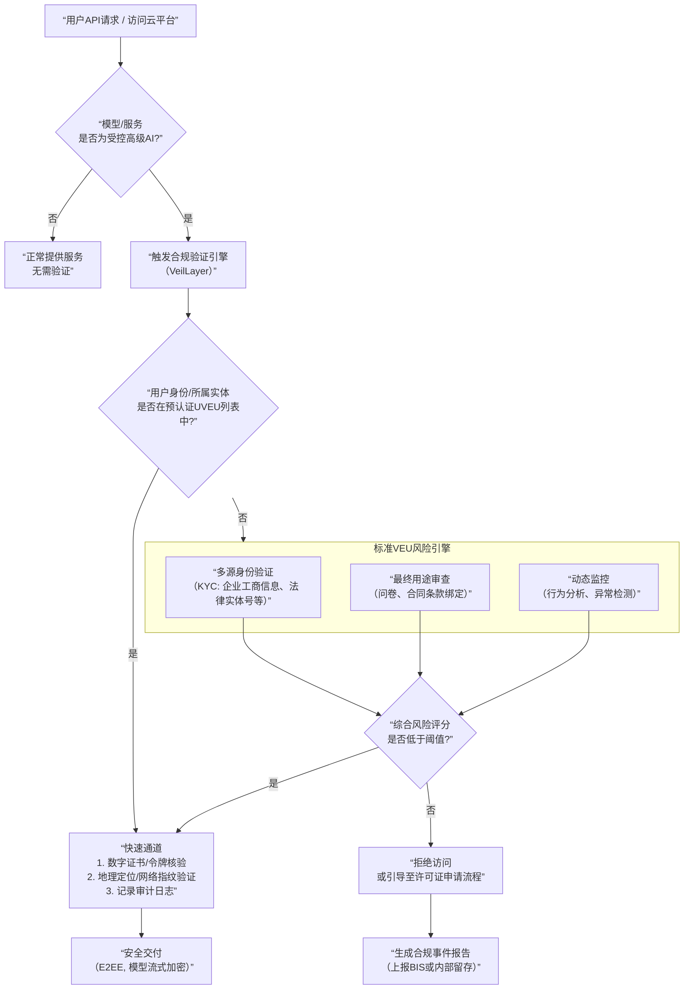

AI安全治理  出口管制 科技巨头的合规

“**Universal Validated End Users (UVEUs)**”并非一个广泛商用的标准术语，而是源于美国商务部工业与安全局（BIS）2024年提出的**人工智能（AI）模型国家安全框架**的讨论稿。它代表了在AI模型出口管制背景下，一个非常具体但关键的**合规与监管概念**。

下面我将从**定义、技术细节、科技巨头的角色**三个层面，深入剖析这个问题，并构建您的直觉。

---

### 1. 核心定义与监管背景

**a) 起源：BIS的AI框架**
2024年，美国BIS发布了一项关于“**人工智能模型、权重和权重的出口、再出口和国内转移（EAR）临时最终规则**”的讨论稿。其核心思想是：**将对先进闭源AI模型（特别是具有“系统性风险”的模型）的访问权限，视为一种受《出口管理条例》（EAR）控制的“物项”（item）**。这意味着，向“外国实体”提供这些模型，可能被视为“出口”，需要申请许可证。

**b) VEU vs. UVEU - 一个光谱**
在该框架中，BIS设想了一个用户验证的**光谱**：
*   **标准验证终端用户（Validated End User, VEU）**： 通过BIS或经授权的第三方进行的**基础性、一次性**身份和最终用途审查。审查标准可能包括：实体合法性、不与受限制实体（如制裁名单、实体清单）关联、声明最终用途非恶意等。
*   **通用验证终端用户（Universal Validated End User, UVEU）**： 这是VEU的一种**高级、通用、简化版**。UVEU指那些来自**友好国家或地区**的实体，其**整体나라/地区的合规体系已被BIS预先评估为足够可靠**。因此，对这类实体验证可以“通用化”和简化，无需对每个具体交易进行单独、深度的审查。
    *   **直觉比喻**： VEU像是“为每个顾客单独安检”；UVEU像是“这个国家的所有乘客持有该国安全机构颁发的‘可信旅客通行证’，我们只快速核验证件真伪即可”。
    *   **关键区别**： VEU验证通常是 **“交易级”** 的（每笔交易或每个采购合同都要验证），而UVEU验证旨在实现 **“国家/地区级”** 的预认证，从而极大降低科技公司的合规成本，同时保持对高风险流向的控制。

**c) UVEU的潜在qualification标准（基于讨论稿推断）**
一个实体或其所在国要成为UVEU，可能需要满足：
1.  **国家/地区层面**： 该国是北约成员国、欧盟成员国、或至少签署了符合美国标准的《瓦森纳协定》等出口管制安排。
2.  **实体层面**： 实体注册并主要运营在上述国家，未被列入任何美国或国际制裁/限制名单。
3.  **合规承诺**： 实体接受并遵守美国式的最终用户/最终用途承诺（End-Use Certificate）。
4.  **技术控制能力**： 实体能证明自身具备符合标准的物理和网络安全措施，能防止模型未授权转移。
5.  **友好国家认证**： BIS可能通过外交渠道与某些国达成协议，认定该国整体法律和执法体系足以“托管”美国AI模型。

---

### 2. 对科技巨头（OpenAI, Anthropic, Google DeepMind等）的技术与合规影响

科技巨头既是这些**先进闭源AI模型的提供方**，也是**UVEU/VEU框架最核心的合规责任主体**。他们必须建立一整套复杂的系统来实现这一监管要求。

#### **a) 技术架构与流程：一个“合规即代码”的实例**

为了满足UVEU/VEU要求，科技巨头必须在产品交付管道中嵌入 **“合规验证层”**。下图展示了一个简化的、必须实现的架构逻辑：

**Tech Stack解析：**
1.  **身份与合规数据库（UVEU/VEU List）**：
    *   **数据源**： 整合美国政府发布的**实体清单（EL）**、**被拒绝人员清单（DPL）**、**军事最终用户清单（MEU）**，以及与盟国政府交换的预认证UVEU名单。
    *   **动态更新**： 需要订阅BIS的规则更新API，实现名单的自动、实时刷新。缺失此功能将导致巨大合规风险。

2.  **用户身份验证层（KYC for Entities）**：
    *   **技术**： 不只是用户名密码，而是集成**企业级身份提供商（如Okta, Azure AD）** 的SAML/OIDC协议，获取企业实体的官方法律名称、注册号、主要营业地等信息。
    *   **验证**： 与第三方商业数据提供商（如Dun & Bradstreet, LexisNexis）API对接，交叉验证企业信息的真实性和是否被标记为高风险。

3.  **动态风险评估引擎**：
    *   **输入**： 用户身份信息、IP地理定位、请求的模型类型/参数规模、请求模式（频率、数据量）、最终用途声明文本。
    *   **模型**： 一个基于规则的引擎 + 一个机器学习模型。规则引擎处理硬性约束（如IP来自伊朗则直接拒绝）。ML模型对模糊情况评分（例如，一个德国初创公司突然请求训练100B参数模型用于“研究”，其风险评分高于一家美国认证的制药公司请求用于“已批药物发现”）。
    *   **输出**： 一个风险分数。高于阈值触发人工审核或自动拒绝。

4.  **安全交付与监控层**：
    *   **传输加密**： 模型推理输出必须经过端到端加密（E2EE），且密钥管理需确保只有授权终端用户设备能解密。
    *   **使用监控**： 在模型服务端嵌入“**水印”或“遥测”**，记录模型输出的关键指纹，以便在发生泄露时溯源。
    *   **行为分析**： 监控用户API调用模式。例如，一个UVEU用户突然以异常高的速率大量请求模型，可能意味着其内部发生了模型转移，系统应自动警报并暂停服务。

#### **b) 关键公式与变量解释（以风险评分为例）**

科技巨头的VEU/UVEU决策可抽象为一个加权评分函数：

**`R = w₁·I + w₂·G + w₃·U + w₄·B + w₅·H`**

*   **`R` (Risk Score)**: 最终风险评分，`R ∈ [0, 100]`。阈值`θ`由合规部门设定，`R < θ`则通过。
*   **`w₁...w₅`**: 权重系数，根据监管重点动态调整。例如，当BIS发布针对特定国家/技术的警告时，`w₂`（地理权重）会被临时调高。
*   **`I` (Identity Score - 身份分)**: 基于KYC数据的可信度。例如，提供经认证的政府商业登记号 vs. 仅提供 unverified 企业邮箱。`I ∈ [0, 20]`。
*   **`G` (Geography Score - 地理分)**: 基于IP、公司注册地、主要运营地。来自UVEU国家（如荷兰）得低分（安全），来自“关注国家”得高分（风险）。`G ∈ [0, 30]`。
*   **`U` (Usage Score - 用途分)**: 基于用户声明的最终用途。符合“民用科研、商业应用”得低分，“与CBRN（化学、生物、放射性、核）相关”得满分风险。`U ∈ [0, 25]`。
*   **`B` (Behavior Score - 行为分)**: 基于历史行为。是新用户（无历史）得中等分，是长期良好记录用户得低分，有异常请求模式得高分。`B ∈ [0, 15]`。
*   **`H` (History Score - 历史违规分)**: 该实体或其关键成员是否在制裁名单、是否有过往违规记录。是则直接`H = 10`（一票否决区间），否则`H = 0`。

**这个公式将定性合规规则量化，并可通过历史决策数据（`R` 与真实发生的违规事件关联）进行ML训练，不断优化`w`和阈值`θ`，形成闭环。**

---

### 3. 科技巨头在此框架中的多重角色与博弈

科技巨头绝非被动的合规执行者，他们是**规则演化的关键参与者**，扮演着多重角色：

1.  **游说者与规则塑造者**：
    *   **目标**： 推动BIS明确、精细地定义 **“UVEU国家/地区列表”** 和 **“受控模型阈值”**（例如，具体多少参数的模型算“先进”？）。模糊性带来巨大的合规不确定性和执行成本。
    *   **策略**： 通过行业组织（如软件联盟BSA、科技行业网络ITI）提交评论，主张“基于风险、可操作”的框架。例如，Anthropic可能游说将“模型在特定评估基准上的表现”而非单纯参数量作为阈值标准，以涵盖其高质量小模型。
    *   **案例**： 微软、谷歌云等作为全球运营者，强力主张一个**广泛的、多边的UVEU认定机制**，以避免形成“AI铁幕”，将欧盟等盟友排除在外，导致其全球云服务出现割裂。

2.  **技术架构创新者（构建“合规基础设施”）**：
    *   如上所述，他们正在将**出口管制法律条文**转化为**全球分布式云平台中的自动决策微服务**。这催生了新的合规科技（Compliance Tech）市场。
    *   例如，**“合规网关”** 可能成为下一代云原生AI平台（如Azure OpenAI Service, Google Vertex AI）的必备入口组件。

3.  **生态系统管理者（对下游客户的约束）**：
    *   科技巨头不仅约束自己，还**将合规义务传递到整个价值链**。他们与签订VEU/UVEU协议的企业客户（如银行、制药公司）会约定：客户若将模型用于未经授权的最终用途，或允许未经验证的关联公司访问，客户将承担全部责任，且巨头有权立即终止服务、追索赔偿。
    *   这实质上将美国出口管制的 enforcement（执行）成本，部分内化并转移给了商业客户。

4.  **地缘政治博弈的棋子与棋手**：
    *   美国试图通过UVEU机制，**构建一个以美国合规标准为核心的“AI民主国家联盟”**。科技巨头成为这个联盟的技术支柱。
    *   它们需要在中美科技竞争的大背景下，平衡 **“全球商业利益”** 与 **“国家/联盟安全要求”**。例如，一家公司在华有大量业务，但必须遵守对华高端AI模型出口限制，这可能导致其中国分支只能获得降级或受限的模型服务，从而影响其竞争力。

**一个具体例子**：
> 假设 **飞利浦（荷兰）** 因为荷兰是欧盟成员且与美国有紧密的出口管制合作，被BIS认定为 **UVEU实体**。飞利浦的研发部门通过Azure OpenAI服务请求使用GPT-4级别模型用于医疗器械图像分析。
> *   **流程**： Azure在验证飞利浦的Azure Active Directory租户已绑定其经验证的欧盟商业注册号后，触发UVEU快速通道。请求被批准，模型在加密通道中交付，所有输出被记录。
> *   **如果** 飞利浦试图将API密钥分享给其在中国的合资公司（非UVEU），则其行为监控系统可能因检测到异常地理登录而触发警报，服务将被暂停，并上报至飞利浦总部和美国BIS。

---

### 结论与未来挑战

**UVEU的本质** 是一个**基于国家/地区信任的“预认证白名单”机制**，旨在解决AI时代出口管制“一刀切”不可行（会扼杀商业和研究）和“完全不控”不行的两难。它是**监管科技（RegTech）与地缘政治深度融合**的产物。

**对科技巨头而言**：
1.  **成本剧增**： 构建和维护上述合规技术栈（身份、风险引擎、监控、审计）是数十亿美元级别的投入。
2.  **战略风险**： 过度严格的自我执行可能疏远客户（如欧洲科研机构抱怨流程繁琐）；执行不严则面临BIS天价罚单（如此前对**中兴、华为**的处罚）甚至刑事指控。
3.  **市场塑造**： 谁能最快、最无缝地实现“**合规无感体验**”，谁就能在受监管的AI云服务市场获得优势。这成了新的竞争维度。

**未解难题**：
*   **定义的模糊性**： “先进模型”的阈值是什么？UVEU国家的名单由谁定、如何更新？这些根本问题不厘清，技术实现就是空中楼阁。
*   **“拆分模型”攻击**： 如果受控模型被拆解成多个不达标的“小模型”在国界外重新组装怎么办？（即“**模型蒸馏+分布式部署**”规避方案）
*   **开源模型的例外**： 框架目前主要针对**闭源/API访问模型**。但闭源模型的输出（如通过API生成的代码、设计图）是否再出口？这打开了另一个合规潘多拉魔盒。

**最终直觉**： **UVEU不是一张静态的“名单”，而是一个动态的、由科技巨头与政府共同运营的“风险治理过程”。** 科技巨头正在成为全球AI治理的 **“私人执法者”** ，其技术架构中的每一个合规决策点，都是美国技术主权战略在世界各地的**数字边境检查站**。

**参考链接与资源（供深入研究）：**
1.  **美国BIS官方文件**： 搜索 “BIS AI Framework Proposed Rule” 或访问 [BIS官网的AI相关页面](https://www.bis.doc.gov/index.php/policy-guidance/country-guidance/emerging-technologies/artificial-intelligence)。
2.  **行业评论与分析**： 布鲁金斯学会、卡内基国际和平研究院等智库有大量关于AI出口管制的报告。搜索 “AI export controls UVEU”。
3.  **科技公司回应**： OpenAI, Anthropic等公司在回应BIS NPRM（Notice of Proposed Rulemaking）时发布的公开信，通常阐述其对合规可行性的担忧和建议。
4.  **技术实现**： 搜索 “AI model compliance infrastructure”, “export control in cloud AI APIs”, “digital trade compliance tech”。相关概念包括“**合规编排**（Compliance Orchestration）”、“**可审计的AI管道**（Auditable AI Pipelines）”。